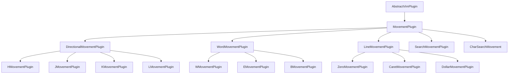

# Movement Plugin Development Guide

This document provides a comprehensive guide for adding new movement plugins to the vim-game project. It covers architectural considerations, implementation patterns, testing requirements, and best practices.

---

## Table of Contents

1. [Architecture Overview](#architecture-overview)
2. [Plugin Categories](#plugin-categories)
3. [Implementation Checklist](#implementation-checklist)
4. [Code Patterns](#code-patterns)
5. [Testing Requirements](#testing-requirements)
6. [Performance Considerations](#performance-considerations)
7. [Export Configuration](#export-configuration)
8. [Common Patterns](#common-patterns)
9. [Troubleshooting](#troubleshooting)

---

## Architecture Overview

### Plugin Inheritance Hierarchy



### Base Class Responsibilities

| Base Class                  | Responsibility                  | Key Methods                                |
| --------------------------- | ------------------------------- | ------------------------------------------ |
| `AbstractVimPlugin`         | Plugin metadata, registration   | `name`, `version`, `patterns`, `modes`     |
| `MovementPlugin`            | Validation, execution flow      | `calculateNewPosition()`, `validateMove()` |
| `DirectionalMovementPlugin` | Step-based directional movement | `applyMovement()`                          |
| `WordMovementPlugin`        | Word boundary traversal         | `findBoundary()`, multi-line search        |
| `LineMovementPlugin`        | Line-relative positioning       | `calculateColumn()`                        |

---

## Plugin Categories

### Category 1: Basic Movement (h, j, k, l)

**Characteristics:**

- Single step or configurable step size
- Movement within single line (h, l) or across lines (j, k)
- No complex boundary detection needed
- Step configurable via `MovementConfig.step`

**Base Class:** `DirectionalMovementPlugin`

**Example Key Bindings:**

- `h` - Move left
- `l` - Move right
- `j` - Move down
- `k` - Move up

### Category 2: Word Movement (w, W, b, B, e, E, ge, gE)

**Characteristics:**

- Multi-line traversal
- Word boundary detection
- Character classification (word vs. non-word)
- Configurable word definition

**Base Class:** `WordMovementPlugin`

**Helper Utilities:**

- `isWordChar(char)` - Check if character is alphanumeric/underscore
- `isWhitespace(char)` - Check if character is whitespace
- `findNextWordStart(line, column)` - Find next word start
- `findWordEnd(line, column)` - Find current/next word end
- `findPreviousWordStart(line, column)` - Find previous word start

**Example Key Bindings:**

- `w` - Start of next word (word chars only)
- `W` - Start of next WORD (whitespace-delimited)
- `b` - Start of previous word
- `B` - Start of previous WORD
- `e` - End of current/next word
- `E` - End of current/next WORD
- `ge` - End of previous word
- `gE` - End of previous WORD

### Category 3: Line Movement (0, ^, $, g\_)

**Characteristics:**

- Line-relative positioning
- Column calculation based on line content
- No step configuration needed

**Base Class:** `LineMovementPlugin`

**Example Key Bindings:**

- `0` - First column of line
- `^` - First non-whitespace character
- `$` - End of line
- `g_` - Last non-whitespace character

### Category 4: Screen Movement (Ctrl+f, Ctrl+b, Ctrl+d, Ctrl+u, H, M, L)

**Characteristics:**

- Viewport-relative positioning
- May require viewport/scroll state
- Page-based or position-based

**Base Class:** Direct `MovementPlugin` extension

**Example Key Bindings:**

- `Ctrl+f` - Forward one full page
- `Ctrl+b` - Backward one full page
- `Ctrl+d` - Forward half page
- `Ctrl+u` - Backward half page
- `H` - Top of viewport
- `M` - Middle of viewport
- `L` - Bottom of viewport

### Category 5: Document Navigation (gg, G, :<number>, <number>G)

**Characteristics:**

- Absolute/relative line positioning
- May require count prefix
- Column preservation across lines

**Base Class:** Direct `MovementPlugin` extension

**Example Key Bindings:**

- `gg` - First line of document
- `G` - Last line of document
- `:<number>` - Jump to specific line number
- `<number>G` - Jump to specific line number

### Category 6: Character Search (f, F, t, T, ;, ,)

**Characteristics:**

- Character-based pattern matching
- Repeat support (;, ,)
- Direction awareness
- Till vs. Find distinction

**Base Class:** `CharSearchMovement`

**Example Key Bindings:**

- `f{char}` - Find next occurrence of char
- `F{char}` - Find previous occurrence of char
- `t{char}` - Till (before) next occurrence
- `T{char}` - Till (after) previous occurrence
- `;` - Repeat last f, F, t, or T
- `,` - Repeat last f, F, t, or T in opposite direction

### Category 7: Code Matching (%)

**Characteristics:**

- Bracket/paren matching
- Requires buffer parsing
- Multi-char support ([ ], { }, < >, etc.)

**Base Class:** Direct `MovementPlugin` extension

**Example Key Bindings:**

- `%` - Jump to matching bracket/paren

### Category 8: Search Navigation (/, ?, n, N, \*, #)

**Characteristics:**

- Pattern-based search
- Search history support
- Direction and case sensitivity

**Base Class:** `SearchMovementPlugin`

**Example Key Bindings:**

- `/` - Forward search
- `?` - Backward search
- `n` - Next search match
- `N` - Previous search match
- `*` - Next word under cursor
- `#` - Previous word under cursor

### Category 9: Jump List (Ctrl+o, Ctrl+i)

**Characteristics:**

- History-based navigation
- Stack/queue management
- Plugin state persistence

**Base Class:** Direct `MovementPlugin` extension

**Example Key Bindings:**

- `Ctrl+o` - Jump back
- `Ctrl+i` - Jump forward

---

## Implementation Checklist

### Step 1: Identify Plugin Category

Determine which category your new plugin falls into:

1. Basic Movement (h, j, k, l)
2. Word Movement (w, W, b, B, e, E, ge, gE)
3. Line Movement (0, ^, $, g\_)
4. Screen Movement (Ctrl+f, Ctrl+b, Ctrl+d, Ctrl+u, H, M, L)
5. Document Navigation (gg, G, :<number>, <number>G)
6. Character Search (f, F, t, T, ;, ,)
7. Code Matching (%)
8. Search Navigation (/, ?, n, N, \*, #)
9. Jump List (Ctrl+o, Ctrl+i)

### Step 2: Create Plugin Directory

```bash
# For example, adding a new plugin for key 'x'
mkdir -p src/plugins/movement/x
```

### Step 3: Create Plugin File

Create `src/plugins/movement/x/XMovementPlugin.ts`:

````typescript
/**
 * XMovementPlugin - Brief description
 *
 * Detailed description of what this plugin does.
 *
 * @example
 * ```typescript
 * import { XMovementPlugin } from './x/XMovementPlugin';
 *
 * const plugin = new XMovementPlugin();
 * ```
 *
 * @see MovementPlugin For the base class
 */
import { MovementPlugin, MovementConfig } from '../base/MovementPlugin';
import { CursorPosition } from '../../../state/CursorPosition';
import { TextBuffer } from '../../../state/TextBuffer';
import { VIM_MODE, VimMode } from '../../../state/VimMode';

/**
 * XMovementPlugin - Extended description
 */
export class XMovementPlugin extends MovementPlugin {
  /**
   * Plugin name
   */
  readonly name = 'movement-x';

  /**
   * Plugin version
   */
  readonly version = '1.0.0';

  /**
   * Plugin description
   */
  readonly description = 'Description of movement (x key)';

  /**
   * Keystroke patterns handled by this plugin
   */
  readonly patterns = ['x'];

  /**
   * Modes this plugin is active in
   */
  readonly modes: VimMode[] = [VIM_MODE.NORMAL, VIM_MODE.VISUAL];

  /**
   * Create a new XMovementPlugin
   */
  constructor(config?: MovementConfig) {
    super(
      'movement-x',
      'Description of movement (x key)',
      'x',
      [VIM_MODE.NORMAL, VIM_MODE.VISUAL],
      config
    );
  }

  /**
   * Calculate new position
   */
  protected calculateNewPosition(
    cursor: CursorPosition,
    buffer: TextBuffer,
    config: Required<MovementConfig>
  ): CursorPosition {
    // Implementation here
    return cursor.clone();
  }
}
````

### Step 4: Create Index File

Create `src/plugins/movement/x/index.ts`:

```typescript
export { XMovementPlugin } from './XMovementPlugin';
```

### Step 5: Update Main Index

Update `src/plugins/movement/index.ts`:

```typescript
/**
 * Movement Plugins Index
 */
export { MovementPlugin, MovementConfig } from './base';
export { HMovementPlugin } from './h';
export { JMovementPlugin } from './j';
export { KMovementPlugin } from './k';
export { LMovementPlugin } from './l';
export { WMovementPlugin } from './w';
export { EMovementPlugin } from './e';
export { BMovementPlugin } from './b';
export { XMovementPlugin } from './x'; // Add this line
```

### Step 6: Write Unit Tests

Create `tests/unit/plugins/movement/x/XMovementPlugin.test.ts`:

```typescript
import { XMovementPlugin } from '../../../../src/plugins/movement/x/XMovementPlugin';
import { CursorPosition } from '../../../../src/state/CursorPosition';
import { TextBuffer } from '../../../../src/state/TextBuffer';
import { MovementConfig } from '../../../../src/plugins/movement/base/MovementPlugin';

describe('XMovementPlugin', () => {
  let plugin: XMovementPlugin;
  let cursor: CursorPosition;
  let buffer: TextBuffer;

  beforeEach(() => {
    plugin = new XMovementPlugin();
    cursor = new CursorPosition(0, 0);
    buffer = new TextBuffer(['hello world']);
  });

  it('should have correct name', () => {
    expect(plugin.name).toBe('movement-x');
  });

  it('should have correct patterns', () => {
    expect(plugin.patterns).toContain('x');
  });

  it('should handle basic movement', () => {
    const newPosition = plugin.calculateNewPosition(cursor, buffer, { step: 1 });
    expect(newPosition).toBeDefined();
  });

  it('should handle empty buffer', () => {
    const emptyBuffer = new TextBuffer([]);
    const newPosition = plugin.calculateNewPosition(cursor, emptyBuffer, { step: 1 });
    expect(newPosition).toEqual(cursor);
  });

  // Add more test cases...
});
```

### Step 7: Run Tests

```bash
npm test -- --testPathPattern="XMovementPlugin"
```

---

## Code Patterns

### Pattern 1: Basic Movement (Step-based)

```typescript
export class HMovementPlugin extends DirectionalMovementPlugin {
  readonly name = 'movement-h';
  readonly version = '1.0.0';
  readonly description = 'Move cursor left (h key)';
  readonly patterns = ['h'];
  readonly modes: VimMode[] = [VIM_MODE.NORMAL, VIM_MODE.VISUAL];

  constructor(config?: MovementConfig) {
    super(
      'movement-h',
      'Move cursor left (h key)',
      'h',
      [VIM_MODE.NORMAL, VIM_MODE.VISUAL],
      config
    );
  }

  protected applyMovement(cursor: CursorPosition, line: string, step: number): CursorPosition {
    const newColumn = Math.max(0, cursor.column - step);
    return new CursorPosition(cursor.line, newColumn);
  }
}
```

### Pattern 2: Word Movement

```typescript
export class WMovementPlugin extends WordMovementPlugin {
  readonly name = 'movement-w';
  readonly version = '1.0.0';
  readonly description = 'Move cursor to start of next word (w key)';
  readonly patterns = ['w'];
  readonly modes: VimMode[] = [VIM_MODE.NORMAL, VIM_MODE.VISUAL];

  protected get direction(): 'forward' | 'backward' {
    return 'forward';
  }

  protected findBoundary(line: string, column: number): number | null {
    return findNextWordStart(line, column);
  }
}
```

### Pattern 3: Line Movement

```typescript
export class DollarMovementPlugin extends LineMovementPlugin {
  readonly name = 'movement-dollar';
  readonly version = '1.0.0';
  readonly description = 'Move to end of line ($ key)';
  readonly patterns = ['$'];
  readonly modes: VimMode[] = [VIM_MODE.NORMAL, VIM_MODE.VISUAL];

  protected calculateLinePosition(line: string, cursor: CursorPosition): number {
    return Math.max(0, line.length - 1);
  }
}
```

### Creating Line Movement Plugins

Line movement plugins extend the [`LineMovementPlugin`](./base/LineMovementPlugin.ts) base class, which provides common functionality for movements that position the cursor at specific columns on the current line.

#### Implementation Steps

1. **Create Plugin Directory**
   ```bash
   mkdir -p src/plugins/movement/x
   ```

2. **Create Plugin File**
   Create `src/plugins/movement/x/XMovementPlugin.ts`:

   ```typescript
   /**
    * XMovementPlugin - Brief description
    *
    * Detailed description of what this plugin does.
    *
    * @example
    * ```typescript
    * import { XMovementPlugin } from './x/XMovementPlugin';
    *
    * const plugin = new XMovementPlugin();
    * executor.registerPlugin(plugin);
    * executor.handleKeystroke('x');
    * ```
    *
    * @see LineMovementPlugin For the base class
    */
   import { LineMovementPlugin } from '../base/LineMovementPlugin';
   import { CursorPosition } from '../../../state/CursorPosition';
   import { VIM_MODE } from '../../../state/VimMode';

   /**
    * XMovementPlugin - Extended description
    */
   export class XMovementPlugin extends LineMovementPlugin {
     readonly name = 'movement-x';
     readonly version = '1.0.0';
     readonly description = 'Description of movement (x key)';
     readonly patterns = ['x'];
     readonly modes: VIM_MODE[] = [VIM_MODE.NORMAL, VIM_MODE.VISUAL];

     constructor() {
       super(
         'movement-x',
         'Description of movement (x key)',
         'x',
         [VIM_MODE.NORMAL, VIM_MODE.VISUAL]
       );
     }

     protected calculateLinePosition(
       line: string,
       cursor: CursorPosition
     ): number {
       // Calculate target column based on line content
       // Return 0 for empty lines or appropriate column
       return 0;
     }
   }
   ```

3. **Create Index File**
   Create `src/plugins/movement/x/index.ts`:

   ```typescript
   export { XMovementPlugin } from './XMovementPlugin';
   ```

4. **Update Main Index**
   Add to `src/plugins/movement/index.ts`:

   ```typescript
   export * from './x';
   ```

5. **Write Unit Tests**
   Create `src/plugins/movement/x/XMovementPlugin.test.ts`:

   ```typescript
   import { XMovementPlugin } from './XMovementPlugin';
   import { ExecutionContext } from '../../../plugin/ExecutionContext';
   import { VimState } from '../../../state/VimState';
   import { CursorPosition } from '../../../state/CursorPosition';
   import { VIM_MODE } from '../../../state/VimMode';

   describe('XMovementPlugin', () => {
     describe('Metadata', () => {
       it('should have correct name', () => {
         const plugin = new XMovementPlugin();
         expect(plugin.name).toBe('movement-x');
       });

       it('should have correct version', () => {
         const plugin = new XMovementPlugin();
         expect(plugin.version).toBe('1.0.0');
       });

       it('should have correct description', () => {
         const plugin = new XMovementPlugin();
         expect(plugin.description).toBe('Description of movement (x key)');
       });

       it('should have correct pattern', () => {
         const plugin = new XMovementPlugin();
         expect(plugin.patterns).toEqual(['x']);
       });

       it('should support NORMAL and VISUAL modes', () => {
         const plugin = new XMovementPlugin();
         expect(plugin.modes).toContain(VIM_MODE.NORMAL);
         expect(plugin.modes).toContain(VIM_MODE.VISUAL);
         expect(plugin.modes).not.toContain(VIM_MODE.INSERT);
         expect(plugin.modes).not.toContain(VIM_MODE.COMMAND);
       });
     });

     describe('Movement Behavior', () => {
       it('should move to correct position', () => {
         const plugin = new XMovementPlugin();
         const state = new VimState('test line');
         state.cursor = new CursorPosition(0, 5);
         const context = new ExecutionContext(state);
         context.setMode(VIM_MODE.NORMAL);

         plugin.execute(context);

         expect(context.getCursor().column).toBe(expectedColumn);
       });
     });

     describe('Edge Cases', () => {
       it('should handle empty line', () => {
         const plugin = new XMovementPlugin();
         const state = new VimState('line1\n\nline3');
         state.cursor = new CursorPosition(1, 0);
         const context = new ExecutionContext(state);
         context.setMode(VIM_MODE.NORMAL);

         plugin.execute(context);

         expect(context.getCursor().column).toBe(expectedForEmpty);
       });

       it('should handle whitespace-only line', () => {
         const plugin = new XMovementPlugin();
         const state = new VimState('line1\n   \nline3');
         state.cursor = new CursorPosition(1, 2);
         const context = new ExecutionContext(state);
         context.setMode(VIM_MODE.NORMAL);

         plugin.execute(context);

         expect(context.getCursor().column).toBe(expectedForWhitespace);
       });
     });
   });
   ```

#### Key Considerations

1. **Column Calculation**: Implement [`calculateLinePosition()`](./base/LineMovementPlugin.ts) to return the target column based on line content.

2. **Empty Line Handling**: Decide how to handle empty lines:
   - Return 0 (stay at start)
   - Return line.length (stay at end, which is 0)
   - Return a specific column based on your movement logic

3. **Whitespace Handling**: Consider how to handle whitespace-only lines:
   - For movements that find non-whitespace (like `^` and `g_`), return 0
   - For absolute movements (like `0` and `$`), return appropriate column

4. **Count Support**: The base class automatically handles count-based movements, moving down (count - 1) lines before applying the line movement.

5. **Utility Functions**: Use existing utilities from [`lineUtils.ts`](./utils/lineUtils.ts):
   - `findFirstNonWhitespace(line)` - Find first non-whitespace character
   - `findLastNonWhitespace(line)` - Find last non-whitespace character
   - `clampColumn(column, line)` - Clamp column to valid range

#### Examples

See the existing line movement plugins for reference:

- [`ZeroMovementPlugin`](./0/ZeroMovementPlugin.ts) - Always returns column 0
- [`CaretMovementPlugin`](./caret/CaretMovementPlugin.ts) - Uses `findFirstNonWhitespace()`
- [`DollarMovementPlugin`](./dollar/DollarMovementPlugin.ts) - Returns `line.length - 1`
- [`GUnderscoreMovementPlugin`](./g-underscore/GUnderscoreMovementPlugin.ts) - Uses `findLastNonWhitespace()`

### Pattern 4: Multi-line Search

```typescript
export class WordMovementPlugin extends MovementPlugin {
  protected calculateNewPosition(
    cursor: CursorPosition,
    buffer: TextBuffer,
    config: Required<MovementConfig>
  ): CursorPosition {
    if (buffer.isEmpty()) return cursor.clone();

    const currentLine = buffer.getLine(cursor.line);
    if (!currentLine) return cursor.clone();

    // Try finding boundary on current line
    const boundary = this.findBoundary(currentLine, cursor.column);
    if (boundary !== null) {
      return new CursorPosition(cursor.line, boundary);
    }

    // Multi-line traversal
    const lineCount = buffer.getLineCount();
    const startLine = cursor.line + 1; // or cursor.line - 1 for backward

    for (let line = startLine; line < lineCount; line++) {
      const lineContent = buffer.getLine(line);
      if (!lineContent) continue;
      if (lineContent.trim().length === 0) continue;

      const boundary = this.findBoundary(lineContent, 0);
      if (boundary !== null) {
        return new CursorPosition(line, boundary);
      }
    }

    return cursor.clone();
  }
}
```

---

## Testing Requirements

### Unit Test Coverage Requirements

| Category               | Minimum Coverage |
| ---------------------- | ---------------- |
| Utility functions      | 100%             |
| Base class methods     | 95%              |
| Plugin implementations | 90%              |
| Edge cases             | 95%              |

### Test File Structure

```
tests/unit/plugins/movement/
├── base/
│   └── MovementPlugin.test.ts
├── h/
│   └── HMovementPlugin.test.ts
├── j/
│   └── JMovementPlugin.test.ts
├── k/
│   └── KMovementPlugin.test.ts
├── l/
│   └── LMovementPlugin.test.ts
├── w/
│   └── WMovementPlugin.test.ts
├── e/
│   └── EMovementPlugin.test.ts
└── b/
    └── BMovementPlugin.test.ts
```

### Required Test Cases

Every plugin must include:

1. **Metadata Tests**
   - Correct `name` property
   - Correct `version` property
   - Correct `description` property
   - Correct `patterns` array
   - Correct `modes` array

2. **Basic Movement Tests**
   - Simple movement from start position
   - Movement from middle position
   - Movement from end position

3. **Boundary Tests**
   - Movement at line start
   - Movement at line end
   - Movement at buffer start
   - Movement at buffer end

4. **Empty State Tests**
   - Empty buffer handling
   - Single line buffer
   - Multiple line buffer

5. **Configuration Tests**
   - Default configuration
   - Custom step value
   - Custom configuration options

### Integration Tests

```typescript
// tests/integration/movement-integration.test.ts
describe('Movement Plugin Integration', () => {
  describe('Word Movement', () => {
    it('should move to next word with w key', async () => {
      await simulateKeystrokes('iHello world<Esc>');
      await simulateKeystrokes('0w');
      // Verify cursor at "world" start
    });

    it('should handle count prefix', async () => {
      await simulateKeystrokes('iOne two three<Esc>');
      await simulateKeystrokes('2w');
      // Verify cursor at "three" start
    });
  });
});
```

---

## Performance Considerations

### Performance Budget

| Operation                | Target Time | Maximum Acceptable |
| ------------------------ | ----------- | ------------------ |
| Single word move         | < 0.1ms     | 0.5ms              |
| Multi-line word move     | < 1ms       | 5ms                |
| Basic movement (h/j/k/l) | < 0.05ms    | 0.2ms              |
| Plugin instantiation     | < 1ms       | 5ms                |

### Optimization Guidelines

1. **Avoid Object Creation in Hot Paths**

   ```typescript
   // Bad: Creates new objects in loop
   for (let i = 0; i < lines.length; i++) {
     const position = new CursorPosition(i, 0);
   }

   // Good: Reuse position
   const position = new CursorPosition(0, 0);
   for (let i = 0; i < lines.length; i++) {
     position.line = i;
     position.column = 0;
   }
   ```

2. **Use Early Termination**

   ```typescript
   // Add limits to multi-line searches
   const MAX_LINES_TO_SEARCH = 1000;
   let linesSearched = 0;

   for (let line = startLine; line < lineCount && linesSearched < MAX_LINES_TO_SEARCH; line++) {
     // Search logic
     linesSearched++;
   }
   ```

3. **Memoize Expensive Operations**

   ```typescript
   private boundaryCache = new Map<string, number>();

   protected findBoundary(line: string, column: number): number | null {
     const key = `${line}:${column}`;
     if (this.boundaryCache.has(key)) {
       return this.boundaryCache.get(key)!;
     }
     const result = this.computeBoundary(line, column);
     this.boundaryCache.set(key, result ?? -1);
     return result;
   }
   ```

4. **Pre-compile Regex Patterns**

   ```typescript
   // Class-level regex
   private static readonly WORD_PATTERN = /\w+/g;

   // Use pre-compiled regex
   findWords(line: string): RegExpMatchArray[] {
     return [...line.matchAll(WORD_PATTERN)];
   }
   ```

### Performance Testing

```typescript
// tests/performance/movement-benchmark.test.ts
describe('Movement Performance', () => {
  it('should move word in < 0.1ms', () => {
    const start = performance.now();
    plugin.calculateNewPosition(cursor, buffer, config);
    const elapsed = performance.now() - start;
    expect(elapsed).toBeLessThan(0.1);
  });

  it('should handle 10000-line buffer efficiently', () => {
    const largeBuffer = new TextBuffer(Array(10000).fill('line '.repeat(100)));
    const start = performance.now();
    plugin.calculateNewPosition(cursor, largeBuffer, config);
    const elapsed = performance.now() - start;
    expect(elapsed).toBeLessThan(10);
  });
});
```

---

## Export Configuration

### Module Exports Pattern

Each plugin directory should follow this pattern:

```
src/plugins/movement/x/
├── XMovementPlugin.ts    # Main plugin implementation
└── index.ts              # Re-export
```

### Index File Template

```typescript
/**
 * X Movement Plugin Index
 */
export { XMovementPlugin } from './XMovementPlugin';
```

### Main Index Update

Add to `src/plugins/movement/index.ts`:

```typescript
/**
 * Movement Plugins Index
 */
export { MovementPlugin, MovementConfig } from './base';
export { HMovementPlugin } from './h';
export { JMovementPlugin } from './j';
export { KMovementPlugin } from './k';
export { LMovementPlugin } from './l';
export { WMovementPlugin } from './w';
export { EMovementPlugin } from './e';
export { BMovementPlugin } from './b';
export { XMovementPlugin } from './x'; // Add this line
```

---

## Common Patterns

### Pattern: Count Prefix Handling

Many vim movements support a count prefix (e.g., `3w` moves 3 words forward). The base `MovementPlugin` handles this through the `config.step` property:

```typescript
// Default MovementConfig
interface MovementConfig {
  step?: number; // Number of steps per keystroke (default: 1)
}

// Usage: 3w
// Plugin receives config.step = 3
```

### Pattern: Mode Support

All plugins should specify which vim modes they support:

```typescript
readonly modes: VimMode[] = [
  VIM_MODE.NORMAL,    // Normal mode
  VIM_MODE.VISUAL,    // Visual mode
  // VIM_MODE.INSERT,   // NOT for movement plugins
  // VIM_MODE.COMMAND,  // Command mode only
];
```

### Pattern: Buffer Boundary Handling

Always handle buffer boundaries gracefully:

```typescript
protected calculateNewPosition(
  cursor: CursorPosition,
  buffer: TextBuffer,
  config: Required<MovementConfig>
): CursorPosition {
  // Handle empty buffer
  if (buffer.isEmpty()) {
    return cursor.clone();
  }

  // Handle invalid line
  const lineCount = buffer.getLineCount();
  if (cursor.line < 0 || cursor.line >= lineCount) {
    return cursor.clone();
  }

  // Handle invalid column
  const line = buffer.getLine(cursor.line);
  if (line === null) {
    return cursor.clone();
  }

  // ... movement logic
}
```

### Pattern: Column Preservation

When moving vertically, preserve column position within bounds:

```typescript
// Moving down/up
const targetLine = buffer.getLine(newLine);
const maxColumn = targetLine?.length ?? 0;
const newColumn = Math.min(cursor.column, maxColumn);
return new CursorPosition(newLine, newColumn);
```

---

## Troubleshooting

### Issue: Plugin Not Triggering

**Possible causes:**

1. Incorrect `patterns` array
2. Plugin not exported in main index
3. Plugin not registered in plugin registry
4. Wrong mode activation

**Debug steps:**

```typescript
// Check plugin metadata
console.log(plugin.name);
console.log(plugin.patterns);
console.log(plugin.modes);

// Check if plugin is exported
import { XMovementPlugin } from './movement/x';
console.log(XMovementPlugin);
```

### Issue: Movement Not Working Correctly

**Possible causes:**

1. `calculateNewPosition` not returning expected position
2. Incorrect boundary detection
3. Multi-line traversal logic error

**Debug steps:**

```typescript
// Add debug logging
protected calculateNewPosition(
  cursor: CursorPosition,
  buffer: TextBuffer,
  config: Required<MovementConfig>
): CursorPosition {
  console.log('Current position:', cursor);
  console.log('Buffer content:', buffer.getAllText());

  const result = this.calculatePosition(cursor, buffer, config);
  console.log('New position:', result);

  return result;
}
```

### Issue: Performance Degradation

**Possible causes:**

1. Too much object creation
2. Inefficient multi-line traversal
3. Missing early termination

**Debug steps:**

```typescript
// Benchmark the plugin
const start = performance.now();
for (let i = 0; i < 1000; i++) {
  plugin.calculateNewPosition(cursor, buffer, config);
}
const elapsed = performance.now() - start;
console.log('Average time:', elapsed / 1000, 'ms');
```

### Issue: Tests Failing

**Possible causes:**

1. Missing mock setup
2. Incorrect buffer state
3. Plugin not in correct initial state

**Debug steps:**

```typescript
// Verify test setup
it('should move correctly', () => {
  const buffer = new TextBuffer(['test line']);
  const cursor = new CursorPosition(0, 0);

  const result = plugin.calculateNewPosition(cursor, buffer, { step: 1 });
  expect(result.line).toBe(0);
  expect(result.column).toBe(1);
});
```

---

## Best Practices

### 1. Follow the Existing Patterns

Always follow the patterns established by existing plugins. Consistency makes the codebase maintainable.

### 2. Keep Plugins Focused

Each plugin should do one thing well. Don't try to handle multiple movement types in a single plugin.

### 3. Write Tests First

Start with failing tests, then implement the plugin to make them pass.

### 4. Document Edge Cases

If your plugin has special behavior for edge cases, document them in comments.

### 5. Consider Performance

Think about performance during implementation, not as an afterthought.

### 6. Use TypeScript Strictly

Enable strict mode and use proper TypeScript types throughout.

### 7. Handle All Buffer States

Test with empty buffers, single lines, multiple lines, and various cursor positions.

### 8. Keep Dependencies Minimal

Don't import unnecessary modules. Keep each plugin self-contained where possible.

---

## Creating Search Movement Plugins

Search movement plugins extend the standard movement plugin pattern to provide pattern-based navigation functionality. This section covers the specific considerations and patterns for creating search-related plugins.

### Search Plugin Architecture

Search plugins follow a different architecture than standard movement plugins:

1. **Search Initiation Plugins** - Start search operations and manage mode transitions
2. **Search Input Handler** - Collects and manages search pattern input
3. **Search Navigation Plugins** - Navigate between search matches
4. **Search Utilities** - Core search algorithms and helper functions

### Shared State Management

Search plugins use a shared `SearchInputManager` to maintain consistent state:

```typescript
import { SearchInputManager } from '../utils/searchInputManager';

// Create once and share across plugins
const searchInputManager = new SearchInputManager();

// Pass to plugins that need it
const forwardPlugin = new SearchForwardPlugin(searchInputManager);
const backwardPlugin = new SearchBackwardPlugin(searchInputManager);
const inputHandlerPlugin = new SearchInputHandlerPlugin(searchInputManager);
```

### Creating Search Initiation Plugins

Search initiation plugins (like `/` and `?`) extend `AbstractVimPlugin` and manage mode transitions:

```typescript
/**
 * CustomSearchInitiationPlugin - Example search initiation plugin
 *
 * Implements a custom search initiation command.
 */
import { AbstractVimPlugin } from '../../../plugin/AbstractVimPlugin';
import { VIM_MODE } from '../../../state/VimMode';
import { SearchInputManager } from '../utils/searchInputManager';

export class CustomSearchInitiationPlugin extends AbstractVimPlugin {
  readonly name = 'movement-custom-search';
  readonly version = '1.0.0';
  readonly description = 'Custom search initiation command';
  readonly patterns = ['<custom-key>'];
  readonly modes = [VIM_MODE.NORMAL, VIM_MODE.VISUAL];

  private searchInputManager: SearchInputManager;

  constructor(searchInputManager: SearchInputManager) {
    super(
      'movement-custom-search',
      'Custom search initiation command',
      ['<custom-key>'],
      [VIM_MODE.NORMAL, VIM_MODE.VISUAL]
    );
    this.searchInputManager = searchInputManager;
  }

  protected performAction(context: ExecutionContextType): void {
    // Start search input with appropriate direction
    this.searchInputManager.start('forward');

    // Transition to SEARCH_INPUT mode
    context.setMode(VIM_MODE.SEARCH_INPUT);
  }
}
```

### Creating Search Navigation Plugins

Search navigation plugins (like `n` and `N`) use search utilities to find and navigate to matches:

```typescript
/**
 * CustomSearchNavigationPlugin - Example search navigation plugin
 *
 * Implements a custom search navigation command.
 */
import { AbstractVimPlugin } from '../../../plugin/AbstractVimPlugin';
import { VIM_MODE } from '../../../state/VimMode';
import { CursorPosition } from '../../../state/CursorPosition';
import { TextBuffer } from '../../../state/TextBuffer';
import { patternToRegex, findAllMatches, findNextMatch } from '../utils/searchUtils';

export class CustomSearchNavigationPlugin extends AbstractVimPlugin {
  readonly name = 'movement-custom-nav';
  readonly version = '1.0.0';
  readonly description = 'Custom search navigation command';
  readonly patterns = ['<custom-nav-key>'];
  readonly modes = [VIM_MODE.NORMAL, VIM_MODE.VISUAL];

  // Store last search pattern
  private lastPattern: string | null = null;
  private lastDirection: 'forward' | 'backward' = 'forward';

  protected performAction(context: ExecutionContextType): void {
    // Check if we have a search pattern
    if (!this.lastPattern) {
      return;
    }

    // Get current state
    const cursor = context.getCursor();
    const buffer = context.getBuffer();

    // Convert pattern to regex
    const regex = patternToRegex(this.lastPattern);
    if (!regex) {
      return;
    }

    // Find all matches
    const matches = findAllMatches(
      buffer,
      regex,
      cursor.line,
      this.lastDirection
    );

    // Find next match
    const nextMatch = findNextMatch(
      matches,
      cursor,
      this.lastDirection,
      true // wrap
    );

    // Move cursor to match
    if (nextMatch) {
      context.setCursor(nextMatch);
    }
  }

  /**
   * Set the search pattern for navigation
   */
  setSearchPattern(pattern: string, direction: 'forward' | 'backward'): void {
    this.lastPattern = pattern;
    this.lastDirection = direction;
  }
}
```

### Using Search Utilities

Search utilities provide core functionality for search operations:

#### Finding All Matches

```typescript
import { findAllMatches } from '../utils/searchUtils';

const buffer = context.getBuffer();
const pattern = /function\s+\w+/g;
const matches = findAllMatches(buffer, pattern, 0, 'forward');

// matches is an array of CursorPosition objects
```

#### Finding Next Match

```typescript
import { findNextMatch } from '../utils/searchUtils';

const cursor = context.getCursor();
const nextMatch = findNextMatch(matches, cursor, 'forward', true);

// nextMatch is a CursorPosition or null
```

#### Extracting Word Under Cursor

```typescript
import { extractWordUnderCursor } from '../utils/searchUtils';

const buffer = context.getBuffer();
const cursor = context.getCursor();
const word = extractWordUnderCursor(buffer, cursor);

// word is a string or null
```

#### Converting Pattern to Regex

```typescript
import { patternToRegex } from '../utils/searchUtils';

const regex = patternToRegex('hello');
// regex is /hello/g or null if invalid
```

### Search Input Manager API

The `SearchInputManager` provides methods for managing search input state:

```typescript
import { SearchInputManager } from '../utils/searchInputManager';

const manager = new SearchInputManager();

// Start search input
manager.start('forward');

// Add characters
manager.addChar('h');
manager.addChar('e');
manager.addChar('l');
manager.addChar('l');
manager.addChar('o');

// Delete characters
manager.deleteChar();

// Move cursor within pattern
manager.moveCursor(-1);

// Get current state
const state = manager.getState();
// { isActive: true, direction: 'forward', pattern: 'hell', cursorPosition: 3 }

// Complete search
const result = manager.complete();
// { pattern: 'hell', direction: 'forward' }

// Cancel search
manager.cancel();
```

### Implementation Checklist for Search Plugins

#### Search Initiation Plugins

1. Extend `AbstractVimPlugin`
2. Define key pattern (e.g., `/`, `?`)
3. Accept `SearchInputManager` in constructor
4. Implement `performAction()` to:
   - Start search input with direction
   - Transition to SEARCH_INPUT mode
5. Support NORMAL and VISUAL modes

#### Search Navigation Plugins

1. Extend `AbstractVimPlugin`
2. Define key pattern (e.g., `n`, `N`)
3. Store last search pattern and direction
4. Implement `performAction()` to:
   - Check for existing search pattern
   - Convert pattern to regex
   - Find all matches using `findAllMatches()`
   - Find next match using `findNextMatch()`
   - Move cursor to match
5. Support NORMAL and VISUAL modes

#### Search Input Handler Plugins

1. Extend `AbstractVimPlugin`
2. Define patterns for characters, backspace, enter, escape
3. Accept `SearchInputManager` in constructor
4. Implement `performAction()` to:
   - Add characters to pattern
   - Delete characters from pattern
   - Complete or cancel search
   - Execute search on Enter
5. Only active in SEARCH_INPUT mode

### Testing Search Plugins

Search plugins require specific test cases:

```typescript
import { CustomSearchPlugin } from './CustomSearchPlugin';
import { SearchInputManager } from '../utils/searchInputManager';
import { ExecutionContext } from '../../../plugin/ExecutionContext';
import { VimState } from '../../../state/VimState';
import { CursorPosition } from '../../../state/CursorPosition';
import { VIM_MODE } from '../../../state/VimMode';

describe('CustomSearchPlugin', () => {
  let plugin: CustomSearchPlugin;
  let searchInputManager: SearchInputManager;
  let state: VimState;
  let context: ExecutionContext;

  beforeEach(() => {
    searchInputManager = new SearchInputManager();
    plugin = new CustomSearchPlugin(searchInputManager);
    state = new VimState('hello world\nhello universe');
    context = new ExecutionContext(state);
    context.setMode(VIM_MODE.NORMAL);
  });

  describe('Search Initiation', () => {
    it('should start search input', () => {
      plugin.performAction(context);

      expect(searchInputManager.isActive()).toBe(true);
      expect(context.getMode()).toBe(VIM_MODE.SEARCH_INPUT);
    });

    it('should set search direction', () => {
      plugin.performAction(context);

      const state = searchInputManager.getState();
      expect(state.direction).toBe('forward');
    });
  });

  describe('Search Navigation', () => {
    it('should find next match', () => {
      plugin.setSearchPattern('hello', 'forward');
      state.cursor = new CursorPosition(0, 0);

      plugin.performAction(context);

      expect(context.getCursor().line).toBe(1);
      expect(context.getCursor().column).toBe(0);
    });

    it('should handle no matches', () => {
      plugin.setSearchPattern('nonexistent', 'forward');
      state.cursor = new CursorPosition(0, 0);

      plugin.performAction(context);

      expect(context.getCursor().line).toBe(0);
      expect(context.getCursor().column).toBe(0);
    });
  });

  describe('Edge Cases', () => {
    it('should handle empty buffer', () => {
      const emptyState = new VimState('');
      const emptyContext = new ExecutionContext(emptyState);
      emptyContext.setMode(VIM_MODE.NORMAL);

      plugin.setSearchPattern('test', 'forward');
      plugin.performAction(emptyContext);

      expect(emptyContext.getCursor().line).toBe(0);
      expect(emptyContext.getCursor().column).toBe(0);
    });

    it('should handle invalid pattern', () => {
      plugin.setSearchPattern('[invalid', 'forward');
      state.cursor = new CursorPosition(0, 0);

      plugin.performAction(context);

      expect(context.getCursor().line).toBe(0);
      expect(context.getCursor().column).toBe(0);
    });
  });
});
```

### Guidelines for Extending Search Functionality

1. **Use Shared State**: Always use a shared `SearchInputManager` for consistency

2. **Handle Mode Transitions**: Properly manage transitions to/from SEARCH_INPUT mode

3. **Validate Patterns**: Always validate search patterns before execution

4. **Handle Edge Cases**: Handle empty buffers, no matches, and invalid patterns

5. **Preserve Search State**: Maintain search pattern and direction across operations

6. **Support Wrap Behavior**: Consider whether to wrap around the buffer

7. **Respect Search Direction**: Always respect the search direction when navigating

8. **Use Search Utilities**: Leverage existing search utilities for consistency

### Examples of Extending Search Functionality

#### Adding Case-Insensitive Search

```typescript
export class CaseInsensitiveSearchPlugin extends AbstractVimPlugin {
  protected performAction(context: ExecutionContextType): void {
    const pattern = this.lastPattern;
    if (!pattern) return;

    // Add 'i' flag for case-insensitive search
    const regex = new RegExp(pattern, 'gi');

    // Use regex for search
    const matches = findAllMatches(buffer, regex, cursor.line, this.lastDirection);
    // ... rest of implementation
  }
}
```

#### Adding Whole Word Search

```typescript
export class WholeWordSearchPlugin extends AbstractVimPlugin {
  protected performAction(context: ExecutionContextType): void {
    const pattern = this.lastPattern;
    if (!pattern) return;

    // Add word boundary anchors
    const wholeWordPattern = `\\b${pattern}\\b`;
    const regex = new RegExp(wholeWordPattern, 'g');

    // Use regex for search
    const matches = findAllMatches(buffer, regex, cursor.line, this.lastDirection);
    // ... rest of implementation
  }
}
```

#### Adding Search with Count

```typescript
export class SearchWithCountPlugin extends AbstractVimPlugin {
  protected performAction(context: ExecutionContextType): void {
    const count = context.getCount() || 1;
    let cursor = context.getCursor();

    // Navigate count times
    for (let i = 0; i < count; i++) {
      const nextMatch = findNextMatch(matches, cursor, this.lastDirection, true);
      if (!nextMatch) break;
      cursor = nextMatch;
    }

    context.setCursor(cursor);
  }
}
```

---

## Additional Resources

- [Vim Motion Documentation](vimdoc.sourceforge.net)
- [Existing Plugin Source Code](src/plugins/movement/)
- [Test Examples](tests/unit/plugins/movement/)
- [Integration Tests](tests/integration/movement-integration.test.ts)
- [Search Movement Documentation](./SEARCH_MOVEMENT.md)
