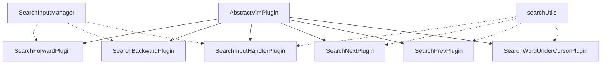

# Search Movement Plugins

## Overview

Search movement plugins provide pattern-based navigation functionality that allows you to quickly find and move to specific text patterns within your document. These are essential Vim commands for efficient code and text navigation.

## Available Commands

| Key | Plugin Name | Action | Description |
|------|--------------|--------|-------------|
| `/` | SearchForwardPlugin | Initiate forward search | Starts search input mode for forward searching |
| `?` | SearchBackwardPlugin | Initiate backward search | Starts search input mode for backward searching |
| `n` | SearchNextPlugin | Next match | Jumps to the next search match |
| `N` | SearchPrevPlugin | Previous match | Jumps to the previous search match |
| `*` | SearchWordUnderCursorPlugin | Search word under cursor | Searches for the word under the cursor |

## Architecture Overview

### Plugin Hierarchy



### Core Components

1. **Search Input Plugins** - Initiate search and manage mode transitions
2. **Search Input Handler** - Collects and manages search pattern input
3. **Search Navigation Plugins** - Navigate between search matches
4. **Search Utilities** - Core search algorithms and helper functions
5. **Search Input Manager** - State management for search input

## Usage Examples

### / - Initiate Forward Search

Starts a forward search by transitioning to SEARCH_INPUT mode and activating the search input manager.

```typescript
// Press '/' to start forward search
executor.handleKeystroke('/');
// Mode is now SEARCH_INPUT
// Search input manager is active with direction: 'forward'

// Type search pattern
executor.handleKeystroke('f');
executor.handleKeystroke('u');
executor.handleKeystroke('n');
executor.handleKeystroke('c');
executor.handleKeystroke('t');
executor.handleKeystroke('i');
executor.handleKeystroke('o');
executor.handleKeystroke('n');

// Press Enter to execute search
executor.handleKeystroke('Enter');
// Cursor moves to first occurrence of "function"
```

**Key characteristics:**
- Works in NORMAL and VISUAL modes
- Transitions to SEARCH_INPUT mode
- Resets search pattern and cursor position
- Sets search direction to 'forward'
- Does not execute in INSERT or COMMAND modes

### ? - Initiate Backward Search

Starts a backward search by transitioning to SEARCH_INPUT mode with backward direction.

```typescript
// Press '?' to start backward search
executor.handleKeystroke('?');
// Mode is now SEARCH_INPUT
// Search input manager is active with direction: 'backward'

// Type search pattern
executor.handleKeystroke('i');
executor.handleKeystroke('m');
executor.handleKeystroke('p');
executor.handleKeystroke('o');
executor.handleKeystroke('r');
executor.handleKeystroke('t');

// Press Enter to execute search
executor.handleKeystroke('Enter');
// Cursor moves to previous occurrence of "import"
```

**Key characteristics:**
- Works in NORMAL and VISUAL modes
- Transitions to SEARCH_INPUT mode
- Resets search pattern and cursor position
- Sets search direction to 'backward'
- Does not execute in INSERT or COMMAND modes

### n - Next Match

Jumps to the next search match based on the current search pattern and direction.

```typescript
// After performing a search
executor.handleKeystroke('n');
// Cursor moves to next occurrence of search pattern

// Use multiple times to navigate through all matches
executor.handleKeystroke('n');
executor.handleKeystroke('n');
// Cursor moves to third occurrence
```

**Key characteristics:**
- Works in NORMAL and VISUAL modes
- Uses the last search pattern
- Respects the search direction (forward/backward)
- Wraps around the buffer if enabled
- Does nothing if no search pattern exists

### N - Previous Match

Jumps to the previous search match based on the current search pattern and direction.

```typescript
// After performing a search
executor.handleKeystroke('N');
// Cursor moves to previous occurrence of search pattern

// Use multiple times to navigate backward through matches
executor.handleKeystroke('N');
executor.handleKeystroke('N');
// Cursor moves to third previous occurrence
```

**Key characteristics:**
- Works in NORMAL and VISUAL modes
- Uses the last search pattern
- Respects the search direction (forward/backward)
- Wraps around the buffer if enabled
- Does nothing if no search pattern exists

### * - Search Word Under Cursor

Automatically searches for the word under the cursor position.

```typescript
// Cursor is positioned on the word "example"
executor.handleKeystroke('*');
// Automatically searches for next occurrence of "example"

// Can be combined with n/N to navigate
executor.handleKeystroke('n');
// Cursor moves to next occurrence of "example"
```

**Key characteristics:**
- Works in NORMAL and VISUAL modes
- Extracts the word under the cursor
- Performs a forward search for the word
- Uses word boundary detection
- Does nothing if cursor is not on a word character

## Mode Transitions

### Search Input Mode

The search input mode is a special mode activated when initiating a search:

```
NORMAL/VISUAL → SEARCH_INPUT (on / or ?)
SEARCH_INPUT → NORMAL (on Enter or Escape)
```

**Search Input Mode Behavior:**
- Characters are added to the search pattern
- Backspace deletes characters from the pattern
- Enter executes the search
- Escape cancels the search
- Arrow keys move cursor within the pattern

### Mode Support Summary

| Plugin | NORMAL | VISUAL | INSERT | COMMAND | SEARCH_INPUT |
|--------|--------|--------|--------|---------|--------------|
| SearchForwardPlugin | ✓ | ✓ | ✗ | ✗ | ✗ |
| SearchBackwardPlugin | ✓ | ✓ | ✗ | ✗ | ✗ |
| SearchInputHandlerPlugin | ✗ | ✗ | ✗ | ✗ | ✓ |
| SearchNextPlugin | ✓ | ✓ | ✗ | ✗ | ✗ |
| SearchPrevPlugin | ✓ | ✓ | ✗ | ✗ | ✗ |
| SearchWordUnderCursorPlugin | ✓ | ✓ | ✗ | ✗ | ✗ |

## State Management

### Search State

The search system maintains the following state:

1. **Last Search Pattern** - The most recently used search pattern
2. **Search Direction** - The direction of the last search (forward/backward)
3. **Search History** - A history of search patterns for quick access
4. **Current Matches** - Array of all match positions for the current pattern

### SearchInputManager State

The [`SearchInputManager`](./utils/searchInputManager.ts) manages the search input state:

```typescript
interface SearchInputState {
  isActive: boolean;           // Whether search input is active
  direction: 'forward' | 'backward';  // Search direction
  pattern: string;             // The search pattern being built
  cursorPosition: number;      // Cursor position within the pattern
}
```

### State Transitions

```
Initial State:
  isActive: false
  pattern: ''
  direction: 'forward'

After pressing /:
  isActive: true
  direction: 'forward'
  pattern: ''
  cursorPosition: 0

After typing 'test':
  isActive: true
  direction: 'forward'
  pattern: 'test'
  cursorPosition: 4

After pressing Enter:
  isActive: false
  pattern: ''
  direction: 'forward'
  cursorPosition: 0
  (Search is executed with pattern 'test')
```

## Search Utilities

### searchUtils.ts Functions

The [`searchUtils.ts`](./utils/searchUtils.ts) module provides core search utility functions:

#### findAllMatches()

Finds all occurrences of a pattern in the buffer.

```typescript
import { findAllMatches } from './utils/searchUtils';

const buffer = new TextBuffer('hello world hello');
const pattern = /hello/g;
const matches = findAllMatches(buffer, pattern, 0, 'forward');
// Returns: [CursorPosition(0, 0), CursorPosition(0, 12)]
```

**Parameters:**
- `buffer` - The text buffer to search
- `pattern` - The regex pattern to search for
- `startLine` - Line to start searching from (default: 0)
- `direction` - Search direction: 'forward' or 'backward' (default: 'forward')

**Returns:** Array of positions where pattern was found

#### findNextMatch()

Finds the next match from current cursor position.

```typescript
import { findNextMatch } from './utils/searchUtils';

const matches = [new CursorPosition(0, 0), new CursorPosition(0, 5)];
const cursor = new CursorPosition(0, 0);
const next = findNextMatch(matches, cursor, 'forward', false);
// Returns: CursorPosition(0, 5)
```

**Parameters:**
- `matches` - Array of all match positions
- `cursor` - Current cursor position
- `direction` - Search direction: 'forward' or 'backward'
- `wrap` - Whether to wrap around buffer (default: false)

**Returns:** Next match position or null if no more matches

#### extractWordUnderCursor()

Extracts the word under the cursor position.

```typescript
import { extractWordUnderCursor } from './utils/searchUtils';

const buffer = new TextBuffer('hello world');
const cursor = new CursorPosition(0, 2);
const word = extractWordUnderCursor(buffer, cursor);
// Returns: 'hello'
```

**Parameters:**
- `buffer` - The text buffer
- `cursor` - Current cursor position

**Returns:** The word under cursor or null if not on a word

#### patternToRegex()

Converts a user-provided search pattern string into a RegExp object.

```typescript
import { patternToRegex } from './utils/searchUtils';

const regex = patternToRegex('hello');
// Returns: /hello/g

const invalid = patternToRegex('[unclosed');
// Returns: null

const empty = patternToRegex('');
// Returns: null
```

**Parameters:**
- `pattern` - User input pattern

**Returns:** RegExp object or null if invalid

### SearchInputManager Class

The [`SearchInputManager`](./utils/searchInputManager.ts) class provides methods for managing search input state:

#### Methods

- `start(direction)` - Start search input with specified direction
- `addChar(char)` - Add character to pattern at cursor position
- `deleteChar()` - Delete character before cursor
- `moveCursor(delta)` - Move cursor within pattern
- `cancel()` - Cancel search input and reset state
- `complete()` - Complete search input and return result
- `getState()` - Get current search input state
- `isActive()` - Check if search input is active

## Plugin Documentation

### SearchForwardPlugin

**File:** [`search-forward/SearchForwardPlugin.ts`](./search-forward/SearchForwardPlugin.ts)

Initiates forward search when `/` key is pressed.

**Key Features:**
- Activates search input manager with 'forward' direction
- Transitions to SEARCH_INPUT mode
- Resets any existing search state

**Example:**
```typescript
import { SearchForwardPlugin } from './search-forward/SearchForwardPlugin';
import { SearchInputManager } from './utils/searchInputManager';

const searchInputManager = new SearchInputManager();
const plugin = new SearchForwardPlugin(searchInputManager);
executor.registerPlugin(plugin);

// Press '/' to start forward search
executor.handleKeystroke('/');
```

### SearchBackwardPlugin

**File:** [`search-backward/SearchBackwardPlugin.ts`](./search-backward/SearchBackwardPlugin.ts)

Initiates backward search when `?` key is pressed.

**Key Features:**
- Activates search input manager with 'backward' direction
- Transitions to SEARCH_INPUT mode
- Resets any existing search state

**Example:**
```typescript
import { SearchBackwardPlugin } from './search-forward/SearchBackwardPlugin';
import { SearchInputManager } from './utils/searchInputManager';

const searchInputManager = new SearchInputManager();
const plugin = new SearchBackwardPlugin(searchInputManager);
executor.registerPlugin(plugin);

// Press '?' to start backward search
executor.handleKeystroke('?');
```

### SearchInputHandlerPlugin

**File:** [`search-input/SearchInputHandlerPlugin.ts`](./search-input/SearchInputHandlerPlugin.ts)

Handles character input during search input mode.

**Key Features:**
- Collects search pattern characters
- Handles backspace for deletion
- Handles Enter to execute search
- Handles Escape to cancel search
- Manages cursor position within pattern

**Example:**
```typescript
import { SearchInputHandlerPlugin } from './search-input/SearchInputHandlerPlugin';
import { SearchInputManager } from './utils/searchInputManager';

const searchInputManager = new SearchInputManager();
const plugin = new SearchInputHandlerPlugin(searchInputManager);
executor.registerPlugin(plugin);

// After pressing '/' to start search
executor.handleKeystroke('t');  // Add 't' to pattern
executor.handleKeystroke('e');  // Add 'e' to pattern
executor.handleKeystroke('s');  // Add 's' to pattern
executor.handleKeystroke('t');  // Add 't' to pattern
executor.handleKeystroke('Enter');  // Execute search
```

### SearchNextPlugin

**File:** [`search-next/SearchNextPlugin.ts`](./search-next/SearchNextPlugin.ts)

Jumps to the next search match when `n` key is pressed.

**Key Features:**
- Uses the last search pattern
- Respects search direction
- Supports wrap behavior
- Works in NORMAL and VISUAL modes

**Example:**
```typescript
import { SearchNextPlugin } from './search-next/SearchNextPlugin';

const plugin = new SearchNextPlugin();
executor.registerPlugin(plugin);

// After performing a search
executor.handleKeystroke('n');  // Go to next match
executor.handleKeystroke('n');  // Go to next match again
```

### SearchPrevPlugin

**File:** [`search-prev/SearchPrevPlugin.ts`](./search-prev/SearchPrevPlugin.ts)

Jumps to the previous search match when `N` key is pressed.

**Key Features:**
- Uses the last search pattern
- Respects search direction
- Supports wrap behavior
- Works in NORMAL and VISUAL modes

**Example:**
```typescript
import { SearchPrevPlugin } from './search-prev/SearchPrevPlugin';

const plugin = new SearchPrevPlugin();
executor.registerPlugin(plugin);

// After performing a search
executor.handleKeystroke('N');  // Go to previous match
executor.handleKeystroke('N');  // Go to previous match again
```

### SearchWordUnderCursorPlugin

**File:** [`search-word/SearchWordUnderCursorPlugin.ts`](./search-word/SearchWordUnderCursorPlugin.ts)

Searches for the word under the cursor when `*` key is pressed.

**Key Features:**
- Extracts word under cursor
- Performs forward search
- Uses word boundary detection
- Works in NORMAL and VISUAL modes

**Example:**
```typescript
import { SearchWordUnderCursorPlugin } from './search-word/SearchWordUnderCursorPlugin';

const plugin = new SearchWordUnderCursorPlugin();
executor.registerPlugin(plugin);

// Cursor is on the word "example"
executor.handleKeystroke('*');  // Search for next "example"
```

## Integration Notes

### Plugin Registration

Search plugins must be registered with the executor in the correct order:

```typescript
import { SearchForwardPlugin } from './search-forward/SearchForwardPlugin';
import { SearchBackwardPlugin } from './search-backward/SearchBackwardPlugin';
import { SearchInputHandlerPlugin } from './search-input/SearchInputHandlerPlugin';
import { SearchNextPlugin } from './search-next/SearchNextPlugin';
import { SearchPrevPlugin } from './search-prev/SearchPrevPlugin';
import { SearchWordUnderCursorPlugin } from './search-word/SearchWordUnderCursorPlugin';
import { SearchInputManager } from './utils/searchInputManager';

// Create shared search input manager
const searchInputManager = new SearchInputManager();

// Register plugins
executor.registerPlugin(new SearchForwardPlugin(searchInputManager));
executor.registerPlugin(new SearchBackwardPlugin(searchInputManager));
executor.registerPlugin(new SearchInputHandlerPlugin(searchInputManager));
executor.registerPlugin(new SearchNextPlugin());
executor.registerPlugin(new SearchPrevPlugin());
executor.registerPlugin(new SearchWordUnderCursorPlugin());
```

### Shared State Management

The `SearchInputManager` is shared between search initiation and input handler plugins to maintain consistent state:

```typescript
// Create once and share
const searchInputManager = new SearchInputManager();

// Pass to plugins that need it
const forwardPlugin = new SearchForwardPlugin(searchInputManager);
const backwardPlugin = new SearchBackwardPlugin(searchInputManager);
const inputHandlerPlugin = new SearchInputHandlerPlugin(searchInputManager);
```

### Search Pattern Persistence

Search patterns are persisted across search operations:

```typescript
// Perform first search
executor.handleKeystroke('/');
executor.handleKeystroke('p');
executor.handleKeystroke('a');
executor.handleKeystroke('t');
executor.handleKeystroke('t');
executor.handleKeystroke('e');
executor.handleKeystroke('r');
executor.handleKeystroke('n');
executor.handleKeystroke('Enter');

// Navigate through matches
executor.handleKeystroke('n');  // Next "pattern"
executor.handleKeystroke('n');  // Next "pattern"

// Start new search (pattern is preserved in history)
executor.handleKeystroke('/');
executor.handleKeystroke('f');
executor.handleKeystroke('u');
executor.handleKeystroke('n');
executor.handleKeystroke('c');
executor.handleKeystroke('t');
executor.handleKeystroke('i');
executor.handleKeystroke('o');
executor.handleKeystroke('n');
executor.handleKeystroke('Enter');

// Old pattern is still in history for recall
```

## Edge Cases

### Empty Buffer

All search commands handle empty buffers gracefully:

```typescript
// Empty buffer
const buffer = new TextBuffer([]);

// Search operations return null or no-op
executor.handleKeystroke('/');
executor.handleKeystroke('t');
executor.handleKeystroke('e');
executor.handleKeystroke('s');
executor.handleKeystroke('t');
executor.handleKeystroke('Enter');
// No matches found, cursor stays at (0, 0)
```

### No Matches Found

When no matches are found:

```typescript
// Search for pattern that doesn't exist
executor.handleKeystroke('/');
executor.handleKeystroke('n');
executor.handleKeystroke('o');
executor.handleKeystroke('m');
executor.handleKeystroke('a');
executor.handleKeystroke('t');
executor.handleKeystroke('c');
executor.handleKeystroke('h');
executor.handleKeystroke('Enter');
// Cursor stays at current position
// Message may be displayed (implementation dependent)
```

### Invalid Regex Patterns

Invalid regex patterns are handled gracefully:

```typescript
// Invalid pattern
executor.handleKeystroke('/');
executor.handleKeystroke('[');
executor.handleKeystroke('u');
executor.handleKeystroke('n');
executor.handleKeystroke('c');
executor.handleKeystroke('l');
executor.handleKeystroke('o');
executor.handleKeystroke('s');
executor.handleKeystroke('e');
executor.handleKeystroke('d');
executor.handleKeystroke('Enter');
// Pattern is rejected, search is not executed
```

### Cursor Not on Word

Word search with cursor not on a word character:

```typescript
// Cursor is on whitespace or non-word character
executor.handleKeystroke('*');
// No action taken, cursor stays at current position
```

## Performance Considerations

Search operations are optimized for performance:

- **Time Complexity**: O(n) where n is the total number of characters in the buffer
- **Space Complexity**: O(m) where m is the number of matches found
- **Pattern Compilation**: Regex patterns are compiled once per search
- **Match Caching**: Matches are cached for navigation between occurrences
- **Zero-Width Match Handling**: Prevents infinite loops for zero-width matches

### Performance Guidelines

1. **Use Specific Patterns**: More specific patterns find fewer matches and are faster
2. **Avoid Complex Regex**: Complex regex patterns can slow down search
3. **Limit Search Scope**: For large buffers, consider limiting search to visible region
4. **Cache Results**: Navigation between matches uses cached results

## Best Practices

1. **Use `*` for Quick Word Search**: When you need to find other occurrences of a word, place the cursor on it and press `*`.

2. **Use `n` and `N` for Navigation**: After performing a search, use `n` and `N` to navigate through matches quickly.

3. **Choose Direction Wisely**: Use `/` for forward search (most common) and `?` for backward search when you know the target is behind you.

4. **Use Regex for Complex Patterns**: Leverage regex patterns for advanced searching (e.g., `/function\s+\w+/`).

5. **Combine with Other Movements**: Search results can be combined with other movements for efficient navigation.

## Common Patterns

### Find Function Definition

```typescript
// Search for function definition
executor.handleKeystroke('/');
executor.handleKeystroke('f');
executor.handleKeystroke('u');
executor.handleKeystroke('n');
executor.handleKeystroke('c');
executor.handleKeystroke('t');
executor.handleKeystroke('i');
executor.handleKeystroke('o');
executor.handleKeystroke('n');
executor.handleKeystroke('Enter');
```

### Find Variable Usage

```typescript
// Place cursor on variable name and search
executor.handleKeystroke('*');
// Navigate through all usages
executor.handleKeystroke('n');
executor.handleKeystroke('n');
executor.handleKeystroke('n');
```

### Find All Imports

```typescript
// Search for import statements
executor.handleKeystroke('/');
executor.handleKeystroke('i');
executor.handleKeystroke('m');
executor.handleKeystroke('p');
executor.handleKeystroke('o');
executor.handleKeystroke('r');
executor.handleKeystroke('t');
executor.handleKeystroke('Enter');
```

### Find Error Messages

```typescript
// Search for error patterns
executor.handleKeystroke('/');
executor.handleKeystroke('e');
executor.handleKeystroke('r');
executor.handleKeystroke('r');
executor.handleKeystroke('o');
executor.handleKeystroke('r');
executor.handleKeystroke(':');
executor.handleKeystroke('Enter');
```

## See Also

- [MovementPlugin Base Class](./base/MovementPlugin.ts)
- [Search Utilities](./utils/searchUtils.ts)
- [Search Input Manager](./utils/searchInputManager.ts)
- [CONTRIBUTING.md](./CONTRIBUTING.md) - For creating new search plugins
- [Line Movement Plugins](./LINE_MOVEMENT.md)
- [Word Movement Plugins](./w/WMovementPlugin.ts)
