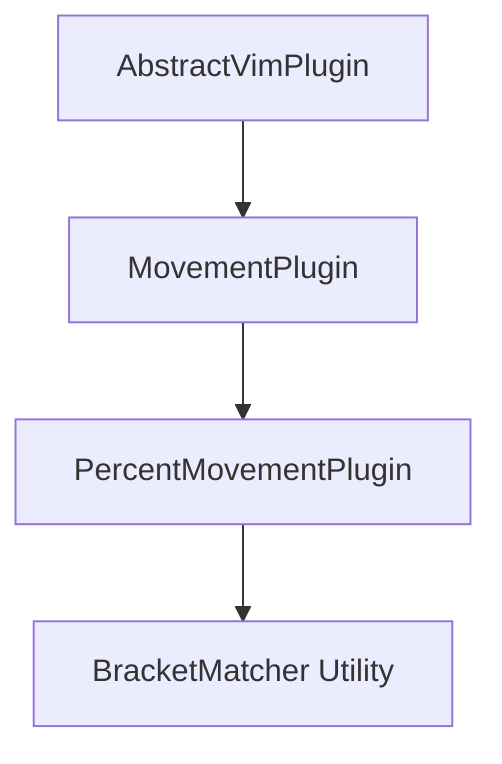

# Code Structure (Parentheses & Brackets) Implementation Plan

## Overview

This document provides a detailed implementation plan for the `%` (percent) keybinding, which enables bracket matching in the Vim engine. The `%` command jumps between matching pairs of parentheses `()`, square brackets `[]`, curly braces `{}`, and angle brackets `<>`, making it essential for navigating code blocks.

**Keybinding:** `%` - Match bracket  
**Plugin Category:** Code Matching (Category 7)  
**Base Class:** Direct `MovementPlugin` extension

---

## Architecture Overview

### Plugin Hierarchy



### Core Components

1. **PercentMovementPlugin** - Main plugin class extending `MovementPlugin`
2. **BracketMatcher** - Utility module for bracket matching algorithms
3. **BracketPair** - Type definitions for bracket pairs
4. **Test Suite** - Comprehensive unit and integration tests

---

## Implementation Phases

### Phase 1: Foundation and Type Definitions

**Objective:** Establish type definitions and utility infrastructure.

#### Tasks

1.1 **Create Bracket Types Module**
   - Location: `packages/vim-engine/src/plugins/movement/utils/bracketTypes.ts`
   - Define `BracketPair` interface:
     ```typescript
     interface BracketPair {
       open: string;
       close: string;
     }
     ```
   - Define all bracket pairs:
     - `()`, `[]`, `{}`, `<>`
   - Export bracket pair mappings and helper functions:
     - `isOpenBracket(char: string): boolean`
     - `isCloseBracket(char: string): boolean`
     - `getMatchingBracket(char: string): string | null`
     - `getBracketPair(char: string): BracketPair | null`

1.2 **Create BracketMatcher Utility Module**
   - Location: `packages/vim-engine/src/plugins/movement/utils/bracketMatcher.ts`
   - Implement core matching algorithm:
     - Stack-based bracket matching for nested structures
     - Direction-aware search (forward from open, backward from close)
     - Multi-line traversal support
   - Define public API:
     ```typescript
     interface MatchResult {
       line: number;
       column: number;
       found: boolean;
     }
     
     function findMatchingBracket(
       buffer: TextBuffer,
       cursor: CursorPosition
     ): MatchResult;
     ```

1.3 **Update Utilities Index**
   - Location: `packages/vim-engine/src/plugins/movement/utils/index.ts`
   - Add exports for new modules:
     ```typescript
     export * from './bracketTypes';
     export * from './bracketMatcher';
     ```

#### Deliverables
- `bracketTypes.ts` with complete type definitions
- `bracketMatcher.ts` with matching algorithm stub
- Updated `index.ts` with new exports
- Unit tests for bracket type utilities

#### Acceptance Criteria
- All bracket pairs are correctly defined
- Helper functions correctly identify bracket types
- Type definitions are exported and accessible

---

### Phase 2: Bracket Matching Algorithm Implementation

**Objective:** Implement the core bracket matching algorithm with support for nested structures.

#### Tasks

2.1 **Implement Single-Line Matching**
   - Handle cursor on opening bracket:
     - Search forward for matching closing bracket
     - Track nesting depth with stack
     - Stop when depth returns to zero
   - Handle cursor on closing bracket:
     - Search backward for matching opening bracket
     - Track nesting depth with stack
     - Stop when depth returns to zero

2.2 **Implement Multi-Line Traversal**
   - Forward search:
     - Start from cursor position on current line
     - Search to end of line, then continue to next lines
     - Track bracket stack across line boundaries
   - Backward search:
     - Start from cursor position on current line
     - Search to start of line, then continue to previous lines
     - Track bracket stack across line boundaries

2.3 **Implement Edge Case Handling**
   - Unmatched brackets:
     - Return cursor position unchanged
     - No error thrown, graceful degradation
   - Cursor not on bracket:
     - Search forward for next opening bracket
     - If found, jump to its matching closing bracket
     - If not found, return cursor position unchanged
   - Nested brackets:
     - Correctly handle arbitrary nesting depth
     - Maintain stack integrity across multiple levels
   - Empty buffer:
     - Return cursor position unchanged

2.4 **Optimization Considerations**
   - Early termination when match found
   - Limit search range (configurable max lines)
   - Avoid unnecessary string allocations
   - Reuse stack object for multiple searches

#### Algorithm Pseudocode

```
function findMatchingBracket(buffer, cursor):
    currentChar = buffer.getChar(cursor)
    
    if isOpenBracket(currentChar):
        return findMatchingClose(buffer, cursor, currentChar)
    else if isCloseBracket(currentChar):
        return findMatchingOpen(buffer, cursor, currentChar)
    else:
        return findNextBracketAndMatch(buffer, cursor)

function findMatchingClose(buffer, cursor, openChar):
    expectedClose = getMatchingBracket(openChar)
    depth = 1
    line = cursor.line
    column = cursor.column + 1
    
    while line < buffer.getLineCount():
        lineContent = buffer.getLine(line)
        
        while column < lineContent.length:
            char = lineContent[column]
            
            if char === openChar:
                depth++
            else if char === expectedClose:
                depth--
                if depth === 0:
                    return { line, column, found: true }
            
            column++
        
        line++
        column = 0
    
    return { line: cursor.line, column: cursor.column, found: false }

function findMatchingOpen(buffer, cursor, closeChar):
    expectedOpen = getMatchingBracket(closeChar)
    depth = 1
    line = cursor.line
    column = cursor.column - 1
    
    while line >= 0:
        lineContent = buffer.getLine(line)
        
        while column >= 0:
            char = lineContent[column]
            
            if char === closeChar:
                depth++
            else if char === expectedOpen:
                depth--
                if depth === 0:
                    return { line, column, found: true }
            
            column--
        
        line--
        if line >= 0:
            lineContent = buffer.getLine(line)
            column = lineContent.length - 1
    
    return { line: cursor.line, column: cursor.column, found: false }

function findNextBracketAndMatch(buffer, cursor):
    // Search forward for next opening bracket
    // Then find its matching closing bracket
    // Return cursor position if no bracket found
```

#### Deliverables
- Complete `bracketMatcher.ts` implementation
- Unit tests for matching algorithm
- Performance benchmarks

#### Acceptance Criteria
- Correctly matches all bracket types
- Handles nested brackets of any depth
- Works across multiple lines
- Gracefully handles unmatched brackets
- Performance meets targets (< 1ms for typical cases)

---

### Phase 3: PercentMovementPlugin Implementation

**Objective:** Create the main plugin class that integrates the bracket matching algorithm.

#### Tasks

3.1 **Create Plugin Directory Structure**
   ```
   packages/vim-engine/src/plugins/movement/percent/
   ├── PercentMovementPlugin.ts
   └── index.ts
   ```

3.2 **Implement PercentMovementPlugin Class**
   - Location: `packages/vim-engine/src/plugins/movement/percent/PercentMovementPlugin.ts`
   - Extend `MovementPlugin` directly (not a specialized subclass)
   - Define plugin metadata:
     ```typescript
     readonly name = 'movement-percent';
     readonly version = '1.0.0';
     readonly description = 'Jump to matching bracket (% key)';
     readonly patterns = ['%'];
     readonly modes: VimMode[] = [VIM_MODE.NORMAL, VIM_MODE.VISUAL];
     ```
   - Implement `calculateNewPosition()`:
     - Use `findMatchingBracket()` utility
     - Return matching position or current position if not found
     - Handle all edge cases

3.3 **Create Index File**
   - Location: `packages/vim-engine/src/plugins/movement/percent/index.ts`
   - Export plugin class:
     ```typescript
     export { PercentMovementPlugin } from './PercentMovementPlugin';
     ```

3.4 **Update Main Movement Index**
   - Location: `packages/vim-engine/src/plugins/movement/index.ts`
   - Add plugin export:
     ```typescript
     export { PercentMovementPlugin } from './percent';
     ```

#### Deliverables
- Complete `PercentMovementPlugin.ts` implementation
- Index file with proper exports
- Updated main movement index

#### Acceptance Criteria
- Plugin follows established patterns
- Properly integrates with base class
- Exports are correctly configured
- Plugin metadata is accurate

---

### Phase 4: Comprehensive Testing

**Objective:** Create a robust test suite covering all scenarios and edge cases.

#### Tasks

4.1 **Create Unit Test File**
   - Location: `packages/vim-engine/src/plugins/movement/percent/PercentMovementPlugin.test.ts`
   - Follow existing test patterns from `ZeroMovementPlugin.test.ts`

4.2 **Implement Test Categories**

   **Metadata Tests:**
   - Correct name, version, description
   - Correct pattern (`%`)
   - Correct mode support (NORMAL, VISUAL)
   - Pattern validation

   **Basic Movement Tests:**
   - Jump from opening `(` to closing `)`
   - Jump from opening `[` to closing `]`
   - Jump from opening `{` to closing `}`
   - Jump from opening `<` to closing `>`
   - Jump from closing to opening brackets
   - Jump from any position on bracket character

   **Nested Bracket Tests:**
   - Single level nesting: `(())`
   - Multiple levels: `(((())))`
   - Mixed bracket types: `({[]})`
   - Deep nesting (10+ levels)
   - Correct matching in complex structures

   **Multi-Line Tests:**
   - Brackets spanning multiple lines
   - Matching across line boundaries
   - Nested brackets across lines
   - Cursor at various line positions

   **Edge Case Tests:**
   - Cursor not on bracket (search forward)
   - No bracket found (stay at cursor)
   - Unmatched opening bracket (stay at cursor)
   - Unmatched closing bracket (stay at cursor)
   - Empty buffer (stay at cursor)
   - Single line with no brackets
   - Brackets in comments/strings (treat as regular characters)

   **Mode Restriction Tests:**
   - Execute in NORMAL mode
   - Execute in VISUAL mode
   - Not execute in INSERT mode
   - Not execute in COMMAND mode

   **Performance Tests:**
   - Large buffer performance (1000+ lines)
   - Deep nesting performance
   - Multiple consecutive operations

4.3 **Create Utility Tests**
   - Location: `packages/vim-engine/src/plugins/movement/utils/bracketTypes.test.ts`
   - Test all bracket type functions
   - Test bracket pair mappings

4.4 **Create Matcher Tests**
   - Location: `packages/vim-engine/src/plugins/movement/utils/bracketMatcher.test.ts`
   - Test matching algorithm in isolation
   - Test edge cases
   - Test performance

#### Deliverables
- Complete test suite for `PercentMovementPlugin`
- Complete test suite for `bracketTypes`
- Complete test suite for `bracketMatcher`
- All tests passing

#### Acceptance Criteria
- Test coverage > 90% for plugin code
- Test coverage = 100% for utility code
- All edge cases covered
- Tests follow existing patterns
- Performance benchmarks meet targets

---

### Phase 5: Integration and Documentation

**Objective:** Integrate the plugin with the existing codebase and create documentation.

#### Tasks

5.1 **Integration Testing**
   - Test plugin registration in PluginRegistry
   - Test plugin execution through VimExecutor
   - Test interaction with other movement plugins
   - Test visual mode behavior

5.2 **Create Plugin Documentation**
   - Add JSDoc comments to all public methods
   - Include usage examples
   - Document behavior for edge cases
   - Reference related utilities

5.3 **Update CONTRIBUTING.md**
   - Add entry for Category 7 (Code Matching)
   - Include `%` plugin as example
   - Document bracket matching patterns

5.4 **Create Integration Test**
   - Location: `packages/vim-engine/tests/integration/bracket-matching-integration.test.ts`
   - Test real-world scenarios:
     - Navigating function definitions
     - Navigating object literals
     - Navigating array structures
     - Navigating nested code blocks

#### Deliverables
- Integration test suite
- Updated documentation
- Updated CONTRIBUTING.md
- All integration tests passing

#### Acceptance Criteria
- Plugin integrates seamlessly
- Documentation is comprehensive
- Examples are clear and accurate
- Integration tests cover realistic scenarios

---

### Phase 6: Performance Optimization and Validation

**Objective:** Ensure the plugin meets performance requirements and handles edge cases gracefully.

#### Tasks

6.1 **Performance Profiling**
   - Benchmark bracket matching on various buffer sizes
   - Identify bottlenecks
   - Optimize hot paths

6.2 **Edge Case Validation**
   - Test with extremely large buffers (10,000+ lines)
   - Test with extremely deep nesting (100+ levels)
   - Test with mixed bracket types at various depths
   - Test memory usage patterns

6.3 **Error Handling Validation**
   - Ensure no crashes on invalid input
   - Ensure graceful degradation on unmatched brackets
   - Ensure no memory leaks

6.4 **Cross-Browser/Environment Testing**
   - Test in Node.js environment
   - Test in browser environment (if applicable)
   - Verify consistent behavior

#### Deliverables
- Performance benchmarks
- Optimization report
- Edge case validation results
- Cross-environment test results

#### Acceptance Criteria
- Single bracket match < 0.5ms (typical case)
- Multi-line match < 2ms (typical case)
- No memory leaks detected
- Consistent behavior across environments

---

## File Structure

```
packages/vim-engine/src/plugins/movement/
├── percent/
│   ├── PercentMovementPlugin.ts
│   ├── PercentMovementPlugin.test.ts
│   └── index.ts
├── utils/
│   ├── bracketTypes.ts
│   ├── bracketTypes.test.ts
│   ├── bracketMatcher.ts
│   ├── bracketMatcher.test.ts
│   └── index.ts (updated)
└── index.ts (updated)

packages/vim-engine/tests/
└── integration/
    └── bracket-matching-integration.test.ts

plans/
└── code-structure-brackets-plan.md (this file)
```

---

## Key Design Decisions

### 1. Base Class Selection

**Decision:** Extend `MovementPlugin` directly instead of creating a specialized base class.

**Rationale:**
- The `%` command has unique behavior that doesn't fit existing patterns
- No other code matching commands exist yet
- Keeps the plugin hierarchy simple
- Can create a specialized base class if similar commands are added later

### 2. Utility Module Organization

**Decision:** Create separate `bracketTypes` and `bracketMatcher` utility modules.

**Rationale:**
- Separates concerns (type definitions vs. algorithm)
- Makes testing easier
- Allows utilities to be reused by other plugins
- Follows existing utility organization patterns

### 3. Matching Algorithm

**Decision:** Use stack-based algorithm with direction-aware search.

**Rationale:**
- Efficient for nested structures
- Handles arbitrary nesting depth
- Easy to understand and maintain
- Performs well for typical code structures

### 4. Edge Case Handling

**Decision:** Graceful degradation (return cursor unchanged) for unmatched brackets.

**Rationale:**
- Matches Vim's behavior
- Prevents confusing cursor jumps
- No error messages needed
- User can continue working

### 5. Cursor Not on Bracket Behavior

**Decision:** Search forward for next opening bracket and match it.

**Rationale:**
- Matches Vim's behavior
- Useful for navigating to next code block
- Provides predictable behavior
- Consistent with Vim's philosophy

---

## Testing Strategy

### Unit Tests

**Coverage Targets:**
- Plugin implementation: > 90%
- Utility functions: 100%
- Edge cases: 100%

**Test Categories:**
1. Metadata validation
2. Basic movement scenarios
3. Nested bracket handling
4. Multi-line traversal
5. Edge cases (empty buffer, unmatched brackets, etc.)
6. Mode restrictions
7. Performance benchmarks

### Integration Tests

**Scenarios:**
1. Plugin registration and execution
2. Interaction with other movement plugins
3. Visual mode behavior
4. Real-world code navigation patterns

### Performance Tests

**Benchmarks:**
- Single-line bracket match: < 0.1ms
- Multi-line bracket match: < 1ms
- Deep nesting (10+ levels): < 0.5ms
- Large buffer (1000+ lines): < 2ms

---

## Risk Mitigation

### Risk 1: Performance Issues with Large Buffers

**Mitigation:**
- Implement search range limits
- Early termination when match found
- Avoid unnecessary string allocations
- Performance testing with large buffers

### Risk 2: Incorrect Matching in Complex Scenarios

**Mitigation:**
- Comprehensive test suite
- Edge case coverage
- Integration testing with real code
- Manual validation against Vim behavior

### Risk 3: Memory Leaks from Stack Objects

**Mitigation:**
- Reuse stack objects where possible
- Memory profiling
- Test with repeated operations

### Risk 4: Integration Issues with Existing Codebase

**Mitigation:**
- Follow established patterns
- Integration testing
- Code review against existing plugins
- Gradual rollout approach

---

## Success Criteria

### Functional Requirements

- [ ] Plugin correctly matches all bracket types: `()`, `[]`, `{}`, `<>`
- [ ] Plugin handles nested brackets of any depth
- [ ] Plugin works across multiple lines
- [ ] Plugin gracefully handles unmatched brackets
- [ ] Plugin handles cursor not on bracket
- [ ] Plugin works in NORMAL and VISUAL modes
- [ ] Plugin does not execute in INSERT or COMMAND modes

### Performance Requirements

- [ ] Single bracket match < 0.5ms (typical case)
- [ ] Multi-line match < 2ms (typical case)
- [ ] No memory leaks detected
- [ ] Handles large buffers (1000+ lines) efficiently

### Quality Requirements

- [ ] Test coverage > 90% for plugin code
- [ ] Test coverage = 100% for utility code
- [ ] All tests passing
- [ ] Code follows existing patterns
- [ ] Documentation is complete
- [ ] Integration tests passing

### Integration Requirements

- [ ] Plugin registers correctly in PluginRegistry
- [ ] Plugin executes correctly through VimExecutor
- [ ] Plugin works with other movement plugins
- [ ] Visual mode behavior is correct

---

## Dependencies

### Internal Dependencies

- `MovementPlugin` (base class)
- `TextBuffer` (for accessing buffer content)
- `CursorPosition` (for cursor positioning)
- `VimMode` (for mode constants)
- `ExecutionContext` (for execution context)

### External Dependencies

- None (pure TypeScript implementation)

---

## Timeline Considerations

### Estimated Phase Durations

- **Phase 1:** Foundation and Type Definitions - 1-2 hours
- **Phase 2:** Bracket Matching Algorithm - 2-3 hours
- **Phase 3:** PercentMovementPlugin Implementation - 1-2 hours
- **Phase 4:** Comprehensive Testing - 3-4 hours
- **Phase 5:** Integration and Documentation - 1-2 hours
- **Phase 6:** Performance Optimization and Validation - 1-2 hours

**Total Estimated Time:** 9-15 hours

### Critical Path

1. Phase 1 (Foundation) → Phase 2 (Algorithm) → Phase 3 (Plugin) → Phase 4 (Testing)

Phases 5 and 6 can run in parallel with Phase 4 once basic implementation is complete.

---

## Future Enhancements

### Potential Future Features

1. **Custom Bracket Pairs**
   - Allow users to define custom bracket pairs
   - Configuration option for additional bracket types

2. **Bracket Highlighting**
   - Highlight matching brackets when cursor is on one
   - Visual feedback for bracket matching

3. **Bracket Counting**
   - Show nesting depth in status bar
   - Display bracket pair information

4. **Smart Bracket Navigation**
   - Jump to outer/inner brackets
   - Navigate between sibling brackets

5. **Bracket-Related Text Objects**
   - Implement text objects like `i(`, `a[`, etc.
   - Select contents between matching brackets

---

## References

### Internal Documentation

- [`CONTRIBUTING.md`](../packages/vim-engine/src/plugins/movement/CONTRIBUTING.md) - Movement plugin development guide
- [`vim-movement-keybindings.md`](../docs/vim-movement-keybindings.md) - Keybindings reference
- Existing movement plugins (h, j, k, l, w, b, e, 0, $, etc.)

### External Resources

- [Vim Documentation: %](https://vimdoc.sourceforge.net/htmldoc/motion.html#%)
- [Vim Motion Documentation](https://vimdoc.sourceforge.net/htmldoc/motion.html)
- [Vim Tips: Bracket Matching](https://vim.fandom.com/wiki/Matching_brackets)

---

## Appendix: Test Case Examples

### Example Test Cases

```typescript
// Test 1: Basic bracket matching
it('should jump from opening to closing parenthesis', () => {
  const state = new VimState('function test(arg1, arg2) { return; }');
  state.cursor = new CursorPosition(0, 9); // On opening '('
  const context = new ExecutionContext(state);
  context.setMode(VIM_MODE.NORMAL);

  plugin.execute(context);

  expect(context.getCursor().column).toBe(23); // On closing ')'
});

// Test 2: Nested brackets
it('should handle nested parentheses', () => {
  const state = new VimState('func((a + b) * (c + d))');
  state.cursor = new CursorPosition(0, 5); // On first '('
  const context = new ExecutionContext(state);
  context.setMode(VIM_MODE.NORMAL);

  plugin.execute(context);

  expect(context.getCursor().column).toBe(22); // On matching ')'
});

// Test 3: Multi-line brackets
it('should match brackets across multiple lines', () => {
  const state = new VimState('function test(\n  arg1,\n  arg2\n) {');
  state.cursor = new CursorPosition(0, 14); // On opening '('
  const context = new ExecutionContext(state);
  context.setMode(VIM_MODE.NORMAL);

  plugin.execute(context);

  expect(context.getCursor().line).toBe(3);
  expect(context.getCursor().column).toBe(0); // On closing ')'
});

// Test 4: Mixed bracket types
it('should handle mixed bracket types', () => {
  const state = new VimState('const obj = { arr: [1, 2, { val: 3 }] };');
  state.cursor = new CursorPosition(0, 12); // On opening '{'
  const context = new ExecutionContext(state);
  context.setMode(VIM_MODE.NORMAL);

  plugin.execute(context);

  expect(context.getCursor().column).toBe(36); // On matching '}'
});

// Test 5: Cursor not on bracket
it('should search forward when cursor not on bracket', () => {
  const state = new VimState('const x = (1 + 2);');
  state.cursor = new CursorPosition(0, 7); // On '='
  const context = new ExecutionContext(state);
  context.setMode(VIM_MODE.NORMAL);

  plugin.execute(context);

  expect(context.getCursor().column).toBe(15); // On closing ')'
});

// Test 6: Unmatched bracket
it('should stay at cursor when bracket is unmatched', () => {
  const state = new VimState('const x = (1 + 2;');
  state.cursor = new CursorPosition(0, 9); // On opening '('
  const context = new ExecutionContext(state);
  context.setMode(VIM_MODE.NORMAL);

  plugin.execute(context);

  expect(context.getCursor().column).toBe(9); // Stay at cursor
});
```

---

## Conclusion

This implementation plan provides a comprehensive roadmap for implementing the `%` (percent) keybinding for bracket matching in the Vim engine. The plan is organized into six executable phases, each with clear tasks, deliverables, and acceptance criteria.

The implementation follows established patterns from existing movement plugins, ensures comprehensive test coverage, and addresses all edge cases and performance considerations. The result will be a robust, performant, and well-tested plugin that matches Vim's behavior for the `%` command.

Once implemented, this plugin will enable users to efficiently navigate code structures by jumping between matching brackets, a fundamental feature for code editing and navigation.
