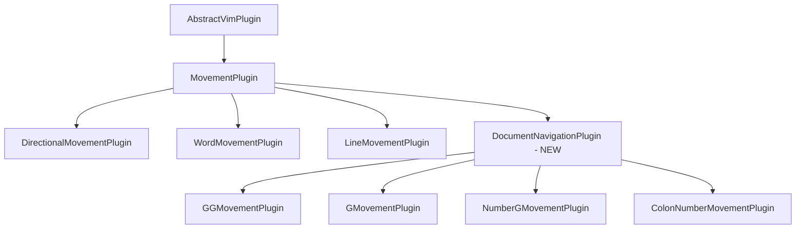

# Document Navigation Implementation Plan

## Overview

This plan outlines the implementation of Document Navigation keybindings for the Vim engine, specifically:
- `gg`: Jump to the first line of the document
- `G`: Jump to the last line of the document
- `:10`: Jump to a specific line number (command-line syntax)
- `10G`: Jump to a specific line number (count prefix syntax)

## Table of Contents

1. [Architecture Analysis](#architecture-analysis)
2. [Implementation Phases](#implementation-phases)
3. [Plugin Structure](#plugin-structure)
4. [Edge Cases and Error Handling](#edge-cases-and-error-handling)
5. [Test Strategy](#test-strategy)
6. [Integration Considerations](#integration-considerations)
7. [Execution Checklist](#execution-checklist)

---

## Architecture Analysis

### Existing Plugin Hierarchy

Based on the existing codebase, the plugin architecture follows this pattern:



### Key Architectural Decisions

1. **Base Class Selection**: Document navigation plugins should extend `MovementPlugin` directly, not specialized subclasses like `LineMovementPlugin` or `DirectionalMovementPlugin`, because:
   - They involve absolute line positioning (not line-relative)
   - They require access to buffer line count
   - They have unique count prefix handling requirements

2. **Pattern Registration**: The `CommandRouter` supports:
   - Single character patterns (e.g., 'G')
   - Multi-character sequences (e.g., 'gg')
   - Count prefix handling (e.g., '10G')

3. **Command-Line Syntax**: The `:number` syntax requires special handling:
   - It's a command-line style command, not a keystroke pattern
   - Requires parsing of the colon character followed by digits
   - May need integration with a command-line system or special handling in the executor

---

## Implementation Phases

### Phase 1: Create Document Navigation Base Plugin

**Objective**: Create a base class for document navigation movements to share common functionality.

**Tasks**:

1.1 Create base plugin class `DocumentNavigationPlugin`
   - Extend `MovementPlugin`
   - Location: `packages/vim-engine/src/plugins/movement/base/DocumentNavigationPlugin.ts`
   - Implement common methods:
     - `clampLine(line: number, buffer: TextBuffer): number` - Clamp line to valid buffer range
     - `getTargetLine(cursor: CursorPosition, buffer: TextBuffer, config: Required<MovementConfig>): number` - Abstract method for subclasses
     - `calculateNewPosition()` - Override from MovementPlugin to use getTargetLine

1.2 Create index file for base plugin
   - Location: `packages/vim-engine/src/plugins/movement/base/index.ts`
   - Export `DocumentNavigationPlugin`

**Deliverables**:
- `DocumentNavigationPlugin.ts` with base implementation
- Updated `base/index.ts` with export

**Dependencies**: None

---

### Phase 2: Implement `gg` Movement Plugin

**Objective**: Create plugin for jumping to the first line of the document.

**Tasks**:

2.1 Create `GGMovementPlugin`
   - Location: `packages/vim-engine/src/plugins/movement/gg/GGMovementPlugin.ts`
   - Pattern: `['gg']`
   - Modes: `[VIM_MODE.NORMAL, VIM_MODE.VISUAL]`
   - Implement `getTargetLine()` to always return 0

2.2 Create index file
   - Location: `packages/vim-engine/src/plugins/movement/gg/index.ts`
   - Export `GGMovementPlugin`

2.3 Update main movement index
   - Location: `packages/vim-engine/src/plugins/movement/index.ts`
   - Add: `export * from './gg';`

**Deliverables**:
- `GGMovementPlugin.ts` with implementation
- `gg/index.ts` with export
- Updated `movement/index.ts`

**Dependencies**: Phase 1 complete

---

### Phase 3: Implement `G` Movement Plugin

**Objective**: Create plugin for jumping to the last line of the document.

**Tasks**:

3.1 Create `GMovementPlugin`
   - Location: `packages/vim-engine/src/plugins/movement/G/GMovementPlugin.ts`
   - Pattern: `['G']`
   - Modes: `[VIM_MODE.NORMAL, VIM_MODE.VISUAL]`
   - Implement `getTargetLine()` to return `buffer.getLineCount() - 1`

3.2 Create index file
   - Location: `packages/vim-engine/src/plugins/movement/G/index.ts`
   - Export `GMovementPlugin`

3.3 Update main movement index
   - Location: `packages/vim-engine/src/plugins/movement/index.ts`
   - Add: `export * from './G';`

**Deliverables**:
- `GMovementPlugin.ts` with implementation
- `G/index.ts` with export
- Updated `movement/index.ts`

**Dependencies**: Phase 1 complete

---

### Phase 4: Implement `numberG` Movement Plugin

**Objective**: Create plugin for jumping to a specific line using count prefix (e.g., `10G`).

**Tasks**:

4.1 Create `NumberGMovementPlugin`
   - Location: `packages/vim-engine/src/plugins/movement/numberG/NumberGMovementPlugin.ts`
   - Pattern: `['G']` (same as Phase 3, but handles count prefix)
   - Modes: `[VIM_MODE.NORMAL, VIM_MODE.VISUAL]`
   - Implement `getTargetLine()` to use `config.step - 1` (Vim uses 1-based line numbers, config.step is the count)
   - Handle edge case: If count is 0 or not provided, jump to last line (same as `G`)

4.2 Create index file
   - Location: `packages/vim-engine/src/plugins/movement/numberG/index.ts`
   - Export `NumberGMovementPlugin`

4.3 Update main movement index
   - Location: `packages/vim-engine/src/plugins/movement/index.ts`
   - Add: `export * from './numberG';`

**Note**: This plugin may need to be merged with `GMovementPlugin` since they both handle the 'G' pattern. The decision should be:
- Option A: Single plugin that handles both `G` (no count) and `numberG` (with count)
- Option B: Separate plugins with pattern priority

**Deliverables**:
- `NumberGMovementPlugin.ts` with implementation (or merged with GMovementPlugin)
- `numberG/index.ts` with export (if separate)
- Updated `movement/index.ts`

**Dependencies**: Phase 1 complete

---

### Phase 5: Implement `:number` Command-Line Syntax

**Objective**: Create plugin for jumping to a specific line using command-line syntax (e.g., `:10`).

**Analysis Required**:

Before implementation, investigate:
1. Does the codebase have an existing command-line system?
2. How does the `VimExecutor` handle the colon (`:`) character?
3. Is there a command mode that needs to be activated?

**Tasks**:

5.1 Investigation
   - Search for existing command-line or command mode implementations
   - Check if `:` is handled by any existing plugin
   - Review `VimExecutor.handleKeystroke()` for command-line handling

5.2 Create `ColonNumberMovementPlugin` (if no existing command-line system)
   - Location: `packages/vim-engine/src/plugins/movement/colonNumber/ColonNumberMovementPlugin.ts`
   - Pattern: `[':']` (or more specific pattern based on investigation)
   - Modes: `[VIM_MODE.NORMAL, VIM_MODE.VISUAL]`
   - Implement command parsing:
     - Buffer keystrokes after `:`
     - Parse digits to extract line number
     - Execute jump on Enter key
     - Cancel on Escape key

5.3 Alternative: Integrate with existing command-line system
   - If a command-line system exists, create a command handler for line numbers
   - Location: Depends on existing system structure

5.4 Create index file
   - Location: `packages/vim-engine/src/plugins/movement/colonNumber/index.ts`
   - Export plugin

5.5 Update main movement index
   - Location: `packages/vim-engine/src/plugins/movement/index.ts`
   - Add: `export * from './colonNumber';`

**Deliverables**:
- Investigation report on command-line system
- `ColonNumberMovementPlugin.ts` with implementation (or integration with existing system)
- `colonNumber/index.ts` with export
- Updated `movement/index.ts`

**Dependencies**: Phase 1 complete, investigation complete

---

### Phase 6: Write Unit Tests

**Objective**: Create comprehensive unit tests for all document navigation plugins.

**Tasks**:

6.1 Test `GGMovementPlugin`
   - Location: `packages/vim-engine/src/plugins/movement/gg/GGMovementPlugin.test.ts`
   - Test cases:
     - Metadata tests (name, version, description, patterns, modes)
     - Basic movement: Jump to line 0 from any position
     - Empty buffer handling
     - Single line buffer
     - Multi-line buffer
     - Visual mode support

6.2 Test `GMovementPlugin`
   - Location: `packages/vim-engine/src/plugins/movement/G/GMovementPlugin.test.ts`
   - Test cases:
     - Metadata tests
     - Basic movement: Jump to last line from any position
     - Empty buffer handling
     - Single line buffer
     - Multi-line buffer
     - Visual mode support

6.3 Test `NumberGMovementPlugin` (or merged GMovementPlugin)
   - Location: `packages/vim-engine/src/plugins/movement/numberG/NumberGMovementPlugin.test.ts`
   - Test cases:
     - Metadata tests
     - Count prefix: `10G` jumps to line 10
     - Count prefix with large numbers
     - Count prefix beyond buffer size (clamp to last line)
     - Count prefix of 0 (jump to last line)
     - No count prefix (jump to last line)
     - Invalid count handling

6.4 Test `ColonNumberMovementPlugin`
   - Location: `packages/vim-engine/src/plugins/movement/colonNumber/ColonNumberMovementPlugin.test.ts`
   - Test cases:
     - Metadata tests
     - Basic command: `:10<Enter>` jumps to line 10
     - Single digit: `:5<Enter>` jumps to line 5
     - Large numbers: `:9999<Enter>` clamps to last line
     - Invalid numbers: `:abc<Enter>` shows error or cancels
     - Cancel with Escape: `:10<Esc>` cancels without jumping
     - Empty command: `:<Enter>` cancels or shows error
     - Visual mode support

6.5 Test `DocumentNavigationPlugin` base class
   - Location: `packages/vim-engine/src/plugins/movement/base/DocumentNavigationPlugin.test.ts`
   - Test cases:
     - `clampLine()` method
     - Column preservation across line changes
     - Empty buffer handling

**Deliverables**:
- Complete test suites for all plugins
- Minimum 90% code coverage per CONTRIBUTING.md requirements

**Dependencies**: Phases 2-5 complete

---

### Phase 7: Integration Tests

**Objective**: Create integration tests to verify plugins work correctly with the Vim engine.

**Tasks**:

7.1 Create integration test file
   - Location: `packages/vim-engine/tests/integration/document-navigation-integration.test.ts`
   - Test scenarios:
     - Register plugins with `VimExecutor`
     - Execute `gg` and verify cursor position
     - Execute `G` and verify cursor position
     - Execute `10G` and verify cursor position
     - Execute `:10<Enter>` and verify cursor position
     - Test with various buffer sizes
     - Test with empty buffers
     - Test in NORMAL and VISUAL modes
     - Test column preservation after line jumps

7.2 Test plugin registration
   - Verify all plugins are properly exported
   - Verify pattern registration with `CommandRouter`
   - Verify plugin priority and conflict resolution

**Deliverables**:
- Integration test file
- All tests passing

**Dependencies**: Phases 2-6 complete

---

### Phase 8: Documentation

**Objective**: Update project documentation to reflect new plugins.

**Tasks**:

8.1 Update CONTRIBUTING.md
   - Add Document Navigation to plugin categories
   - Document the new base class `DocumentNavigationPlugin`
   - Add implementation examples for document navigation plugins

8.2 Update LINE_MOVEMENT.md (if applicable)
   - Document document navigation commands
   - Add usage examples

8.3 Create README for document navigation
   - Location: `packages/vim-engine/src/plugins/movement/DOCUMENT_NAVIGATION.md`
   - Document all document navigation commands
   - Provide examples and use cases

**Deliverables**:
- Updated CONTRIBUTING.md
- Updated LINE_MOVEMENT.md (if applicable)
- New DOCUMENT_NAVIGATION.md

**Dependencies**: Phases 2-7 complete

---

## Plugin Structure

### Directory Structure

```
packages/vim-engine/src/plugins/movement/
├── base/
│   ├── MovementPlugin.ts (existing)
│   ├── DirectionalMovementPlugin.ts (existing)
│   ├── LineMovementPlugin.ts (existing)
│   ├── WordMovementPlugin.ts (existing)
│   ├── DocumentNavigationPlugin.ts (NEW)
│   └── index.ts (update)
├── gg/
│   ├── GGMovementPlugin.ts (NEW)
│   └── index.ts (NEW)
├── G/
│   ├── GMovementPlugin.ts (NEW)
│   └── index.ts (NEW)
├── numberG/
│   ├── NumberGMovementPlugin.ts (NEW - may merge with G)
│   └── index.ts (NEW)
├── colonNumber/
│   ├── ColonNumberMovementPlugin.ts (NEW)
│   └── index.ts (NEW)
└── index.ts (update)
```

### Plugin Template

```typescript
/**
 * XMovementPlugin - Brief description
 *
 * Detailed description of what this plugin does.
 *
 * @example
 * ```typescript
 * import { XMovementPlugin } from './x/XMovementPlugin';
 *
 * const plugin = new XMovementPlugin();
 * executor.registerPlugin(plugin);
 * executor.handleKeystroke('x');
 * ```
 *
 * @see DocumentNavigationPlugin For the base class
 */
import { DocumentNavigationPlugin } from '../base/DocumentNavigationPlugin';
import { CursorPosition } from '../../../state/CursorPosition';
import { TextBuffer } from '../../../state/TextBuffer';
import { VIM_MODE } from '../../../state/VimMode';

/**
 * XMovementPlugin - Extended description
 */
export class XMovementPlugin extends DocumentNavigationPlugin {
  readonly name = 'movement-x';
  readonly version = '1.0.0';
  readonly description = 'Description of movement (x key)';
  readonly patterns = ['x'];
  readonly modes: VIM_MODE[] = [VIM_MODE.NORMAL, VIM_MODE.VISUAL];

  constructor() {
    super(
      'movement-x',
      'Description of movement (x key)',
      'x',
      [VIM_MODE.NORMAL, VIM_MODE.VISUAL]
    );
  }

  protected getTargetLine(
    cursor: CursorPosition,
    buffer: TextBuffer,
    config: Required<MovementConfig>
  ): number {
    // Implementation
    return 0;
  }
}
```

---

## Edge Cases and Error Handling

### Empty Buffer Handling

**Scenario**: Buffer has no lines

**Expected Behavior**:
- All document navigation commands should gracefully handle empty buffers
- Cursor should remain at current position (or position 0,0 if no cursor)
- No errors should be thrown

**Implementation**:
```typescript
protected calculateNewPosition(
  cursor: CursorPosition,
  buffer: TextBuffer,
  config: Required<MovementConfig>
): CursorPosition {
  if (buffer.isEmpty()) {
    return cursor.clone();
  }
  // ... rest of implementation
}
```

### Invalid Line Numbers

**Scenario**: User specifies a line number beyond buffer size

**Expected Behavior**:
- Clamp to the last valid line
- For `numberG`: `999G` on a 100-line buffer should jump to line 99
- For `:number`: `:999<Enter>` on a 100-line buffer should jump to line 99

**Implementation**:
```typescript
protected clampLine(line: number, buffer: TextBuffer): number {
  const lineCount = buffer.getLineCount();
  if (lineCount === 0) return 0;
  return Math.max(0, Math.min(line, lineCount - 1));
}
```

### Zero Line Number

**Scenario**: User specifies `0G` or `:0`

**Expected Behavior**:
- In Vim, `0G` jumps to the first line (line 0 in 0-based indexing)
- `:0` should jump to the first line

**Implementation**:
```typescript
protected getTargetLine(
  cursor: CursorPosition,
  buffer: TextBuffer,
  config: Required<MovementConfig>
): number {
  const targetLine = config.step - 1; // Convert 1-based to 0-based
  if (targetLine <= 0) return 0;
  return this.clampLine(targetLine, buffer);
}
```

### Negative Line Numbers

**Scenario**: User somehow specifies a negative line number

**Expected Behavior**:
- Clamp to line 0 (first line)
- Should not occur in normal usage but should be handled defensively

**Implementation**:
```typescript
protected clampLine(line: number, buffer: TextBuffer): number {
  const lineCount = buffer.getLineCount();
  if (lineCount === 0) return 0;
  return Math.max(0, Math.min(line, lineCount - 1));
}
```

### Single Line Buffer

**Scenario**: Buffer has exactly one line

**Expected Behavior**:
- `gg` should jump to line 0
- `G` should jump to line 0
- `1G` should jump to line 0
- `:1` should jump to line 0
- Cursor column should be preserved within line bounds

### Column Preservation

**Scenario**: Jumping from a line with 50 characters to a line with 10 characters

**Expected Behavior**:
- Cursor column should be clamped to the target line's length
- Use `cursor.desiredColumn` to remember the user's intended column position
- If moving to a shorter line, clamp to line length
- If moving to a longer line, restore to desired column if within bounds

**Implementation**:
```typescript
protected calculateNewPosition(
  cursor: CursorPosition,
  buffer: TextBuffer,
  config: Required<MovementConfig>
): CursorPosition {
  const targetLine = this.getTargetLine(cursor, buffer, config);
  const lineContent = buffer.getLine(targetLine);
  
  if (!lineContent) {
    return cursor.clone();
  }
  
  const maxColumn = lineContent.length;
  const newColumn = Math.min(cursor.desiredColumn, maxColumn);
  
  return new CursorPosition(targetLine, newColumn, cursor.desiredColumn);
}
```

### Command-Line Syntax Edge Cases

**Invalid Input**:
- `:abc<Enter>` - Non-numeric input should show error or cancel
- `:<Enter>` - Empty command should cancel or show error
- `:10` followed by `Esc` - Should cancel without jumping

**Partial Input**:
- `:1` followed by `0` followed by `Enter` - Should parse as `:10`
- `:1` followed by `Esc` - Should cancel

**Implementation Strategy**:
- Buffer keystrokes after `:`
- Parse on `Enter` key
- Clear buffer on `Esc` or invalid input
- Show error message for invalid input (if UI supports it)

---

## Test Strategy

### Unit Test Coverage Requirements

Per CONTRIBUTING.md, minimum coverage requirements:
- Utility functions: 100%
- Base class methods: 95%
- Plugin implementations: 90%
- Edge cases: 95%

### Test Categories

#### 1. Metadata Tests

Every plugin must have metadata tests:
```typescript
describe('Metadata', () => {
  it('should have correct name', () => {
    expect(plugin.name).toBe('movement-gg');
  });

  it('should have correct version', () => {
    expect(plugin.version).toBe('1.0.0');
  });

  it('should have correct description', () => {
    expect(plugin.description).toBe('Jump to first line of document');
  });

  it('should have correct pattern', () => {
    expect(plugin.patterns).toEqual(['gg']);
  });

  it('should support NORMAL and VISUAL modes', () => {
    expect(plugin.modes).toContain(VIM_MODE.NORMAL);
    expect(plugin.modes).toContain(VIM_MODE.VISUAL);
  });
});
```

#### 2. Basic Movement Tests

Test basic functionality from various positions:
```typescript
describe('Basic Movement', () => {
  it('should jump to first line from middle of buffer', () => {
    const buffer = new TextBuffer(['line1', 'line2', 'line3', 'line4', 'line5']);
    const cursor = new CursorPosition(2, 5);
    const result = plugin.calculateNewPosition(cursor, buffer, { step: 1 });
    expect(result.line).toBe(0);
  });

  it('should jump to last line from middle of buffer', () => {
    const buffer = new TextBuffer(['line1', 'line2', 'line3', 'line4', 'line5']);
    const cursor = new CursorPosition(2, 5);
    const result = plugin.calculateNewPosition(cursor, buffer, { step: 1 });
    expect(result.line).toBe(4);
  });
});
```

#### 3. Boundary Tests

Test behavior at buffer boundaries:
```typescript
describe('Boundary Tests', () => {
  it('should handle jump from first line', () => {
    const buffer = new TextBuffer(['line1', 'line2', 'line3']);
    const cursor = new CursorPosition(0, 0);
    const result = plugin.calculateNewPosition(cursor, buffer, { step: 1 });
    expect(result.line).toBe(expectedLine);
  });

  it('should handle jump from last line', () => {
    const buffer = new TextBuffer(['line1', 'line2', 'line3']);
    const cursor = new CursorPosition(2, 5);
    const result = plugin.calculateNewPosition(cursor, buffer, { step: 1 });
    expect(result.line).toBe(expectedLine);
  });
});
```

#### 4. Empty State Tests

Test with empty or minimal buffers:
```typescript
describe('Empty State Tests', () => {
  it('should handle empty buffer', () => {
    const buffer = new TextBuffer([]);
    const cursor = new CursorPosition(0, 0);
    const result = plugin.calculateNewPosition(cursor, buffer, { step: 1 });
    expect(result).toEqual(cursor);
  });

  it('should handle single line buffer', () => {
    const buffer = new TextBuffer(['only line']);
    const cursor = new CursorPosition(0, 5);
    const result = plugin.calculateNewPosition(cursor, buffer, { step: 1 });
    expect(result.line).toBe(expectedLine);
  });
});
```

#### 5. Count Prefix Tests

Test count prefix functionality:
```typescript
describe('Count Prefix', () => {
  it('should jump to line 10 with 10G', () => {
    const buffer = new TextBuffer(Array(20).fill('line'));
    const cursor = new CursorPosition(0, 0);
    const result = plugin.calculateNewPosition(cursor, buffer, { step: 10 });
    expect(result.line).toBe(9); // 0-based indexing
  });

  it('should clamp to last line if count exceeds buffer', () => {
    const buffer = new TextBuffer(Array(10).fill('line'));
    const cursor = new CursorPosition(0, 0);
    const result = plugin.calculateNewPosition(cursor, buffer, { step: 100 });
    expect(result.line).toBe(9);
  });
});
```

#### 6. Column Preservation Tests

Test that column position is handled correctly:
```typescript
describe('Column Preservation', () => {
  it('should preserve column when moving to longer line', () => {
    const buffer = new TextBuffer(['short', 'much longer line here']);
    const cursor = new CursorPosition(0, 3, 3);
    const result = plugin.calculateNewPosition(cursor, buffer, { step: 1 });
    expect(result.column).toBe(3);
    expect(result.desiredColumn).toBe(3);
  });

  it('should clamp column when moving to shorter line', () => {
    const buffer = new TextBuffer(['much longer line here', 'short']);
    const cursor = new CursorPosition(0, 10, 10);
    const result = plugin.calculateNewPosition(cursor, buffer, { step: 1 });
    expect(result.column).toBe(4); // 'short'.length
    expect(result.desiredColumn).toBe(10); // Remember desired column
  });
});
```

#### 7. Command-Line Syntax Tests

Test the `:number` syntax:
```typescript
describe('Command-Line Syntax', () => {
  it('should jump to line 10 with :10<Enter>', () => {
    // Simulate keystrokes: ':', '1', '0', '<Enter>'
    // Verify cursor at line 9 (0-based)
  });

  it('should cancel on Escape', () => {
    // Simulate keystrokes: ':', '1', '0', '<Esc>'
    // Verify cursor didn't move
  });

  it('should handle invalid input', () => {
    // Simulate keystrokes: ':', 'a', 'b', 'c', '<Enter>'
    // Verify error or cancel
  });
});
```

### Performance Tests

Per CONTRIBUTING.md, performance requirements:
- Document navigation: < 1ms
- Large buffer handling: < 10ms for 10,000 lines

```typescript
describe('Performance', () => {
  it('should navigate in < 1ms', () => {
    const buffer = new TextBuffer(Array(100).fill('line'));
    const cursor = new CursorPosition(50, 0);
    
    const start = performance.now();
    plugin.calculateNewPosition(cursor, buffer, { step: 1 });
    const elapsed = performance.now() - start;
    
    expect(elapsed).toBeLessThan(1);
  });

  it('should handle 10,000-line buffer efficiently', () => {
    const buffer = new TextBuffer(Array(10000).fill('line'));
    const cursor = new CursorPosition(5000, 0);
    
    const start = performance.now();
    plugin.calculateNewPosition(cursor, buffer, { step: 1 });
    const elapsed = performance.now() - start;
    
    expect(elapsed).toBeLessThan(10);
  });
});
```

---

## Integration Considerations

### Plugin Registration

All plugins must be registered with the `VimExecutor`:

```typescript
import { GGMovementPlugin } from './plugins/movement/gg';
import { GMovementPlugin } from './plugins/movement/G';
import { NumberGMovementPlugin } from './plugins/movement/numberG';
import { ColonNumberMovementPlugin } from './plugins/movement/colonNumber';

const executor = new VimExecutor();
executor.registerPlugin(new GGMovementPlugin());
executor.registerPlugin(new GMovementPlugin());
executor.registerPlugin(new NumberGMovementPlugin());
executor.registerPlugin(new ColonNumberMovementPlugin());
```

### Pattern Conflicts

**Potential Conflict**: `GMovementPlugin` and `NumberGMovementPlugin` both use pattern `['G']`

**Resolution Options**:

1. **Merge into single plugin** (Recommended):
   - Create one `GMovementPlugin` that handles both cases
   - Check `config.step` to determine behavior
   - If `step === 1`, jump to last line
   - If `step > 1`, jump to `step - 1` line

2. **Pattern priority**:
   - Register `NumberGMovementPlugin` first
   - It handles count prefixes
   - `GMovementPlugin` as fallback

**Recommendation**: Merge into single plugin for simplicity and consistency with Vim behavior.

### Command-Line Integration

The `:number` syntax requires integration with the command-line system:

**Option A: Standalone Plugin**
- Create `ColonNumberMovementPlugin` that handles `:` keystrokes
- Buffer keystrokes after `:`
- Parse and execute on `Enter`

**Option B: Command-Line System Integration**
- If a command-line system exists, integrate with it
- Add line number command to command registry

**Decision**: Depends on investigation results from Phase 5.

### Mode Support

All document navigation plugins should support:
- `VIM_MODE.NORMAL` - Primary mode
- `VIM_MODE.VISUAL` - Extend selection
- `VIM_MODE.VISUAL_LINE` - Extend selection by lines
- `VIM_MODE.VISUAL_BLOCK` - Extend selection by block (may not apply)

**Not supported**:
- `VIM_MODE.INSERT` - Movement commands not available in insert mode
- `VIM_MODE.COMMAND` - Command mode has its own navigation

### Visual Mode Behavior

In visual mode, document navigation should extend the selection:

```typescript
protected performAction(context: ExecutionContext): void {
  const newPosition = this.calculateNewPosition(cursor, buffer, this.config);
  
  if (context.isMode(VIM_MODE.VISUAL)) {
    // Extend selection to new position
    context.extendSelection(newPosition);
  } else {
    // Normal mode - just move cursor
    context.setCursor(newPosition);
  }
}
```

### Count Prefix Handling

The `VimExecutor` handles count prefixes through the `config.step` parameter:

```typescript
// User types: 10G
// Executor buffers: '1', '0', 'G'
// Executor matches pattern 'G' with config.step = 10
// Plugin receives config.step = 10
```

Plugins should use `config.step` to determine target line:
```typescript
protected getTargetLine(
  cursor: CursorPosition,
  buffer: TextBuffer,
  config: Required<MovementConfig>
): number {
  // Vim uses 1-based line numbers, config.step is the count
  // So 10G means line 10 (0-based: 9)
  const targetLine = config.step - 1;
  return this.clampLine(targetLine, buffer);
}
```

### Cursor Position Object

The `CursorPosition` class has three properties:
- `line`: Current line (0-based)
- `column`: Current column (0-based)
- `desiredColumn`: Remembered column for vertical movement

Plugins should preserve `desiredColumn` when moving vertically:
```typescript
return new CursorPosition(
  targetLine,
  newColumn,
  cursor.desiredColumn // Preserve desired column
);
```

---

## Execution Checklist

### Pre-Implementation

- [ ] Review existing plugin architecture
- [ ] Study CONTRIBUTING.md guidelines
- [ ] Review existing movement plugin implementations
- [ ] Investigate command-line system for `:number` syntax
- [ ] Confirm naming conventions for plugins
- [ ] Verify test framework setup

### Phase 1: Base Plugin

- [ ] Create `DocumentNavigationPlugin.ts` in `base/` directory
- [ ] Implement `clampLine()` method
- [ ] Implement abstract `getTargetLine()` method
- [ ] Override `calculateNewPosition()` from `MovementPlugin`
- [ ] Update `base/index.ts` with export
- [ ] Write unit tests for base class
- [ ] Run tests and verify pass

### Phase 2: gg Plugin

- [ ] Create `gg/` directory
- [ ] Create `GGMovementPlugin.ts`
- [ ] Implement `getTargetLine()` to return 0
- [ ] Create `gg/index.ts`
- [ ] Update `movement/index.ts`
- [ ] Write unit tests
- [ ] Run tests and verify pass

### Phase 3: G Plugin

- [ ] Create `G/` directory
- [ ] Create `GMovementPlugin.ts`
- [ ] Implement `getTargetLine()` to return last line
- [ ] Create `G/index.ts`
- [ ] Update `movement/index.ts`
- [ ] Write unit tests
- [ ] Run tests and verify pass

### Phase 4: numberG Plugin

- [ ] Decide: Merge with G plugin or create separate?
- [ ] If separate: Create `numberG/` directory
- [ ] Create `NumberGMovementPlugin.ts`
- [ ] Implement count prefix handling
- [ ] Create `numberG/index.ts`
- [ ] Update `movement/index.ts`
- [ ] Write unit tests
- [ ] Run tests and verify pass

### Phase 5: colonNumber Plugin

- [ ] Complete investigation of command-line system
- [ ] Create `colonNumber/` directory
- [ ] Create `ColonNumberMovementPlugin.ts`
- [ ] Implement command parsing and buffering
- [ ] Handle Enter and Escape keys
- [ ] Create `colonNumber/index.ts`
- [ ] Update `movement/index.ts`
- [ ] Write unit tests
- [ ] Run tests and verify pass

### Phase 6: Unit Tests

- [ ] Complete all unit test files
- [ ] Verify 90%+ code coverage for plugins
- [ ] Verify 95%+ code coverage for base class
- [ ] Verify 95%+ edge case coverage
- [ ] Run full test suite
- [ ] Fix any failing tests

### Phase 7: Integration Tests

- [ ] Create integration test file
- [ ] Test plugin registration
- [ ] Test all commands with executor
- [ ] Test with various buffer sizes
- [ ] Test in NORMAL and VISUAL modes
- [ ] Run integration tests
- [ ] Fix any failing tests

### Phase 8: Documentation

- [ ] Update CONTRIBUTING.md with document navigation category
- [ ] Document DocumentNavigationPlugin base class
- [ ] Add implementation examples
- [ ] Create DOCUMENT_NAVIGATION.md
- [ ] Document all commands with examples
- [ ] Review documentation for completeness

### Final Verification

- [ ] All tests passing (unit + integration)
- [ ] Code coverage meets requirements
- [ ] Documentation complete
- [ ] No linting errors
- [ ] TypeScript compilation successful
- [ ] All plugins properly exported
- [ ] Integration with VimExecutor verified

---

## Appendix: Implementation Notes

### Vim Behavior Reference

From Vim documentation:

- `gg`: Go to the first line in the buffer
- `G`: Go to the last line in the buffer
- `[count]G`: Go to line `[count]` (default: last line)
- `:[range]`: Go to the first line in `[range]` (e.g., `:10` goes to line 10)

### Column Preservation in Vim

Vim remembers the column you want to be at when moving vertically:
- If you move from column 10 on a long line to a shorter line, the cursor moves to the end of the shorter line
- If you then move to a longer line, the cursor returns to column 10

This is implemented using the `desiredColumn` property.

### 1-Based vs 0-Based Indexing

Vim uses 1-based line numbers (line 1 is the first line)
The codebase uses 0-based indexing (line 0 is the first line)

Conversion:
- Vim line 1 → Code line 0
- Vim line 10 → Code line 9
- `[count]G` → `config.step - 1`

### Command-Line Syntax in Vim

In Vim, the `:` character enters command-line mode:
- User types `:` to enter command-line mode
- User types command (e.g., `10`)
- User presses `Enter` to execute
- User presses `Esc` to cancel

The implementation should mimic this behavior.

---

## Conclusion

This implementation plan provides a comprehensive roadmap for adding Document Navigation keybindings to the Vim engine. The plan is divided into 8 phases, each with clear tasks, deliverables, and dependencies.

Key considerations:
1. Follow existing plugin architecture patterns
2. Handle all edge cases (empty buffers, invalid line numbers, etc.)
3. Maintain 90%+ test coverage
4. Preserve column position across line changes
5. Support both NORMAL and VISUAL modes
6. Integrate properly with the existing VimExecutor and CommandRouter

The plan is designed to be executed by an orchestrator mode, with each phase building upon the previous ones and providing clear checkpoints for verification.
