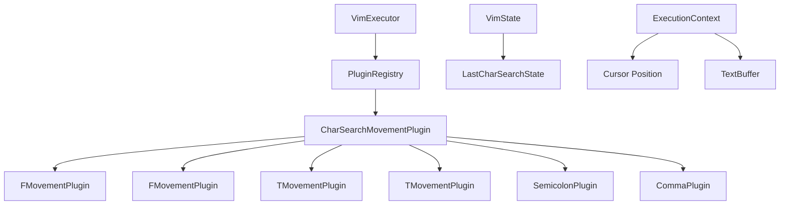
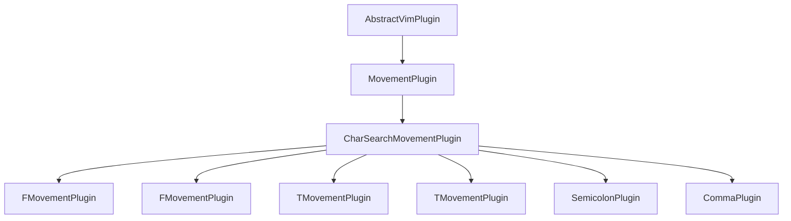
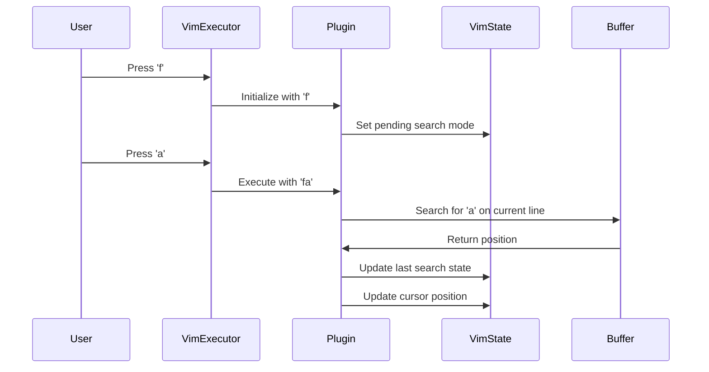

# Find and Jump (Character Search) Implementation Plan

## Overview

This plan details the implementation of Vim's Find and Jump (Character Search) keybindings for the vim-engine project. These commands enable rapid navigation within a line by searching for specific characters.

**Keybindings to Implement:**
- `f{char}`: Find forward - Jumps to the next occurrence of {char} on the current line
- `F{char}`: Find backward - Jumps to the previous occurrence of {char} on the current line
- `t{char}`: Till forward - Jumps to just before the next occurrence of {char}
- `T{char}`: Till backward - Jumps to just before the previous occurrence of {char}
- `;`: Repeat find - Repeats the last f, F, t, or T command in the same direction
- `,`: Repeat reverse - Repeats the last f, F, t, or T command in the opposite direction

**Scope:** This plan covers architecture, implementation, testing, and integration. No code will be written during planning.

---

## Table of Contents

1. [Architecture Overview](#architecture-overview)
2. [Phase 1: State Management](#phase-1-state-management)
3. [Phase 2: Base Class and Utilities](#phase-2-base-class-and-utilities)
4. [Phase 3: Core Search Plugins (f, F, t, T)](#phase-3-core-search-plugins-f-f-t-t)
5. [Phase 4: Repeat Plugins (; and ,)](#phase-4-repeat-plugins--and-)
6. [Phase 5: Plugin Registration and Integration](#phase-5-plugin-registration-and-integration)
7. [Phase 6: Testing Strategy](#phase-6-testing-strategy)
8. [Phase 7: Documentation](#phase-7-documentation)
9. [Edge Cases and Error Handling](#edge-cases-and-error-handling)
10. [Performance Considerations](#performance-considerations)

---

## Architecture Overview

### System Context



### Plugin Inheritance Hierarchy



### State Flow



---

## Phase 1: State Management

### Objective

Add state to track the last character search command, enabling repeat functionality with `;` and `,`.

### Tasks

#### 1.1 Define LastCharSearchState Interface

**File:** `packages/vim-engine/src/state/LastCharSearchState.ts`

**Purpose:** Define the structure for tracking the last character search.

**Properties to Include:**
- `char: string` - The character that was searched for
- `command: 'f' | 'F' | 't' | 'T'` - The command type
- `direction: 'forward' | 'backward'` - Search direction
- `mode: 'find' | 'till'` - Whether it was find or till
- `timestamp: number` - When the search was performed (for potential timeout)

**Considerations:**
- Use TypeScript strict typing
- Make all properties readonly for immutability
- Provide factory methods for creating state from commands

#### 1.2 Extend VimState with Search State

**File:** `packages/vim-engine/src/state/VimState.ts`

**Changes Required:**
- Add `lastCharSearch: LastCharSearchState | null` property
- Add `setLastCharSearch(state: LastCharSearchState): void` method
- Add `getLastCharSearch(): LastCharSearchState | null` method
- Add `clearLastCharSearch(): void` method
- Update `clone()` method to include `lastCharSearch`
- Update `reset()` method to clear `lastCharSearch`

**Considerations:**
- Initialize to `null` in constructor
- Ensure proper deep cloning in `clone()` method
- Follow existing patterns for state management (e.g., `jumpList`, `changeList`)

#### 1.3 Update ExecutionContext

**File:** `packages/vim-engine/src/plugin/ExecutionContext.ts`

**Changes Required:**
- Add `getLastCharSearch(): LastCharSearchState | null` method
- Add `setLastCharSearch(state: LastCharSearchState | null): void` method

**Considerations:**
- Delegate to underlying VimState
- Maintain consistency with other state accessors

---

## Phase 2: Base Class and Utilities

### Objective

Create the base class and utility functions that will be shared across all character search plugins.

### Tasks

#### 2.1 Create CharSearchMovementPlugin Base Class

**File:** `packages/vim-engine/src/plugins/movement/base/CharSearchMovementPlugin.ts`

**Purpose:** Provide common functionality for character search movements.

**Key Features:**
- Extend `MovementPlugin`
- Define abstract methods for character search logic
- Handle direction (forward/backward)
- Handle mode (find/till)
- Manage count-based repetitions

**Abstract Methods:**
- `getCommandType(): 'f' | 'F' | 't' | 'T'`
- `getDirection(): 'forward' | 'backward'`
- `getSearchMode(): 'find' | 'till'`

**Protected Methods:**
- `findCharacter(line: string, char: string, column: number, direction: 'forward' | 'backward'): number | null`
- `findTillPosition(line: string, char: string, column: number, direction: 'forward' | 'backward'): number | null`
- `handleCount(cursor: CursorPosition, buffer: TextBuffer, count: number): CursorPosition`

**Considerations:**
- Follow patterns from `WordMovementPlugin` and `LineMovementPlugin`
- Handle edge cases (character not found, empty line)
- Support count prefix (e.g., `2f;` jumps to second semicolon)
- Update `lastCharSearch` state after successful search

#### 2.2 Create Character Search Utilities

**File:** `packages/vim-engine/src/plugins/movement/utils/charSearch.ts`

**Purpose:** Provide utility functions for character searching on a line.

**Functions to Implement:**

1. `findNextChar(line: string, char: string, startColumn: number): number | null`
   - Searches forward from `startColumn + 1`
   - Returns column index of next occurrence
   - Returns `null` if not found

2. `findPrevChar(line: string, char: string, startColumn: number): number | null`
   - Searches backward from `startColumn - 1`
   - Returns column index of previous occurrence
   - Returns `null` if not found

3. `findTillNextChar(line: string, char: string, startColumn: number): number | null`
   - Returns position before the next occurrence
   - If found at column `c`, returns `c - 1`
   - Returns `null` if not found

4. `findTillPrevChar(line: string, char: string, startColumn: number): number | null`
   - Returns position after the previous occurrence
   - If found at column `c`, returns `c + 1`
   - Returns `null` if not found

**Considerations:**
- Handle empty lines
- Handle out-of-bounds startColumn values
- Consider case sensitivity (Vim is case-sensitive)
- Optimize for performance (avoid unnecessary string operations)

#### 2.3 Create Base Class Index File

**File:** `packages/vim-engine/src/plugins/movement/base/index.ts`

**Changes Required:**
- Export `CharSearchMovementPlugin`

**Considerations:**
- Follow existing export patterns
- Maintain alphabetical order if applicable

---

## Phase 3: Core Search Plugins (f, F, t, T)

### Objective

Implement the four core character search plugins that handle the initial search commands.

### Tasks

#### 3.1 Create FLowerMovementPlugin (f key)

**File:** `packages/vim-engine/src/plugins/movement/f/FLowerMovementPlugin.ts`

**Purpose:** Implement `f{char}` - find forward command.

**Key Features:**
- Pattern: `f` (will be combined with next character)
- Modes: `NORMAL`, `VISUAL`
- Direction: `forward`
- Mode: `find`
- Update `lastCharSearch` state on success

**Implementation Details:**
- Wait for next character to complete the command
- Search forward from current position
- Jump to the character's position
- Handle count prefix (e.g., `3fa` jumps to 3rd 'a')
- Update `lastCharSearch` with: `{ char, command: 'f', direction: 'forward', mode: 'find' }`

**Considerations:**
- Multi-key sequence handling (f + character)
- Edge case: character not found (cursor stays in place)
- Edge case: count exceeds occurrences (go to last occurrence or stay)
- Integration with VimState for state management

#### 3.2 Create FUpperMovementPlugin (F key)

**File:** `packages/vim-engine/src/plugins/movement/f-capital/FUpperMovementPlugin.ts`

**Purpose:** Implement `F{char}` - find backward command.

**Key Features:**
- Pattern: `F` (will be combined with next character)
- Modes: `NORMAL`, `VISUAL`
- Direction: `backward`
- Mode: `find`
- Update `lastCharSearch` state on success

**Implementation Details:**
- Wait for next character to complete the command
- Search backward from current position
- Jump to the character's position
- Handle count prefix (e.g., `3Fa` jumps to 3rd previous 'a')
- Update `lastCharSearch` with: `{ char, command: 'F', direction: 'backward', mode: 'find' }`

**Considerations:**
- Multi-key sequence handling (F + character)
- Edge case: character not found (cursor stays in place)
- Edge case: count exceeds occurrences (go to first occurrence or stay)
- Mirror behavior of `f` but in reverse direction

#### 3.3 Create TLowerMovementPlugin (t key)

**File:** `packages/vim-engine/src/plugins/movement/t/TLowerMovementPlugin.ts`

**Purpose:** Implement `t{char}` - till forward command.

**Key Features:**
- Pattern: `t` (will be combined with next character)
- Modes: `NORMAL`, `VISUAL`
- Direction: `forward`
- Mode: `till`
- Update `lastCharSearch` state on success

**Implementation Details:**
- Wait for next character to complete the command
- Search forward from current position
- Jump to position just before the character
- Handle count prefix (e.g., `3ta` jumps to position before 3rd 'a')
- Update `lastCharSearch` with: `{ char, command: 't', direction: 'forward', mode: 'till' }`

**Considerations:**
- Multi-key sequence handling (t + character)
- Edge case: character not found (cursor stays in place)
- Edge case: character at column 0 (till would be -1, should stay at 0)
- Edge case: count exceeds occurrences (go to position before last occurrence or stay)

#### 3.4 Create TUpperMovementPlugin (T key)

**File:** `packages/vim-engine/src/plugins/movement/t-capital/TUpperMovementPlugin.ts`

**Purpose:** Implement `T{char}` - till backward command.

**Key Features:**
- Pattern: `T` (will be combined with next character)
- Modes: `NORMAL`, `VISUAL`
- Direction: `backward`
- Mode: `till`
- Update `lastCharSearch` state on success

**Implementation Details:**
- Wait for next character to complete the command
- Search backward from current position
- Jump to position just after the character
- Handle count prefix (e.g., `3Ta` jumps to position after 3rd previous 'a')
- Update `lastCharSearch` with: `{ char, command: 'T', direction: 'backward', mode: 'till' }`

**Considerations:**
- Multi-key sequence handling (T + character)
- Edge case: character not found (cursor stays in place)
- Edge case: character at line end (till would be beyond line length)
- Mirror behavior of `t` but in reverse direction

#### 3.5 Create Index Files for Each Plugin

**Files:**
- `packages/vim-engine/src/plugins/movement/f/index.ts`
- `packages/vim-engine/src/plugins/movement/f-capital/index.ts`
- `packages/vim-engine/src/plugins/movement/t/index.ts`
- `packages/vim-engine/src/plugins/movement/t-capital/index.ts`

**Purpose:** Re-export plugins following project conventions.

**Considerations:**
- Follow existing patterns (e.g., `w-capital`, `b-capital`)
- Use descriptive exports to avoid naming conflicts

---

## Phase 4: Repeat Plugins (; and ,)

### Objective

Implement the repeat commands that re-execute the last character search.

### Tasks

#### 4.1 Create SemicolonPlugin (; key)

**File:** `packages/vim-engine/src/plugins/movement/semicolon/SemicolonPlugin.ts`

**Purpose:** Implement `;` - repeat last character search in same direction.

**Key Features:**
- Pattern: `;`
- Modes: `NORMAL`, `VISUAL`
- Retrieves `lastCharSearch` from state
- Repeats the search in the same direction
- Handles count prefix

**Implementation Details:**
- Check if `lastCharSearch` exists
- If not, do nothing (Vim behavior: no error, just no action)
- Extract char, command, direction, mode from `lastCharSearch`
- Perform the search from current position
- Handle count prefix (e.g., `3;` repeats 3 times)
- Update `lastCharSearch` timestamp

**Considerations:**
- Edge case: no previous search (do nothing)
- Edge case: character not found (cursor stays in place)
- Edge case: count exceeds occurrences (go to last occurrence or stay)
- Should this update `lastCharSearch`? (Vim typically does not update on repeat)

#### 4.2 Create CommaPlugin (, key)

**File:** `packages/vim-engine/src/plugins/movement/comma/CommaPlugin.ts`

**Purpose:** Implement `,` - repeat last character search in opposite direction.

**Key Features:**
- Pattern: `,`
- Modes: `NORMAL`, `VISUAL`
- Retrieves `lastCharSearch` from state
- Repeats the search in opposite direction
- Handles count prefix

**Implementation Details:**
- Check if `lastCharSearch` exists
- If not, do nothing
- Extract char, command, direction, mode from `lastCharSearch`
- Reverse the direction (forward ↔ backward)
- Perform the search from current position
- Handle count prefix (e.g., `3,` repeats 3 times in opposite direction)
- Update `lastCharSearch` timestamp

**Considerations:**
- Edge case: no previous search (do nothing)
- Edge case: character not found (cursor stays in place)
- Edge case: count exceeds occurrences (go to last occurrence or stay)
- Should this update `lastCharSearch`? (Vim typically does not update on repeat)
- Direction reversal logic must be correct

#### 4.3 Create Index Files for Repeat Plugins

**Files:**
- `packages/vim-engine/src/plugins/movement/semicolon/index.ts`
- `packages/vim-engine/src/plugins/movement/comma/index.ts`

**Purpose:** Re-export plugins following project conventions.

**Considerations:**
- Follow existing patterns
- Use descriptive exports

---

## Phase 5: Plugin Registration and Integration

### Objective

Register all character search plugins with the movement plugin system.

### Tasks

#### 5.1 Update Movement Plugins Index

**File:** `packages/vim-engine/src/plugins/movement/index.ts`

**Changes Required:**
- Export `CharSearchMovementPlugin` from base
- Export `FLowerMovementPlugin` from f
- Export `FUpperMovementPlugin` from f-capital
- Export `TLowerMovementPlugin` from t
- Export `TUpperMovementPlugin` from t-capital
- Export `SemicolonPlugin` from semicolon
- Export `CommaPlugin` from comma

**Considerations:**
- Follow existing export patterns
- Add comments to group related plugins
- Maintain alphabetical or logical ordering

#### 5.2 Update Plugins Index

**File:** `packages/vim-engine/src/plugins/index.ts`

**Changes Required:**
- Ensure movement plugins are exported
- Verify no conflicts with other plugin types

**Considerations:**
- Check if any changes are needed (likely not, as movement plugins are already exported)

#### 5.3 Verify Plugin Registration

**Task:** Ensure plugins are properly registered in the plugin registry.

**Considerations:**
- Check if automatic registration is used
- Verify patterns are unique
- Ensure no pattern conflicts with existing plugins

---

## Phase 6: Testing Strategy

### Objective

Create comprehensive test coverage for all character search functionality.

### Tasks

#### 6.1 Unit Tests for Utilities

**File:** `packages/vim-engine/src/plugins/movement/utils/charSearch.test.ts`

**Test Cases:**

1. `findNextChar` tests:
   - Find character in middle of line
   - Find character at end of line
   - Character not found
   - Empty line
   - Start column at end of line
   - Start column beyond line length

2. `findPrevChar` tests:
   - Find character in middle of line
   - Find character at start of line
   - Character not found
   - Empty line
   - Start column at start of line
   - Start column negative

3. `findTillNextChar` tests:
   - Find till character in middle of line
   - Find till character at column 1 (should return 0)
   - Character not found
   - Empty line
   - Character at column 0 (should return 0 or null)

4. `findTillPrevChar` tests:
   - Find till character in middle of line
   - Find till character at line end
   - Character not found
   - Empty line
   - Character at line end (should return line.length or null)

**Considerations:**
- Achieve 100% coverage for utility functions
- Test edge cases thoroughly
- Use parameterized tests where appropriate

#### 6.2 Unit Tests for Base Class

**File:** `packages/vim-engine/src/plugins/movement/base/CharSearchMovementPlugin.test.ts`

**Test Cases:**

1. State management tests:
   - Verify `lastCharSearch` is updated correctly
   - Verify state is not updated when character not found

2. Count handling tests:
   - Count of 1 (default behavior)
   - Count of 2 (find 2nd occurrence)
   - Count exceeding occurrences (go to last or stay)

3. Direction tests:
   - Forward search
   - Backward search

4. Mode tests:
   - Find mode (land on character)
   - Till mode (land before/after character)

**Considerations:**
- Test abstract methods through mock implementations
- Verify integration with VimState

#### 6.3 Unit Tests for FLowerMovementPlugin

**File:** `packages/vim-engine/src/plugins/movement/f/FLowerMovementPlugin.test.ts`

**Test Cases:**

1. Metadata tests:
   - Correct name
   - Correct version
   - Correct description
   - Correct patterns
   - Correct modes

2. Basic movement tests:
   - Find character forward
   - Find character at end of line
   - Character not found (cursor stays)
   - Empty line

3. Count tests:
   - `2fa` finds 2nd 'a'
   - `3fa` finds 3rd 'a'
   - Count exceeds occurrences

4. State tests:
   - `lastCharSearch` is set correctly
   - `lastCharSearch` includes correct char, command, direction, mode

5. Edge cases:
   - Cursor at line end
   - Cursor at character to find
   - Multiple occurrences of character

**Considerations:**
- Achieve 90%+ coverage
- Test multi-key sequence handling
- Verify Vim behavior matches

#### 6.4 Unit Tests for FUpperMovementPlugin

**File:** `packages/vim-engine/src/plugins/movement/f-capital/FUpperMovementPlugin.test.ts`

**Test Cases:**

1. Metadata tests (same as FLower)

2. Basic movement tests:
   - Find character backward
   - Find character at start of line
   - Character not found (cursor stays)
   - Empty line

3. Count tests:
   - `2Fa` finds 2nd previous 'a'
   - `3Fa` finds 3rd previous 'a'
   - Count exceeds occurrences

4. State tests:
   - `lastCharSearch` is set correctly
   - Direction is 'backward'

5. Edge cases:
   - Cursor at line start
   - Cursor at character to find
   - Multiple occurrences of character

**Considerations:**
- Mirror FLower tests but in reverse
- Verify backward search logic

#### 6.5 Unit Tests for TLowerMovementPlugin

**File:** `packages/vim-engine/src/plugins/movement/t/TLowerMovementPlugin.test.ts`

**Test Cases:**

1. Metadata tests

2. Basic movement tests:
   - Till character forward (land before)
   - Till character at column 1 (land at 0)
   - Till character at column 0 (stay at 0)
   - Character not found (cursor stays)
   - Empty line

3. Count tests:
   - `2ta` lands before 2nd 'a'
   - `3ta` lands before 3rd 'a'

4. State tests:
   - `lastCharSearch` mode is 'till'

5. Edge cases:
   - Character immediately after cursor
   - Character at line end

**Considerations:**
- Verify till vs. find behavior
- Test boundary conditions carefully

#### 6.6 Unit Tests for TUpperMovementPlugin

**File:** `packages/vim-engine/src/plugins/movement/t-capital/TUpperMovementPlugin.test.ts`

**Test Cases:**

1. Metadata tests

2. Basic movement tests:
   - Till character backward (land after)
   - Till character at line end (land at line.length)
   - Character not found (cursor stays)
   - Empty line

3. Count tests:
   - `2Ta` lands after 2nd previous 'a'
   - `3Ta` lands after 3rd previous 'a'

4. State tests:
   - `lastCharSearch` mode is 'till'
   - Direction is 'backward'

5. Edge cases:
   - Character immediately before cursor
   - Character at line start

**Considerations:**
- Mirror TLower tests but in reverse
- Verify till backward logic

#### 6.7 Unit Tests for SemicolonPlugin

**File:** `packages/vim-engine/src/plugins/movement/semicolon/SemicolonPlugin.test.ts`

**Test Cases:**

1. Metadata tests

2. Basic repeat tests:
   - Repeat last forward find
   - Repeat last backward find
   - Repeat last forward till
   - Repeat last backward till

3. No previous search tests:
   - No `lastCharSearch` (do nothing)
   - Cursor stays in place

4. Count tests:
   - `3;` repeats 3 times

5. Edge cases:
   - Character not found on repeat
   - Count exceeds occurrences

6. State tests:
   - Verify `lastCharSearch` is not updated (or is updated, depending on Vim behavior)

**Considerations:**
- Test with all four command types (f, F, t, T)
- Verify direction preservation

#### 6.8 Unit Tests for CommaPlugin

**File:** `packages/vim-engine/src/plugins/movement/comma/CommaPlugin.test.ts`

**Test Cases:**

1. Metadata tests

2. Basic repeat tests:
   - Repeat last forward find (now backward)
   - Repeat last backward find (now forward)
   - Repeat last forward till (now backward)
   - Repeat last backward till (now forward)

3. No previous search tests:
   - No `lastCharSearch` (do nothing)
   - Cursor stays in place

4. Count tests:
   - `3,` repeats 3 times in opposite direction

5. Edge cases:
   - Character not found on repeat
   - Count exceeds occurrences

6. State tests:
   - Verify `lastCharSearch` is not updated (or is updated)

**Considerations:**
- Verify direction reversal logic
- Test with all four command types

#### 6.9 Integration Tests

**File:** `packages/vim-engine/tests/integration/char-search-integration.test.ts`

**Test Cases:**

1. Workflow tests:
   - Search with `f`, repeat with `;`, reverse with `,`
   - Search with `F`, repeat with `;`, reverse with `,`
   - Search with `t`, repeat with `;`, reverse with `,`
   - Search with `T`, repeat with `;`, reverse with `,`

2. Multi-step tests:
   - `fa;;,` sequence
   - `3fa;` sequence
   - `fa,;` sequence

3. Mode switching tests:
   - Search in NORMAL mode, verify cursor position
   - Search in VISUAL mode, verify selection behavior

4. State persistence tests:
   - Verify `lastCharSearch` persists across commands
   - Verify state is cleared on mode change (if applicable)

**Considerations:**
- Test realistic user workflows
- Verify integration with other movement commands
- Test with VimState cloning/resetting

#### 6.10 Performance Tests

**File:** `packages/vim-engine/tests/performance/char-search-benchmark.test.ts`

**Test Cases:**

1. Single search performance:
   - Measure time for `fa` on typical line
   - Target: < 0.1ms

2. Repeat performance:
   - Measure time for `;` repeat
   - Target: < 0.1ms

3. Long line performance:
   - Measure time for search on 1000-character line
   - Target: < 1ms

4. Count performance:
   - Measure time for `100fa`
   - Target: < 5ms

**Considerations:**
- Benchmark against performance budget
- Identify optimization opportunities
- Test with realistic line lengths

---

## Phase 7: Documentation

### Objective

Create comprehensive documentation for the character search functionality.

### Tasks

#### 7.1 Update CONTRIBUTING.md

**File:** `packages/vim-engine/src/plugins/movement/CONTRIBUTING.md`

**Changes Required:**
- Add "Category 6: Character Search" section with details
- Update plugin inheritance hierarchy diagram to include `CharSearchMovementPlugin`
- Add implementation checklist for character search plugins
- Add code patterns for character search plugins
- Add testing requirements specific to character search

**Considerations:**
- Follow existing documentation style
- Provide clear examples
- Include edge case handling guidance

#### 7.2 Create Plugin-Specific Documentation

**File:** `packages/vim-engine/src/plugins/movement/CHAR_SEARCH.md`

**Purpose:** Provide detailed documentation for character search functionality.

**Sections to Include:**

1. Overview
   - What character search is
   - When to use it
   - Benefits over word movement

2. Commands Reference
   - `f{char}` - Find forward
   - `F{char}` - Find backward
   - `t{char}` - Till forward
   - `T{char}` - Till backward
   - `;` - Repeat same direction
   - `,` - Repeat opposite direction

3. Examples
   - Basic usage
   - With counts
   - With repeats
   - Common workflows

4. Architecture
   - Plugin structure
   - State management
   - Utility functions

5. Implementation Details
   - Multi-key sequence handling
   - State persistence
   - Edge case handling

6. Testing
   - Test strategy
   - Coverage requirements
   - Performance benchmarks

**Considerations:**
- Use clear, concise language
- Include code examples
- Add diagrams where helpful

#### 7.3 Update README.md

**File:** `packages/vim-engine/README.md`

**Changes Required:**
- Add character search to feature list
- Update plugin count
- Add link to CHAR_SEARCH.md

**Considerations:**
- Keep README high-level
- Link to detailed documentation

---

## Edge Cases and Error Handling

### Edge Cases to Handle

#### 1. Character Not Found
**Scenario:** User searches for a character that doesn't exist on the current line.

**Expected Behavior:** Cursor stays in place, no error message.

**Implementation:**
- Return original cursor position
- Do not update `lastCharSearch` state
- No visual feedback (Vim behavior)

#### 2. Empty Line
**Scenario:** User executes character search on an empty line.

**Expected Behavior:** Cursor stays in place, no error.

**Implementation:**
- Check for empty line before searching
- Return original cursor position
- Do not update `lastCharSearch` state

#### 3. Cursor at Boundaries
**Scenarios:**
- Cursor at column 0 and searching backward
- Cursor at line end and searching forward
- Cursor at character to find

**Expected Behavior:**
- `f` from column 0: search from column 1
- `F` from line end: search from line.length - 1
- `t` when next char is target: land before it (column 0 if target at column 1)
- `T` when prev char is target: land after it (line.length if target at line end)

**Implementation:**
- Adjust search start position based on command
- Handle boundary conditions in utility functions

#### 4. Till at Boundaries
**Scenarios:**
- `t` when character at column 0
- `T` when character at line end

**Expected Behavior:**
- `t` to column 0: stay at column 0 (can't go before)
- `T` to line end: stay at line end (can't go after)

**Implementation:**
- Clamp result to valid range [0, line.length - 1]
- Handle in `findTillNextChar` and `findTillPrevChar`

#### 5. Count Exceeds Occurrences
**Scenario:** User executes `10fa` but there are only 3 'a's on the line.

**Expected Behavior:** Cursor goes to the last occurrence (3rd 'a').

**Implementation:**
- Track occurrence count during search
- Stop when reaching last occurrence or count
- Return last found position

#### 6. No Previous Search
**Scenario:** User presses `;` or `,` without having performed a character search.

**Expected Behavior:** No action, cursor stays in place, no error.

**Implementation:**
- Check if `lastCharSearch` is null
- Return early without action
- Do not show error

#### 7. Multi-Key Sequence Interruption
**Scenario:** User presses `f` then presses a different command (not a character).

**Expected Behavior:** The `f` command is cancelled, no search performed.

**Implementation:**
- This depends on the keystroke processor architecture
- May need to handle pending state in VimState or plugin
- Clear pending state on non-character input

#### 8. Case Sensitivity
**Scenario:** User searches for 'a' but line contains 'A'.

**Expected Behavior:** No match (Vim is case-sensitive).

**Implementation:**
- Use exact character matching (case-sensitive)
- Do not use case-insensitive comparison

#### 9. Special Characters
**Scenario:** User searches for special characters like `;`, `,`, `$`, etc.

**Expected Behavior:** Search for the literal character, not the command.

**Implementation:**
- Treat all characters as literal search targets
- No special character escaping needed

#### 10. Visual Mode
**Scenario:** User performs character search in VISUAL mode.

**Expected Behavior:** Cursor moves, selection extends from visual start to new position.

**Implementation:**
- Verify VISUAL mode support in plugins
- Ensure selection is updated correctly
- Test with both character-wise and line-wise visual modes

### Error Handling Strategy

#### Validation
- Validate line exists before searching
- Validate column is within bounds
- Validate `lastCharSearch` state before repeating

#### Graceful Degradation
- Return original cursor position on failure
- Do not update state on failure
- Do not throw errors for normal edge cases

#### Logging (Optional)
- Consider adding debug logging for troubleshooting
- Do not log for normal edge cases (character not found, etc.)
- Only log for unexpected errors

---

## Performance Considerations

### Performance Targets

| Operation                | Target Time | Maximum Acceptable |
| ------------------------ | ----------- | ------------------ |
| Single character search  | < 0.1ms     | 0.5ms              |
| Repeat search (; or ,)   | < 0.1ms     | 0.5ms              |
| Count-based search (10x) | < 1ms       | 5ms                |
| Long line search (1000 chars) | < 1ms   | 5ms                |

### Optimization Strategies

#### 1. Avoid Unnecessary String Operations
```typescript
// Bad: Creates new strings
for (let i = 0; i < line.length; i++) {
  if (line[i] === char) { /* ... */ }
}

// Good: Direct character access
for (let i = 0; i < line.length; i++) {
  if (line.charCodeAt(i) === char.charCodeAt(0)) { /* ... */ }
}
```

#### 2. Early Termination
```typescript
// Stop searching once count is reached
let found = 0;
for (let i = start; i < line.length; i++) {
  if (line[i] === char) {
    found++;
    if (found >= count) return i;
  }
}
```

#### 3. Cache Search Results (Optional)
```typescript
// Consider caching for repeated searches on same line
private searchCache = new Map<string, number[]>();

findOccurrences(line: string, char: string): number[] {
  const key = `${line}:${char}`;
  if (this.searchCache.has(key)) {
    return this.searchCache.get(key)!;
  }
  // Compute and cache
}
```

#### 4. Use Efficient Data Structures
- Use array indices for positions
- Avoid creating intermediate arrays
- Use primitive types where possible

#### 5. Minimize Object Creation
```typescript
// Bad: Creates new objects in loop
for (let i = 0; i < count; i++) {
  const pos = new CursorPosition(line, column);
}

// Good: Reuse position
let pos = new CursorPosition(line, column);
for (let i = 0; i < count; i++) {
  pos.column = column;
}
```

### Memory Considerations

#### State Management
- `lastCharSearch` state is small (single object)
- No memory leaks expected
- State is cleared on reset

#### Caching (If Implemented)
- Limit cache size
- Use LRU eviction if needed
- Clear cache on buffer changes

---

## Implementation Dependencies

### Required Files to Create

1. `packages/vim-engine/src/state/LastCharSearchState.ts`
2. `packages/vim-engine/src/plugins/movement/base/CharSearchMovementPlugin.ts`
3. `packages/vim-engine/src/plugins/movement/utils/charSearch.ts`
4. `packages/vim-engine/src/plugins/movement/f/FLowerMovementPlugin.ts`
5. `packages/vim-engine/src/plugins/movement/f-capital/FUpperMovementPlugin.ts`
6. `packages/vim-engine/src/plugins/movement/t/TLowerMovementPlugin.ts`
7. `packages/vim-engine/src/plugins/movement/t-capital/TUpperMovementPlugin.ts`
8. `packages/vim-engine/src/plugins/movement/semicolon/SemicolonPlugin.ts`
9. `packages/vim-engine/src/plugins/movement/comma/CommaPlugin.ts`

### Required Files to Modify

1. `packages/vim-engine/src/state/VimState.ts` - Add `lastCharSearch` state
2. `packages/vim-engine/src/plugin/ExecutionContext.ts` - Add search state accessors
3. `packages/vim-engine/src/plugins/movement/base/index.ts` - Export base class
4. `packages/vim-engine/src/plugins/movement/index.ts` - Export all plugins

### Required Test Files to Create

1. `packages/vim-engine/src/plugins/movement/utils/charSearch.test.ts`
2. `packages/vim-engine/src/plugins/movement/base/CharSearchMovementPlugin.test.ts`
3. `packages/vim-engine/src/plugins/movement/f/FLowerMovementPlugin.test.ts`
4. `packages/vim-engine/src/plugins/movement/f-capital/FUpperMovementPlugin.test.ts`
5. `packages/vim-engine/src/plugins/movement/t/TLowerMovementPlugin.test.ts`
6. `packages/vim-engine/src/plugins/movement/t-capital/TUpperMovementPlugin.test.ts`
7. `packages/vim-engine/src/plugins/movement/semicolon/SemicolonPlugin.test.ts`
8. `packages/vim-engine/src/plugins/movement/comma/CommaPlugin.test.ts`
9. `packages/vim-engine/tests/integration/char-search-integration.test.ts`
10. `packages/vim-engine/tests/performance/char-search-benchmark.test.ts`

### Required Documentation Files to Create/Update

1. `packages/vim-engine/src/plugins/movement/CHAR_SEARCH.md` - New
2. `packages/vim-engine/src/plugins/movement/CONTRIBUTING.md` - Update
3. `packages/vim-engine/README.md` - Update

---

## Phase Execution Order

### Recommended Order for Implementation

1. **Phase 1: State Management** - Foundation for all other phases
2. **Phase 2: Base Class and Utilities** - Core functionality
3. **Phase 3: Core Search Plugins** - Implement f, F, t, T
4. **Phase 4: Repeat Plugins** - Implement ; and ,
5. **Phase 5: Plugin Registration** - Integrate with existing system
6. **Phase 6: Testing Strategy** - Write comprehensive tests
7. **Phase 7: Documentation** - Document the implementation

### Parallel Execution Opportunities

- Phase 3 plugins can be implemented in parallel (f, F, t, T)
- Phase 4 plugins can be implemented in parallel (; and ,)
- Unit tests can be written alongside implementation
- Documentation can be written after implementation is complete

---

## Success Criteria

### Functional Requirements

- [ ] All six commands (f, F, t, T, ;, ,) work correctly
- [ ] Commands work in NORMAL and VISUAL modes
- [ ] Count prefix is supported (e.g., `3fa`)
- [ ] Repeat commands work correctly (; and ,)
- [ ] State management persists across commands
- [ ] Edge cases are handled gracefully

### Quality Requirements

- [ ] Unit test coverage ≥ 90% for plugins
- [ ] Unit test coverage = 100% for utilities
- [ ] All tests pass
- [ ] No linting errors
- [ ] TypeScript strict mode compliance

### Performance Requirements

- [ ] Single search < 0.1ms
- [ ] Repeat search < 0.1ms
- [ ] Count-based search (10x) < 1ms
- [ ] Long line search (1000 chars) < 1ms

### Documentation Requirements

- [ ] CONTRIBUTING.md updated with character search section
- [ ] CHAR_SEARCH.md created with comprehensive documentation
- [ ] README.md updated with feature list
- [ ] All code has JSDoc comments

---

## Open Questions and Decisions Needed

### 1. Multi-Key Sequence Handling
**Question:** How should the keystroke processor handle the multi-key sequences (f{char}, F{char}, etc.)?

**Options:**
- Option A: Plugins handle pending state internally
- Option B: Keystroke processor provides pending state mechanism
- Option C: Use a dedicated multi-key sequence handler

**Recommendation:** Review existing keystroke processor implementation to determine the best approach.

### 2. State Update on Repeat
**Question:** Should `;` and `,` update the `lastCharSearch` state?

**Vim Behavior:** Vim typically does NOT update the last search when using repeat commands.

**Recommendation:** Do NOT update `lastCharSearch` on repeat commands.

### 3. Visual Mode Selection Behavior
**Question:** How should character search affect the visual selection?

**Options:**
- Option A: Extend selection from visual start to new cursor position
- Option B: Replace selection with new cursor position only
- Option C: Different behavior for character-wise vs. line-wise visual mode

**Recommendation:** Follow Vim behavior - extend selection from visual start to new cursor position.

### 4. Pending State Timeout
**Question:** Should there be a timeout for pending multi-key sequences (e.g., if user presses `f` then waits 10 seconds)?

**Vim Behavior:** Vim does not have a timeout for pending commands.

**Recommendation:** No timeout needed, pending state persists until next valid keystroke or cancellation.

### 5. Count with Repeat
**Question:** How should count interact with repeat commands (e.g., `3;`)?

**Vim Behavior:** `3;` repeats the last search 3 times.

**Recommendation:** Implement count support for repeat commands as per Vim behavior.

---

## Risk Assessment

### Technical Risks

| Risk | Likelihood | Impact | Mitigation |
| ---- | ---------- | ------ | ---------- |
| Multi-key sequence handling complexity | Medium | Medium | Review existing patterns, implement carefully |
| State management bugs | Low | High | Comprehensive testing, clear state lifecycle |
| Performance issues with long lines | Low | Low | Implement efficient search algorithms |
| Integration issues with existing plugins | Low | Medium | Thorough integration testing |

### Schedule Risks

| Risk | Likelihood | Impact | Mitigation |
| ---- | ---------- | ------ | ---------- |
| Underestimated complexity of edge cases | Medium | Medium | Start with edge case analysis |
| Testing takes longer than expected | Low | Low | Write tests alongside implementation |
| Documentation delays | Low | Low | Document as you go |

---

## Conclusion

This plan provides a comprehensive roadmap for implementing the Find and Jump (Character Search) keybindings for the vim-engine project. The plan is organized into clear, actionable phases that build upon each other, making it suitable for execution by an orchestrator.

The key strengths of this plan are:
- **Clear phase structure** - Each phase has specific, measurable objectives
- **Comprehensive testing strategy** - Unit, integration, and performance tests
- **Thorough edge case handling** - All known edge cases are addressed
- **Performance considerations** - Targets and optimization strategies defined
- **Documentation focus** - Clear documentation requirements

The implementation should proceed in the recommended order, with parallel execution where possible to maximize efficiency. Regular testing and validation at each phase will ensure a high-quality, maintainable implementation.

---

## Appendix: Vim Behavior Reference

### Find Forward (f{char})
- Searches from current column + 1 to end of line
- Jumps to the character's position
- If not found, cursor stays in place
- Example: On "hello world", cursor at column 0, `fo` jumps to column 4

### Find Backward (F{char})
- Searches from current column - 1 to start of line
- Jumps to the character's position
- If not found, cursor stays in place
- Example: On "hello world", cursor at column 10, `Fo` jumps to column 7

### Till Forward (t{char})
- Searches from current column + 1 to end of line
- Jumps to position before the character
- If character at column 1, jumps to column 0
- If character at column 0, stays at column 0
- Example: On "hello world", cursor at column 0, `to` jumps to column 3

### Till Backward (T{char})
- Searches from current column - 1 to start of line
- Jumps to position after the character
- If character at line end, stays at line end
- Example: On "hello world", cursor at column 10, `To` jumps to column 8

### Repeat Same Direction (;)
- Repeats last f, F, t, or T command in same direction
- If no previous search, does nothing
- Example: After `fa`, `;` jumps to next 'a'

### Repeat Opposite Direction (,)
- Repeats last f, F, t, or T command in opposite direction
- If no previous search, does nothing
- Example: After `fa`, `,` jumps to previous 'a'

### Count Prefix
- All commands support count prefix
- Count applies to number of occurrences to find
- Example: `3fa` jumps to 3rd 'a', `;` jumps to 4th 'a'

---

**Document Version:** 1.0  
**Last Updated:** 2025-01-12  
**Status:** Ready for Implementation
