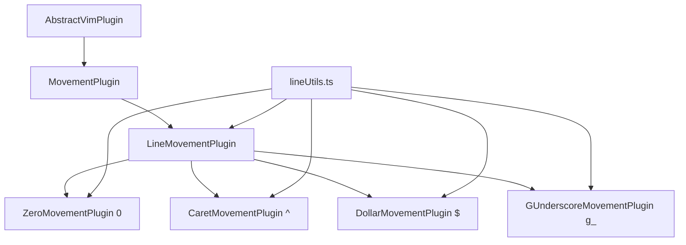

# Line Movement Plugins Implementation Plan

## Overview

This plan outlines the implementation of Vim Line Movement keybindings as plugins for the vim-engine. The Line Movement commands move the cursor to specific positions on the current line.

### Line Movement Commands to Implement

| Key | Action | Description |
|-----|--------|-------------|
| `0` | Start of line | Moves to the absolute first character of the line (column 0) |
| `^` | First non-blank | Moves to the first non-whitespace character (indented text) |
| `$` | End of line | Moves to the very last character of the line |
| `g_` | Last non-blank | Moves to the last non-whitespace character of the line |

## Architecture Overview



### Existing Infrastructure

- **Base Classes**: [`AbstractVimPlugin`](packages/vim-engine/src/plugin/AbstractVimPlugin.ts:47) → [`MovementPlugin`](packages/vim-engine/src/plugins/movement/base/MovementPlugin.ts:80)
- **Utilities**: [`lineUtils.ts`](packages/vim-engine/src/plugins/movement/utils/lineUtils.ts:1) provides helper functions:
  - [`findFirstNonWhitespace()`](packages/vim-engine/src/plugins/movement/utils/lineUtils.ts:41)
  - [`findLastNonWhitespace()`](packages/vim-engine/src/plugins/movement/utils/lineUtils.ts:60)
  - [`clampColumn()`](packages/vim-engine/src/plugins/movement/utils/lineUtils.ts:23)
  - [`isEmptyOrWhitespace()`](packages/vim-engine/src/plugins/movement/utils/lineUtils.ts:78)
  - [`getEffectiveLineLength()`](packages/vim-engine/src/plugins/movement/utils/lineUtils.ts:95)

---

## Phase 1: Foundation - Create LineMovementPlugin Base Class

### Objective
Create a specialized base class for line-based movements that extends [`MovementPlugin`](packages/vim-engine/src/plugins/movement/base/MovementPlugin.ts:80).

### Tasks

#### 1.1 Create LineMovementPlugin Base Class
**File**: [`packages/vim-engine/src/plugins/movement/base/LineMovementPlugin.ts`](packages/vim-engine/src/plugins/movement/base/LineMovementPlugin.ts)

**Purpose**: Provide common functionality for all line movement plugins including:
- Line retrieval and validation
- Column position calculation
- Edge case handling (empty lines, whitespace-only lines)
- Support for count-based movements (e.g., `3$` to move to end of line 3 lines down)

**Key Features**:
```typescript
export abstract class LineMovementPlugin extends MovementPlugin {
  // Abstract method for subclasses to implement specific line position logic
  protected abstract calculateLinePosition(
    line: string,
    cursor: CursorPosition
  ): number;
  
  // Template method that handles common logic
  protected calculateNewPosition(
    cursor: CursorPosition,
    buffer: TextBuffer,
    config: Required<MovementConfig>
  ): CursorPosition;
  
  // Handle count-based movements (e.g., 3$ moves 3 lines down then to end)
  protected handleCountMovement(
    cursor: CursorPosition,
    buffer: TextBuffer,
    count: number
  ): CursorPosition;
}
```

**Implementation Details**:
- Extend [`MovementPlugin`](packages/vim-engine/src/plugins/movement/base/MovementPlugin.ts:80)
- Implement [`calculateNewPosition()`](packages/vim-engine/src/plugins/movement/base/MovementPlugin.ts:150) to:
  1. Get current line from buffer
  2. Handle count-based movements if count > 1
  3. Call [`calculateLinePosition()`](packages/vim-engine/src/plugins/movement/base/LineMovementPlugin.ts) to get target column
  4. Validate and return new [`CursorPosition`](packages/vim-engine/src/state/CursorPosition.ts:32)
- Handle edge cases:
  - Empty buffer
  - Empty lines
  - Whitespace-only lines
  - Count exceeding buffer boundaries

**Deliverables**:
- [`LineMovementPlugin.ts`](packages/vim-engine/src/plugins/movement/base/LineMovementPlugin.ts) with complete implementation
- JSDoc documentation with examples
- Unit tests in [`LineMovementPlugin.test.ts`](packages/vim-engine/src/plugins/movement/base/LineMovementPlugin.test.ts)

---

## Phase 2: Implement Individual Line Movement Plugins

### Objective
Create four concrete plugin implementations for each Line Movement command.

### Tasks

#### 2.1 Implement ZeroMovementPlugin (0 key)
**Files**:
- [`packages/vim-engine/src/plugins/movement/0/ZeroMovementPlugin.ts`](packages/vim-engine/src/plugins/movement/0/ZeroMovementPlugin.ts)
- [`packages/vim-engine/src/plugins/movement/0/index.ts`](packages/vim-engine/src/plugins/movement/0/index.ts)
- [`packages/vim-engine/src/plugins/movement/0/ZeroMovementPlugin.test.ts`](packages/vim-engine/src/plugins/movement/0/ZeroMovementPlugin.test.ts)

**Purpose**: Move cursor to column 0 (absolute start of line)

**Implementation**:
```typescript
export class ZeroMovementPlugin extends LineMovementPlugin {
  readonly name = 'movement-0';
  readonly version = '1.0.0';
  readonly description = 'Move to start of line (0 key)';
  readonly patterns = ['0'];
  readonly modes: VimMode[] = [VIM_MODE.NORMAL, VIM_MODE.VISUAL];
  
  protected calculateLinePosition(line: string, cursor: CursorPosition): number {
    return 0; // Always return column 0
  }
}
```

**Test Coverage**:
- Metadata verification
- Basic movement to column 0
- Movement from different starting positions
- Empty line handling
- Count-based movements (e.g., `30` moves 3 lines down then to column 0)
- Mode restrictions (NORMAL, VISUAL only)

#### 2.2 Implement CaretMovementPlugin (^ key)
**Files**:
- [`packages/vim-engine/src/plugins/movement/caret/CaretMovementPlugin.ts`](packages/vim-engine/src/plugins/movement/caret/CaretMovementPlugin.ts)
- [`packages/vim-engine/src/plugins/movement/caret/index.ts`](packages/vim-engine/src/plugins/movement/caret/index.ts)
- [`packages/vim-engine/src/plugins/movement/caret/CaretMovementPlugin.test.ts`](packages/vim-engine/src/plugins/movement/caret/CaretMovementPlugin.test.ts)

**Purpose**: Move cursor to first non-whitespace character

**Implementation**:
```typescript
export class CaretMovementPlugin extends LineMovementPlugin {
  readonly name = 'movement-caret';
  readonly version = '1.0.0';
  readonly description = 'Move to first non-blank character (^ key)';
  readonly patterns = ['^'];
  readonly modes: VimMode[] = [VIM_MODE.NORMAL, VIM_MODE.VISUAL];
  
  protected calculateLinePosition(line: string, cursor: CursorPosition): number {
    const firstNonWhitespace = findFirstNonWhitespace(line);
    return firstNonWhitespace !== null ? firstNonWhitespace : 0;
  }
}
```

**Test Coverage**:
- Metadata verification
- Movement to first non-whitespace
- Movement on lines with leading spaces
- Movement on lines with tabs
- Empty line handling (should stay at column 0)
- Whitespace-only line handling (should stay at column 0)
- Count-based movements
- Mode restrictions

#### 2.3 Implement DollarMovementPlugin ($ key)
**Files**:
- [`packages/vim-engine/src/plugins/movement/dollar/DollarMovementPlugin.ts`](packages/vim-engine/src/plugins/movement/dollar/DollarMovementPlugin.ts)
- [`packages/vim-engine/src/plugins/movement/dollar/index.ts`](packages/vim-engine/src/plugins/movement/dollar/index.ts)
- [`packages/vim-engine/src/plugins/movement/dollar/DollarMovementPlugin.test.ts`](packages/vim-engine/src/plugins/movement/dollar/DollarMovementPlugin.test.ts)

**Purpose**: Move cursor to the very last character of the line

**Implementation**:
```typescript
export class DollarMovementPlugin extends LineMovementPlugin {
  readonly name = 'movement-dollar';
  readonly version = '1.0.0';
  readonly description = 'Move to end of line ($ key)';
  readonly patterns = ['$'];
  readonly modes: VimMode[] = [VIM_MODE.NORMAL, VIM_MODE.VISUAL];
  
  protected calculateLinePosition(line: string, cursor: CursorPosition): number {
    // Move to last character (line.length - 1), or 0 if line is empty
    return Math.max(0, line.length - 1);
  }
}
```

**Test Coverage**:
- Metadata verification
- Movement to last character
- Movement on non-empty lines
- Empty line handling (should stay at column 0)
- Single character line handling
- Count-based movements (e.g., `3$` moves 3 lines down then to end)
- Mode restrictions

#### 2.4 Implement GUnderscoreMovementPlugin (g_ key)
**Files**:
- [`packages/vim-engine/src/plugins/movement/g-underscore/GUnderscoreMovementPlugin.ts`](packages/vim-engine/src/plugins/movement/g-underscore/GUnderscoreMovementPlugin.ts)
- [`packages/vim-engine/src/plugins/movement/g-underscore/index.ts`](packages/vim-engine/src/plugins/movement/g-underscore/index.ts)
- [`packages/vim-engine/src/plugins/movement/g-underscore/GUnderscoreMovementPlugin.test.ts`](packages/vim-engine/src/plugins/movement/g-underscore/GUnderscoreMovementPlugin.test.ts)

**Purpose**: Move cursor to the last non-whitespace character of the line

**Implementation**:
```typescript
export class GUnderscoreMovementPlugin extends LineMovementPlugin {
  readonly name = 'movement-g-underscore';
  readonly version = '1.0.0';
  readonly description = 'Move to last non-blank character (g_ key)';
  readonly patterns = ['g_'];
  readonly modes: VimMode[] = [VIM_MODE.NORMAL, VIM_MODE.VISUAL];
  
  protected calculateLinePosition(line: string, cursor: CursorPosition): number {
    const lastNonWhitespace = findLastNonWhitespace(line);
    return lastNonWhitespace !== null ? lastNonWhitespace : 0;
  }
}
```

**Test Coverage**:
- Metadata verification
- Movement to last non-whitespace
- Movement on lines with trailing spaces
- Movement on lines with trailing tabs
- Empty line handling (should stay at column 0)
- Whitespace-only line handling (should stay at column 0)
- Count-based movements
- Mode restrictions

---

## Phase 3: Integration and Exports

### Objective
Integrate the new plugins into the movement module and ensure proper exports.

### Tasks

#### 3.1 Update Base Module Exports
**File**: [`packages/vim-engine/src/plugins/movement/base/index.ts`](packages/vim-engine/src/plugins/movement/base/index.ts)

**Action**: Add export for [`LineMovementPlugin`](packages/vim-engine/src/plugins/movement/base/LineMovementPlugin.ts)

```typescript
export * from './MovementPlugin';
export * from './DirectionalMovementPlugin';
export * from './WordMovementPlugin';
export * from './LineMovementPlugin';
```

#### 3.2 Update Movement Module Index
**File**: [`packages/vim-engine/src/plugins/movement/index.ts`](packages/vim-engine/src/plugins/movement/index.ts)

**Action**: Add exports for all four new line movement plugins

```typescript
export * from './base';
export * from './h';
export * from './j';
export * from './k';
export * from './l';
export * from './e';
export * from './ge';

// New line movement plugins
export * from './0';
export * from './caret';
export * from './dollar';
export * from './g-underscore';

// Word movement exports
export { WMovementPlugin as WordMovementPlugin } from './w';
export { WMovementPlugin as CapitalWordMovementPlugin } from './w-capital';
export { BMovementPlugin as BackwardMovementPlugin } from './b';
export { BMovementPlugin as CapitalBackwardMovementPlugin } from './b-capital';
```

#### 3.3 Update Main Package Index
**File**: [`packages/vim-engine/src/plugins/index.ts`](packages/vim-engine/src/plugins/index.ts)

**Action**: Ensure new plugins are exported from the main plugins module (if applicable)

---

## Phase 4: Comprehensive Testing

### Objective
Ensure all plugins work correctly individually and together.

### Tasks

#### 4.1 Unit Tests for Each Plugin
Create comprehensive unit tests following the pattern from [`HMovementPlugin.test.ts`](packages/vim-engine/src/plugins/movement/h/HMovementPlugin.test.ts:1):

**Test Categories**:
1. **Metadata Tests**
   - Plugin name, version, description
   - Pattern validation
   - Mode support

2. **Configuration Tests**
   - Default configuration
   - Custom configuration
   - Runtime configuration updates

3. **Movement Behavior Tests**
   - Basic movement functionality
   - Movement from various positions
   - Edge cases (empty lines, whitespace-only lines)

4. **Count-Based Movement Tests**
   - Single count (e.g., `3$`)
   - Large counts
   - Count exceeding buffer boundaries

5. **Mode Restriction Tests**
   - NORMAL mode execution
   - VISUAL mode execution
   - INSERT mode rejection
   - COMMAND mode rejection

6. **Edge Case Tests**
   - Empty buffer
   - Single line buffer
   - Multi-line buffer
   - Lines with mixed whitespace
   - Lines with tabs and spaces

#### 4.2 Integration Tests
**File**: [`packages/vim-engine/tests/integration/line-movement-integration.test.ts`](packages/vim-engine/tests/integration/line-movement-integration.test.ts)

**Test Scenarios**:
- Sequential line movements
- Combining line movements with other movements
- Visual mode selection with line movements
- Count-based movements across multiple lines

#### 4.3 Test Utilities
Ensure test utilities from [`tests/integration.test.utils.ts`](packages/vim-engine/tests/integration.test.utils.ts) are available for creating test contexts and states.

---

## Phase 5: Documentation

### Objective
Create comprehensive documentation for the new plugins.

### Tasks

#### 5.1 Update CONTRIBUTING Guide
**File**: [`packages/vim-engine/src/plugins/movement/CONTRIBUTING.md`](packages/vim-engine/src/plugins/movement/CONTRIBUTING.md)

**Action**: Add section on creating line movement plugins

#### 5.2 Create Plugin Documentation
Create a markdown file documenting the line movement plugins:

**File**: [`packages/vim-engine/src/plugins/movement/LINE_MOVEMENT.md`](packages/vim-engine/src/plugins/movement/LINE_MOVEMENT.md)

**Content**:
- Overview of line movement commands
- Usage examples
- Behavior details
- Edge cases
- Integration with other movements

---

## Phase 6: Code Quality and Best Practices

### Objective
Ensure code follows project standards and best practices.

### Tasks

#### 6.1 Code Style
- Follow existing code style (see [`.eslintrc.json`](.eslintrc.json:1))
- Use consistent naming conventions
- Proper JSDoc documentation
- TypeScript strict mode compliance

#### 6.2 Error Handling
- Validate buffer state before operations
- Handle edge cases gracefully
- Provide meaningful error messages

#### 6.3 Performance
- Minimize buffer access
- Cache line content when appropriate
- Avoid unnecessary object creation

#### 6.4 Type Safety
- Use TypeScript type annotations
- Leverage existing types from [`types.ts`](packages/vim-engine/src/types.ts)
- Ensure proper type inference

---

## Implementation Sequence

### Recommended Execution Order

1. **Phase 1**: Create [`LineMovementPlugin`](packages/vim-engine/src/plugins/movement/base/LineMovementPlugin.ts) base class with tests
2. **Phase 2.1**: Implement [`ZeroMovementPlugin`](packages/vim-engine/src/plugins/movement/0/ZeroMovementPlugin.ts) (0 key) with tests
3. **Phase 2.2**: Implement [`CaretMovementPlugin`](packages/vim-engine/src/plugins/movement/caret/CaretMovementPlugin.ts) (^ key) with tests
4. **Phase 2.3**: Implement [`DollarMovementPlugin`](packages/vim-engine/src/plugins/movement/dollar/DollarMovementPlugin.ts) ($ key) with tests
5. **Phase 2.4**: Implement [`GUnderscoreMovementPlugin`](packages/vim-engine/src/plugins/movement/g-underscore/GUnderscoreMovementPlugin.ts) (g_ key) with tests
6. **Phase 3**: Update exports and integration
7. **Phase 4**: Run all tests and fix any issues
8. **Phase 5**: Create documentation
9. **Phase 6**: Code review and quality checks

---

## File Structure

```
packages/vim-engine/src/plugins/movement/
├── base/
│   ├── MovementPlugin.ts (existing)
│   ├── DirectionalMovementPlugin.ts (existing)
│   ├── WordMovementPlugin.ts (existing)
│   ├── LineMovementPlugin.ts (NEW)
│   ├── index.ts (UPDATE)
│   └── LineMovementPlugin.test.ts (NEW)
├── 0/ (NEW)
│   ├── ZeroMovementPlugin.ts
│   ├── index.ts
│   └── ZeroMovementPlugin.test.ts
├── caret/ (NEW)
│   ├── CaretMovementPlugin.ts
│   ├── index.ts
│   └── CaretMovementPlugin.test.ts
├── dollar/ (NEW)
│   ├── DollarMovementPlugin.ts
│   ├── index.ts
│   └── DollarMovementPlugin.test.ts
├── g-underscore/ (NEW)
│   ├── GUnderscoreMovementPlugin.ts
│   ├── index.ts
│   └── GUnderscoreMovementPlugin.test.ts
├── utils/
│   ├── lineUtils.ts (existing, will be used)
│   └── ...
├── index.ts (UPDATE)
├── CONTRIBUTING.md (UPDATE)
└── LINE_MOVEMENT.md (NEW)

packages/vim-engine/tests/integration/
└── line-movement-integration.test.ts (NEW)
```

---

## Success Criteria

### Functional Requirements
- [ ] All four line movement commands work correctly in NORMAL mode
- [ ] All four line movement commands work correctly in VISUAL mode
- [ ] Commands do not execute in INSERT or COMMAND modes
- [ ] Count-based movements work correctly (e.g., `3$`, `5^`)
- [ ] Edge cases are handled properly (empty lines, whitespace-only lines)
- [ ] All unit tests pass
- [ ] All integration tests pass

### Code Quality Requirements
- [ ] Code follows project style guidelines
- [ ] All files have comprehensive JSDoc documentation
- [ ] Test coverage meets project standards
- [ ] No TypeScript compilation errors
- [ ] No ESLint errors
- [ ] Code is properly integrated into the module system

### Documentation Requirements
- [ ] Plugin usage is documented
- [ ] Edge cases are documented
- [ ] Examples are provided
- [ ] CONTRIBUTING guide is updated

---

## Dependencies

### Internal Dependencies
- [`AbstractVimPlugin`](packages/vim-engine/src/plugin/AbstractVimPlugin.ts:47)
- [`MovementPlugin`](packages/vim-engine/src/plugins/movement/base/MovementPlugin.ts:80)
- [`CursorPosition`](packages/vim-engine/src/state/CursorPosition.ts:32)
- [`TextBuffer`](packages/vim-engine/src/state/TextBuffer.ts:38)
- [`VimMode`](packages/vim-engine/src/state/VimMode.ts:38), [`VIM_MODE`](packages/vim-engine/src/state/VimMode.ts:52)
- [`ExecutionContext`](packages/vim-engine/src/plugin/ExecutionContext.ts)
- [`lineUtils.ts`](packages/vim-engine/src/plugins/movement/utils/lineUtils.ts:1) functions

### External Dependencies
- None (pure TypeScript implementation)

---

## Risk Mitigation

### Potential Risks

1. **Count-based Movement Complexity**
   - **Risk**: Implementing count-based movements (e.g., `3$`) may be complex
   - **Mitigation**: Implement in [`LineMovementPlugin`](packages/vim-engine/src/plugins/movement/base/LineMovementPlugin.ts) base class with clear separation of concerns

2. **Edge Case Handling**
   - **Risk**: Empty lines and whitespace-only lines may cause unexpected behavior
   - **Mitigation**: Comprehensive unit tests covering all edge cases

3. **Pattern Matching**
   - **Risk**: `g_` is a two-key sequence that may require special handling
   - **Mitigation**: Verify pattern matching works correctly with existing keystroke processor

4. **Integration Issues**
   - **Risk**: New plugins may not integrate properly with existing system
   - **Mitigation**: Integration tests and careful export management

---

## Notes for Implementation

### Key Design Decisions

1. **Base Class Approach**: Creating [`LineMovementPlugin`](packages/vim-engine/src/plugins/movement/base/LineMovementPlugin.ts) base class follows the existing pattern and reduces code duplication

2. **Utility Functions**: Leveraging existing functions from [`lineUtils.ts`](packages/vim-engine/src/plugins/movement/utils/lineUtils.ts:1) ensures consistency with existing code

3. **Count Support**: Supporting count-based movements aligns with Vim's behavior and is mentioned in the documentation

4. **Mode Support**: All line movements should work in NORMAL and VISUAL modes, following the pattern of existing movement plugins

5. **Testing Strategy**: Following the comprehensive test pattern from [`HMovementPlugin.test.ts`](packages/vim-engine/src/plugins/movement/h/HMovementPlugin.test.ts:1) ensures quality

### Vim Behavior Reference

From the documentation:
- `0` moves to column 0 (absolute start)
- `^` moves to first non-whitespace
- `$` moves to last character (line.length - 1)
- `g_` moves to last non-whitespace
- All support count prefixes (e.g., `3$` moves 3 lines down then to end)

---

## Conclusion

This plan provides a structured approach to implementing the Line Movement keybindings as plugins. The implementation follows existing patterns in the codebase, leverages available utilities, and includes comprehensive testing and documentation.

The plan is divided into clear phases that can be executed independently, making it suitable for orchestrator mode to divide work among multiple developers or AI agents.
