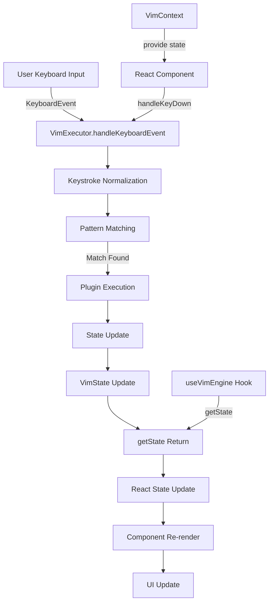

# Monorepo Conversion Plan for vim-engine

## Executive Summary

This document outlines a comprehensive plan to convert the current vim-engine TypeScript library into a monorepo structure containing two packages:

1. **vim-engine** - The core vim library (existing code reorganized)
2. **vim-demo** - A React application demonstrating vim-engine functionality

---

## Part 1: Monorepo Structure

### 1.1 Monorepo Tool Choice: pnpm Workspace

**Choice:** pnpm workspace with Turborepo for task orchestration

**Justification:**

| Criteria                  | pnpm Workspace         | Turborepo | Nx        |
| ------------------------- | ---------------------- | --------- | --------- |
| **Setup Complexity**      | Low (built-in)         | Medium    | High      |
| **Disk Space**            | Excellent (hard links) | N/A       | Good      |
| **Speed**                 | Very Fast              | Very Fast | Fast      |
| **Caching**               | Basic                  | Advanced  | Advanced  |
| **Learning Curve**        | Low                    | Medium    | High      |
| **Integration with Vite** | Native                 | Excellent | Good      |
| **TypeScript Support**    | Native                 | Excellent | Excellent |

**Decision:** pnpm workspace is the best choice because:

1. The project already uses pnpm (evidenced by `pnpm-lock.yaml`)
2. Simple setup with minimal configuration
3. Excellent disk efficiency with hard links
4. Native TypeScript support
5. Turborepo can be added on top for advanced caching if needed

### 1.2 Directory Structure

```
vim-engine-monorepo/
├── packages/
│   ├── vim-engine/           # Core library package
│   │   ├── src/
│   │   │   ├── core/
│   │   │   ├── state/
│   │   │   ├── input/
│   │   │   ├── plugin/
│   │   │   ├── plugins/
│   │   │   ├── config/
│   │   │   ├── di/
│   │   │   ├── types.ts
│   │   │   └── index.ts
│   │   ├── tests/
│   │   │   ├── unit/
│   │   │   ├── integration/
│   │   │   ├── e2e/
│   │   │   ├── performance/
│   │   │   └── browser/
│   │   ├── package.json
│   │   ├── tsconfig.json
│   │   ├── vite.config.ts
│   │   └── README.md
│   │
│   └── vim-demo/             # React demo application
│       ├── src/
│       │   ├── components/
│       │   │   ├── Editor.tsx
│       │   │   ├── StatusBar.tsx
│       │   │   ├── ModeIndicator.tsx
│       │   │   └── CommandPalette.tsx
│       │   ├── hooks/
│       │   │   ├── useVimEngine.ts
│       │   │   └── useVimState.ts
│       │   ├── contexts/
│       │   │   └── VimContext.tsx
│       │   ├── utils/
│       │   │   └── cursorHelpers.ts
│       │   ├── App.tsx
│       │   ├── main.tsx
│       │   └── vite-env.d.ts
│       ├── public/
│       ├── index.html
│       ├── package.json
│       ├── tsconfig.json
│       ├── tsconfig.node.json
│       ├── vite.config.ts
│       ├── tailwind.config.js
│       └── README.md
│
├── pnpm-workspace.yaml       # Workspace configuration
├── package.json              # Root package.json
├── tsconfig.base.json        # Shared TypeScript config
├── turbo.json                # Turborepo configuration (optional)
├── .gitignore
├── .prettierrc               # Shared Prettier config
├── .eslintrc.json            # Shared ESLint config
└── README.md                 # Monorepo README
```

### 1.3 Root-Level Configuration Files

#### `pnpm-workspace.yaml`

```yaml
packages:
  - "packages/*"
```

#### `package.json` (Root)

```json
{
  "name": "vim-engine-monorepo",
  "version": "0.0.1",
  "private": true,
  "scripts": {
    "dev": "turbo run dev --parallel",
    "build": "turbo run build",
    "test": "turbo run test",
    "lint": "turbo run lint",
    "clean": "turbo run clean && rm -rf node_modules",
    "format": "prettier --write \"**/*.{ts,tsx,js,jsx,json,md}\"",
    "format:check": "prettier --check \"**/*.{ts,tsx,js,jsx,json,md}\""
  },
  "devDependencies": {
    "@types/node": "^25.0.6",
    "prettier": "^3.4.2",
    "turbo": "^2.3.3",
    "typescript": "~5.9.3"
  },
  "engines": {
    "node": ">=18.0.0",
    "pnpm": ">=9.0.0"
  }
}
```

#### `tsconfig.base.json`

```json
{
  "compilerOptions": {
    "target": "ES2022",
    "useDefineForClassFields": true,
    "module": "ESNext",
    "lib": ["ES2022", "DOM"],
    "skipLibCheck": true,
    "moduleResolution": "bundler",
    "allowImportingTsExtensions": true,
    "moduleDetection": "force",
    "strict": true,
    "noUnusedLocals": true,
    "noUnusedParameters": true,
    "noFallthroughCasesInSwitch": true,
    "esModuleInterop": true,
    "resolveJsonModule": true,
    "declaration": true,
    "declarationMap": true
  },
  "exclude": ["node_modules", "dist", "**/*.test.ts", "tests"]
}
```

#### `turbo.json` (Optional, for advanced caching)

```json
{
  "$schema": "https://turbo.build/schema.json",
  "globalDependencies": ["**/.env.*local"],
  "pipeline": {
    "build": {
      "dependsOn": ["^build"],
      "outputs": ["dist/**", ".next/**"]
    },
    "dev": {
      "cache": false,
      "persistent": true
    },
    "test": {
      "dependsOn": ["build"],
      "outputs": []
    },
    "lint": {
      "outputs": []
    },
    "clean": {
      "cache": false
    }
  }
}
```

#### `.prettierrc`

```json
{
  "semi": true,
  "singleQuote": true,
  "tabWidth": 2,
  "trailingComma": "es5",
  "printWidth": 100
}
```

### 1.4 Reorganizing Current vim-engine as a Package

**Migration Steps:**

1. Create `packages/vim-engine/` directory
2. Move all source files from `src/` to `packages/vim-engine/src/`
3. Move all test files from `tests/` to `packages/vim-engine/tests/`
4. Move `package.json`, `tsconfig.json`, `vite.config.ts` to `packages/vim-engine/`
5. Remove `index.html` and `public/` (not needed for library)
6. Update `packages/vim-engine/package.json` with new package name

---

## Part 2: Vim-Engine Package

### 2.1 Package Configuration

#### `packages/vim-engine/package.json`

```json
{
  "name": "@vim-engine/core",
  "version": "0.1.0",
  "type": "module",
  "main": "./dist/vim-engine-core.umd.js",
  "module": "./dist/vim-engine-core.es.js",
  "types": "./dist/index.d.ts",
  "exports": {
    ".": {
      "types": "./dist/index.d.ts",
      "import": "./dist/vim-engine-core.es.js",
      "require": "./dist/vim-engine-core.umd.js"
    }
  },
  "files": ["dist"],
  "scripts": {
    "dev": "vite build --watch",
    "build": "tsc && vite build",
    "test": "vitest run",
    "test:watch": "vitest watch",
    "test:ui": "vitest --ui",
    "test:coverage": "vitest run --coverage",
    "lint": "eslint src --ext .ts",
    "lint:fix": "eslint src --ext .ts --fix",
    "clean": "rm -rf dist"
  },
  "devDependencies": {
    "@types/node": "^25.0.6",
    "@types/rx": "^4.1.4",
    "@typescript-eslint/eslint-plugin": "^8.18.2",
    "@typescript-eslint/parser": "^8.18.2",
    "@vitest/ui": "^2.1.8",
    "eslint": "^9.17.0",
    "typescript": "~5.9.3",
    "vite": "^7.2.4",
    "vite-plugin-dts": "^4.5.4",
    "vitest": "^2.1.8"
  },
  "dependencies": {
    "rxjs": "^7.8.1"
  },
  "peerDependencies": {},
  "publishConfig": {
    "access": "public"
  }
}
```

### 2.2 Build Configuration

#### `packages/vim-engine/tsconfig.json`

```json
{
  "extends": "../../tsconfig.base.json",
  "compilerOptions": {
    "outDir": "./dist",
    "rootDir": "./src",
    "declaration": true,
    "declarationMap": true,
    "emitDeclarationOnly": true,
    "composite": true
  },
  "include": ["src"],
  "exclude": [
    "node_modules",
    "dist",
    "**/*.test.ts",
    "tests",
    "src/**/*.test.ts"
  ],
  "references": []
}
```

#### `packages/vim-engine/vite.config.ts`

```typescript
import { defineConfig } from "vite";
import { resolve } from "path";
import dts from "vite-plugin-dts";

export default defineConfig({
  plugins: [
    dts({
      insertTypesEntry: true,
      rollupTypes: true,
    }),
  ],
  build: {
    lib: {
      entry: resolve(__dirname, "src/index.ts"),
      name: "VimEngine",
      fileName: (format) => `vim-engine-core.${format}.js`,
      formats: ["es", "umd"],
    },
    rollupOptions: {
      // Externalize dependencies that should not be bundled
      external: ["rxjs"],
      output: {
        globals: {
          rxjs: "rxjs",
        },
      },
    },
    sourcemap: true,
    minify: false, // Keep readable for debugging
  },
  test: {
    globals: true,
    environment: "node",
    coverage: {
      provider: "v8",
      reporter: ["text", "json", "html"],
    },
  },
});
```

### 2.3 Public API Documentation

The vim-engine library exposes the following public API through `src/index.ts`:

#### Core Classes

**`VimExecutor`** - Main orchestrator for vim command execution

```typescript
class VimExecutor {
  constructor(debounceMs?: number, dependencies?: VimExecutorDependencies);
  initialize(): void;
  start(): void;
  stop(): void;
  destroy(): void;
  registerPlugin(plugin: VimPlugin): void;
  unregisterPlugin(pluginName: string): void;
  getRegisteredPlugins(): VimPlugin[];
  getExecutionContext(): ExecutionContext;
  getCurrentMode(): VimMode;
  setCurrentMode(mode: VimMode): void;
  getState(): VimState;
  handleKeyboardEvent(event: KeyboardEvent): void;
  handleKeystroke(keystroke: string): void;
  isRunning(): boolean;
  getKeystrokeCount(): number;
  getStats(): {
    pluginCount: number;
    errorCount: number;
    keystrokeCount: number;
  };
}
```

**`VimState`** - Container for all vim editor state

```typescript
class VimState {
  constructor(initialContent?: string | TextBuffer);
  get mode(): VimMode;
  set mode(value: VimMode);
  get buffer(): TextBuffer;
  set buffer(value: TextBuffer);
  get cursor(): CursorPosition;
  set cursor(value: CursorPosition);
  registers: Record<string, RegisterContent>;
  markPositions: MarkPositionMap;
  jumpList: CursorPosition[];
  changeList: CursorPosition[];
  searchHistory: string[];
  commandHistory: string[];
  addJump(position: CursorPosition): void;
  addChange(position: CursorPosition): void;
  pushSearch(term: string): void;
  pushCommand(command: string): void;
  clone(): VimState;
  reset(): void;
}
```

**`TextBuffer`** - Line-oriented text management

```typescript
class TextBuffer {
  constructor(initialContent?: string | string[]);
  getLine(lineNumber: number): string | null;
  setLine(lineNumber: number, content: string): boolean;
  insertLine(lineNumber: number, content: string): boolean;
  deleteLine(lineNumber: number): boolean;
  getLines(): string[];
  setLines(lines: string[]): void;
  getContent(): string;
  setContent(content: string): void;
  getLineCount(): number;
  isEmpty(): boolean;
  isValidLine(lineNumber: number): boolean;
  getCharAt(lineNumber: number, column: number): string | null;
  insertCharAt(lineNumber: number, column: number, char: string): boolean;
  deleteCharAt(lineNumber: number, column: number): boolean;
  clone(): TextBuffer;
  static fromArray(lines: string[]): TextBuffer;
}
```

**`CursorPosition`** - Immutable cursor position tracking

```typescript
class CursorPosition {
  constructor(line?: number, column?: number, desiredColumn?: number);
  get line(): number;
  get column(): number;
  get desiredColumn(): number;
  withLine(line: number): CursorPosition;
  withColumn(column: number): CursorPosition;
  withColumns(column: number, desiredColumn: number): CursorPosition;
  moveLeft(): CursorPosition;
  moveRight(): CursorPosition;
  moveUp(): CursorPosition;
  moveDown(): CursorPosition;
  isAtStartOfLine(): boolean;
  isAtEndOfLine(lineLength: number): boolean;
  isAtStart(): boolean;
  isAtEnd(maxLine: number, maxColumn: number): boolean;
  equals(other: CursorPosition): boolean;
  isBefore(other: CursorPosition): boolean;
  isAfter(other: CursorPosition): boolean;
  clone(): CursorPosition;
  toString(): string;
  toJSON(): { line: number; column: number };
  static fromJSON(data: { line: number; column: number }): CursorPosition;
  static fromEvent(
    event: MouseEvent,
    charWidth: number,
    lineHeight: number
  ): CursorPosition;
}
```

#### Types and Enums

**`VimMode`** - Vim mode type and constants

```typescript
type VimMode =
  | "NORMAL"
  | "INSERT"
  | "VISUAL"
  | "COMMAND"
  | "REPLACE"
  | "SELECT";

const VIM_MODE = {
  NORMAL: "NORMAL",
  INSERT: "INSERT",
  VISUAL: "VISUAL",
  COMMAND: "COMMAND",
  REPLACE: "REPLACE",
  SELECT: "SELECT",
} as const;

function isValidVimMode(mode: string): mode is VimMode;
```

**`VimPlugin`** - Plugin interface

```typescript
interface VimPlugin {
  readonly name: string;
  readonly version: string;
  readonly description: string;
  readonly patterns: string[];
  readonly modes: VimMode[];
  initialize(context: ExecutionContextType): void;
  destroy(): void;
  execute(context: ExecutionContextType): void;
  canExecute(context: ExecutionContextType): boolean;
  validatePattern(pattern: string): boolean;
  onRegister(): void;
  onUnregister(): void;
  enable(): void;
  disable(): void;
  isEnabled(): boolean;
}
```

#### Input Processing

**`KeystrokeProcessor`** - Keyboard event to keystroke conversion

```typescript
class KeystrokeProcessor {
  constructor(options?: KeystrokeProcessorOptions);
  process(event: KeyboardEvent): KeystrokeEvent;
  processKey(key: string): string;
  flushPending(): string;
  clearPending(): void;
  getPendingKeystrokes(): string;
  getPendingAsArray(): string[];
  hasPending(): boolean;
  getPendingCount(): number;
  setTimeout(timeout: number): void;
  getTimeout(): number;
  shouldProcess(event: KeyboardEvent): boolean;
}
```

#### Plugin System

**`PluginRegistry`** - Plugin management
**`CommandRouter`** - Command pattern matching and routing
**`ExecutionContext`** - Execution context for plugins
**`AbstractVimPlugin`** - Base class for plugin implementations

### 2.4 Dependencies to Share

**Shared Dependencies (Root Level):**

- `typescript` - Shared across all packages
- `@types/node` - Shared type definitions
- `prettier` - Code formatting
- `eslint` - Linting
- `turbo` - Task orchestration (optional)

**vim-engine Dependencies:**

- `rxjs: ^7.8.1` - Reactive programming (required)
- `vite: ^7.2.4` - Build tool
- `vite-plugin-dts: ^4.5.4` - Type declaration generation
- `vitest: ^2.1.8` - Testing framework

**vim-demo Dependencies:**

- `@vim-engine/core: workspace:*` - Local vim-engine package
- `react: ^18.3.1` - React framework
- `react-dom: ^18.3.1` - React DOM
- `vite: ^7.2.4` - Build tool
- `@vitejs/plugin-react: ^4.3.4` - React plugin for Vite

---

## Part 3: React Demo App Package

### 3.1 React Framework Choice: Vite + React

**Choice:** Vite + React

**Justification:**

| Criteria                        | Vite + React | Next.js | Create React App |
| ------------------------------- | ------------ | ------- | ---------------- |
| **Build Speed**                 | Excellent    | Good    | Slow             |
| **HMR Speed**                   | Instant      | Fast    | Slow             |
| **Setup Complexity**            | Low          | Medium  | Low              |
| **Bundle Size**                 | Small        | Medium  | Large            |
| **Config Flexibility**          | High         | Medium  | Low              |
| **SSR Support**                 | No           | Yes     | No               |
| **Learning Curve**              | Low          | Medium  | Low              |
| **TypeScript Support**          | Native       | Native  | Native           |
| **Integration with vim-engine** | Excellent    | Good    | Good             |

**Decision:** Vite + React is the best choice because:

1. Fast development experience with instant HMR
2. Simple setup and configuration
3. Excellent TypeScript support
4. No need for SSR (demo is client-side only)
5. Easy integration with vim-engine library
6. Smaller bundle size for faster loading
7. Modern and actively maintained

### 3.2 Package Structure

```
packages/vim-demo/
├── src/
│   ├── components/
│   │   ├── Editor.tsx              # Main editor component
│   │   ├── StatusBar.tsx           # Status bar showing mode, position
│   │   ├── ModeIndicator.tsx      # Visual mode indicator
│   │   ├── CommandPalette.tsx     # Command palette UI
│   │   ├── LineNumber.tsx         # Line number display
│   │   └── VimHelp.tsx            # Help modal with vim commands
│   ├── hooks/
│   │   ├── useVimEngine.ts        # Hook for vim-engine integration
│   │   ├── useVimState.ts         # Hook for vim state subscription
│   │   └── useKeyboard.ts         # Hook for keyboard event handling
│   ├── contexts/
│   │   └── VimContext.tsx         # React context for vim state
│   ├── utils/
│   │   ├── cursorHelpers.ts       # Cursor position utilities
│   │   └── textHelpers.ts         # Text manipulation utilities
│   ├── types/
│   │   └── index.ts               # Demo-specific types
│   ├── App.tsx                    # Root app component
│   ├── main.tsx                   # Entry point
│   └── vite-env.d.ts
├── public/
│   └── vite.svg
├── index.html
├── package.json
├── tsconfig.json
├── tsconfig.node.json
├── vite.config.ts
├── tailwind.config.js
├── postcss.config.js
└── README.md
```

### 3.3 Package Configuration

#### `packages/vim-demo/package.json`

```json
{
  "name": "@vim-engine/demo",
  "version": "0.1.0",
  "type": "module",
  "scripts": {
    "dev": "vite",
    "build": "tsc && vite build",
    "preview": "vite preview",
    "lint": "eslint src --ext .ts,.tsx",
    "lint:fix": "eslint src --ext .ts,.tsx --fix"
  },
  "dependencies": {
    "@vim-engine/core": "workspace:*",
    "react": "^18.3.1",
    "react-dom": "^18.3.1"
  },
  "devDependencies": {
    "@types/react": "^18.3.12",
    "@types/react-dom": "^18.3.1",
    "@typescript-eslint/eslint-plugin": "^8.18.2",
    "@typescript-eslint/parser": "^8.18.2",
    "@vitejs/plugin-react": "^4.3.4",
    "autoprefixer": "^10.4.20",
    "eslint": "^9.17.0",
    "eslint-plugin-react": "^7.37.2",
    "eslint-plugin-react-hooks": "^5.0.0",
    "postcss": "^8.4.49",
    "tailwindcss": "^3.4.17",
    "typescript": "~5.9.3",
    "vite": "^7.2.4"
  }
}
```

### 3.4 TypeScript Configuration

#### `packages/vim-demo/tsconfig.json`

```json
{
  "extends": "../../tsconfig.base.json",
  "compilerOptions": {
    "target": "ES2020",
    "lib": ["ES2020", "DOM", "DOM.Iterable"],
    "jsx": "react-jsx",
    "module": "ESNext",
    "moduleResolution": "bundler",
    "resolveJsonModule": true,
    "allowJs": true,
    "noEmit": true,
    "isolatedModules": true,
    "allowSyntheticDefaultImports": true,
    "esModuleInterop": true,
    "forceConsistentCasingInFileNames": true,
    "skipLibCheck": true
  },
  "include": ["src"],
  "references": [{ "path": "../vim-engine" }]
}
```

#### `packages/vim-demo/tsconfig.node.json`

```json
{
  "compilerOptions": {
    "composite": true,
    "skipLibCheck": true,
    "module": "ESNext",
    "moduleResolution": "bundler",
    "allowSyntheticDefaultImports": true
  },
  "include": ["vite.config.ts"]
}
```

### 3.5 Vite Configuration

#### `packages/vim-demo/vite.config.ts`

```typescript
import { defineConfig } from "vite";
import react from "@vitejs/plugin-react";
import path from "path";

export default defineConfig({
  plugins: [react()],
  resolve: {
    alias: {
      "@": path.resolve(__dirname, "./src"),
    },
  },
  server: {
    port: 3000,
    open: true,
  },
  build: {
    outDir: "dist",
    sourcemap: true,
  },
});
```

### 3.6 Tailwind CSS Configuration

#### `packages/vim-demo/tailwind.config.js`

```javascript
/** @type {import('tailwindcss').Config} */
export default {
  content: ["./index.html", "./src/**/*.{js,ts,jsx,tsx}"],
  theme: {
    extend: {
      colors: {
        vim: {
          normal: "#00ff00",
          insert: "#ffff00",
          visual: "#ff00ff",
          command: "#00ffff",
          replace: "#ff0000",
          select: "#00ffff",
        },
      },
    },
  },
  plugins: [],
};
```

#### `packages/vim-demo/postcss.config.js`

```javascript
export default {
  plugins: {
    tailwindcss: {},
    autoprefixer: {},
  },
};
```

### 3.7 Integration with vim-engine Library

#### `packages/vim-demo/src/hooks/useVimEngine.ts`

```typescript
import { useEffect, useRef, useCallback } from "react";
import {
  VimExecutor,
  VimState,
  VimMode,
  VIM_MODE,
  ExecutionContext,
} from "@vim-engine/core";

export interface UseVimEngineOptions {
  initialContent?: string;
  onStateChange?: (state: VimState) => void;
  onModeChange?: (mode: VimMode) => void;
}

export function useVimEngine(options: UseVimEngineOptions = {}) {
  const executorRef = useRef<VimExecutor | null>(null);
  const stateRef = useRef<VimState | null>(null);

  // Initialize vim-engine
  useEffect(() => {
    // Create initial state
    const state = new VimState(options.initialContent || "");

    // Create execution context with initial state
    const context = new ExecutionContext(state);

    // Create executor with the execution context
    const executor = new VimExecutor(undefined, { executionContext: context });

    executor.initialize();
    executor.start();

    executorRef.current = executor;
    stateRef.current = state;

    return () => {
      executor.stop();
      executor.destroy();
    };
  }, [options.initialContent]);

  // Handle keyboard events
  const handleKeyDown = useCallback(
    (event: KeyboardEvent) => {
      if (executorRef.current) {
        executorRef.current.handleKeyboardEvent(event);
        // Update state after command execution
        const newState = executorRef.current?.getState();
        if (newState) {
          stateRef.current = newState;
          options.onStateChange?.(newState);
          options.onModeChange?.(newState.mode);
        }
      }
    },
    [options.onStateChange, options.onModeChange]
  );

  // Get current state
  const getState = useCallback(() => {
    return stateRef.current;
  }, []);

  // Get current mode
  const getMode = useCallback(() => {
    return executorRef.current?.getCurrentMode();
  }, []);

  // Set mode
  const setMode = useCallback((mode: VimMode) => {
    executorRef.current?.setCurrentMode(mode);
  }, []);

  // Handle keystroke string directly
  const handleKeystroke = useCallback(
    (keystroke: string) => {
      executorRef.current?.handleKeystroke(keystroke);
      const newState = executorRef.current?.getState();
      if (newState) {
        stateRef.current = newState;
        options.onStateChange?.(newState);
        options.onModeChange?.(newState.mode);
      }
    },
    [options.onStateChange, options.onModeChange]
  );

  return {
    handleKeyDown,
    handleKeystroke,
    getState,
    getMode,
    setMode,
  };
}
```

#### `packages/vim-demo/src/contexts/VimContext.tsx`

```typescript
import { createContext, useContext, ReactNode } from "react";
import { VimState, VimMode } from "@vim-engine/core";
import { useVimEngine } from "../hooks/useVimEngine";

interface VimContextValue {
  state: VimState | null;
  mode: VimMode | null;
  handleKeyDown: (event: KeyboardEvent) => void;
  handleKeystroke: (keystroke: string) => void;
  setMode: (mode: VimMode) => void;
}

const VimContext = createContext<VimContextValue | null>(null);

export function VimProvider({
  children,
  initialContent,
}: {
  children: ReactNode;
  initialContent?: string;
}) {
  const { handleKeyDown, handleKeystroke, getState, getMode, setMode } =
    useVimEngine({
      initialContent,
    });

  const value: VimContextValue = {
    state: getState(),
    mode: getMode() || null,
    handleKeyDown,
    handleKeystroke,
    setMode,
  };

  return <VimContext.Provider value={value}>{children}</VimContext.Provider>;
}

export function useVimContext() {
  const context = useContext(VimContext);
  if (!context) {
    throw new Error("useVimContext must be used within a VimProvider");
  }
  return context;
}
```

### 3.8 UI Components

#### `packages/vim-demo/src/components/Editor.tsx`

```typescript
import { useEffect, useRef } from "react";
import { useVimContext } from "../contexts/VimContext";
import { VimMode } from "@vim-engine/core";

export function Editor() {
  const { state, mode, handleKeyDown } = useVimContext();
  const textareaRef = useRef<HTMLTextAreaElement>(null);

  useEffect(() => {
    const textarea = textareaRef.current;
    if (textarea) {
      textarea.addEventListener("keydown", handleKeyDown);
      return () => {
        textarea.removeEventListener("keydown", handleKeyDown);
      };
    }
  }, [handleKeyDown]);

  if (!state) return null;

  const content = state.buffer.getContent();
  const cursor = state.cursor;

  return (
    <div className="flex flex-1 overflow-hidden">
      <div className="bg-gray-800 text-gray-400 p-2 select-none text-right min-w-[50px]">
        {Array.from({ length: state.buffer.getLineCount() }, (_, i) => (
          <div key={i} className="h-6 leading-6">
            {i + 1}
          </div>
        ))}
      </div>
      <div className="flex-1 relative">
        <textarea
          ref={textareaRef}
          value={content}
          readOnly
          className="w-full h-full bg-gray-900 text-gray-100 p-2 font-mono text-sm resize-none focus:outline-none"
          spellCheck={false}
        />
        {/* Cursor overlay */}
        <div
          className="absolute pointer-events-none transition-all duration-75"
          style={{
            top: `${cursor.line * 24}px`,
            left: `${cursor.column * 8 + 32}px`,
            width: "8px",
            height: "24px",
            backgroundColor: mode === "INSERT" ? "#ffff00" : "#00ff00",
          }}
        />
      </div>
    </div>
  );
}
```

#### `packages/vim-demo/src/components/StatusBar.tsx`

```typescript
import { useVimContext } from "../contexts/VimContext";
import { VimMode } from "@vim-engine/core";

const modeColors: Record<VimMode, string> = {
  NORMAL: "bg-vim-normal",
  INSERT: "bg-vim-insert",
  VISUAL: "bg-vim-visual",
  COMMAND: "bg-vim-command",
  REPLACE: "bg-vim-replace",
  SELECT: "bg-vim-select",
};

export function StatusBar() {
  const { state, mode } = useVimContext();

  if (!state || !mode) return null;

  const cursor = state.cursor;

  return (
    <div className="bg-gray-800 text-gray-300 px-4 py-2 flex items-center justify-between text-sm">
      <div className="flex items-center gap-4">
        <span className={`${modeColors[mode]} text-black px-2 py-1 font-bold`}>
          {mode}
        </span>
        <span>Line: {cursor.line + 1}</span>
        <span>Column: {cursor.column + 1}</span>
        <span>Lines: {state.buffer.getLineCount()}</span>
      </div>
      <div className="text-gray-500">
        Press <kbd className="bg-gray-700 px-1 rounded">?</kbd> for help
      </div>
    </div>
  );
}
```

#### `packages/vim-demo/src/components/ModeIndicator.tsx`

```typescript
import { useVimContext } from "../contexts/VimContext";

export function ModeIndicator() {
  const { mode } = useVimContext();

  if (!mode) return null;

  const modeColors: Record<string, string> = {
    NORMAL: "text-green-400",
    INSERT: "text-yellow-400",
    VISUAL: "text-purple-400",
    COMMAND: "text-cyan-400",
    REPLACE: "text-red-400",
    SELECT: "text-cyan-400",
  };

  return <div className={`font-bold ${modeColors[mode]}`}>{mode}</div>;
}
```

#### `packages/vim-demo/src/components/CommandPalette.tsx`

```typescript
import { useState } from "react";
import { useVimContext } from "../contexts/VimContext";

export function CommandPalette() {
  const { mode, handleKeystroke } = useVimContext();
  const [isOpen, setIsOpen] = useState(false);
  const [command, setCommand] = useState("");

  const commands = [
    { key: "h", description: "Move left" },
    { key: "j", description: "Move down" },
    { key: "k", description: "Move up" },
    { key: "l", description: "Move right" },
    { key: "i", description: "Enter insert mode" },
    { key: "Esc", description: "Return to normal mode" },
    { key: "w", description: "Move forward by word" },
    { key: "b", description: "Move backward by word" },
    { key: "e", description: "Move forward to end of word" },
    { key: "ge", description: "Move backward to end of word" },
  ];

  if (!isOpen) {
    return (
      <button
        onClick={() => setIsOpen(true)}
        className="fixed bottom-4 right-4 bg-gray-800 text-gray-300 px-4 py-2 rounded hover:bg-gray-700"
      >
        Commands (?)
      </button>
    );
  }

  return (
    <div className="fixed inset-0 bg-black bg-opacity-50 flex items-center justify-center z-50">
      <div className="bg-gray-900 rounded-lg shadow-xl max-w-2xl w-full max-h-[80vh] overflow-hidden">
        <div className="p-4 border-b border-gray-700 flex justify-between items-center">
          <h2 className="text-xl font-bold text-gray-100">Vim Commands</h2>
          <button
            onClick={() => setIsOpen(false)}
            className="text-gray-400 hover:text-gray-200"
          >
            ✕
          </button>
        </div>
        <div className="p-4 overflow-y-auto max-h-[60vh]">
          <div className="grid grid-cols-2 gap-2">
            {commands.map((cmd) => (
              <button
                key={cmd.key}
                onClick={() => {
                  handleKeystroke(cmd.key);
                  setIsOpen(false);
                }}
                className="text-left p-2 hover:bg-gray-800 rounded"
              >
                <kbd className="bg-gray-800 px-2 py-1 rounded text-green-400">
                  {cmd.key}
                </kbd>
                <span className="ml-2 text-gray-300">{cmd.description}</span>
              </button>
            ))}
          </div>
        </div>
      </div>
    </div>
  );
}
```

### 3.9 State Management Approach

**Approach:** React Context + Custom Hooks

**Rationale:**

1. vim-engine already manages its own state internally
2. React Context provides a clean way to expose vim state to components
3. Custom hooks encapsulate vim-engine interaction logic
4. No need for external state management libraries (Redux, Zustand, etc.)
5. Simple and straightforward for a demo application

**State Flow:**

```
VimEngine (Internal State)
    ↓
VimExecutor.getState()
    ↓
useVimEngine Hook
    ↓
VimContext
    ↓
React Components (Editor, StatusBar, etc.)
```

### 3.10 Keyboard Event Binding

**Implementation Strategy:**

1. **Global Keyboard Listener** - Attach to document or textarea
2. **Event Normalization** - vim-engine handles this internally
3. **Mode-Specific Handling** - vim-engine routes based on current mode
4. **Prevent Default Behavior** - Let vim-engine handle this

**Code Example:**

```typescript
// In Editor component
useEffect(() => {
  const textarea = textareaRef.current;
  if (textarea) {
    const handleKeyDown = (event: KeyboardEvent) => {
      // Let vim-engine handle the event
      vimEngine.handleKeyboardEvent(event);
    };
    textarea.addEventListener("keydown", handleKeyDown);
    return () => {
      textarea.removeEventListener("keydown", handleKeyDown);
    };
  }
}, [vimEngine]);
```

---

## Part 4: Integration Details

### 4.1 Import and Usage Pattern

```typescript
// packages/vim-demo/src/App.tsx
import { VimProvider } from "./contexts/VimContext";
import { Editor } from "./components/Editor";
import { StatusBar } from "./components/StatusBar";
import { CommandPalette } from "./components/CommandPalette";

const sampleText = `Welcome to vim-engine demo!

This is a TypeScript-based vim engine library.
Try using the following commands:

Movement:
  h - Move left
  j - Move down
  k - Move up
  l - Move right
  w - Move forward by word
  b - Move backward by word
  e - Move forward to end of word
  ge - Move backward to end of word

Mode:
  i - Enter insert mode
  Esc - Return to normal mode

Press ? to see all commands.`;

function App() {
  return (
    <VimProvider initialContent={sampleText}>
      <div className="h-screen flex flex-col bg-gray-900">
        <header className="bg-gray-800 text-white p-4">
          <h1 className="text-2xl font-bold">vim-engine Demo</h1>
        </header>
        <Editor />
        <StatusBar />
        <CommandPalette />
      </div>
    </VimProvider>
  );
}

export default App;
```

### 4.2 vim-engine Classes/Methods Used

| vim-engine Class | Method                  | Usage in Demo             |
| ---------------- | ----------------------- | ------------------------- |
| `VimExecutor`    | `constructor()`         | Initialize executor       |
| `VimExecutor`    | `initialize()`          | Setup executor            |
| `VimExecutor`    | `start()`               | Start processing events   |
| `VimExecutor`    | `stop()`                | Stop processing events    |
| `VimExecutor`    | `destroy()`             | Cleanup resources         |
| `VimExecutor`    | `handleKeyboardEvent()` | Process keyboard input    |
| `VimExecutor`    | `handleKeystroke()`     | Process keystroke strings |
| `VimExecutor`    | `getState()`            | Get current state         |
| `VimExecutor`    | `getCurrentMode()`      | Get current mode          |
| `VimExecutor`    | `setCurrentMode()`      | Set vim mode              |
| `VimExecutor`    | `registerPlugin()`      | Register movement plugins |
| `VimState`       | `buffer`                | Access text buffer        |
| `VimState`       | `cursor`                | Access cursor position    |
| `VimState`       | `mode`                  | Access current mode       |
| `TextBuffer`     | `getContent()`          | Get full text             |
| `TextBuffer`     | `getLineCount()`        | Get line count            |
| `TextBuffer`     | `getLine()`             | Get specific line         |
| `CursorPosition` | `line`                  | Get cursor line           |
| `CursorPosition` | `column`                | Get cursor column         |
| `VimMode`        | `VIM_MODE`              | Mode constants            |

### 4.3 Data Flow Diagram



### 4.4 Adapter/Wrapper Patterns

**Pattern 1: React Hook Wrapper**

```typescript
// Encapsulates vim-engine interaction in React-friendly hook
function useVimEngine(options: UseVimEngineOptions) {
  const executor = useRef(new VimExecutor());
  // ... wrapper logic
  return { handleKeyDown, getState, getMode, setMode };
}
```

**Pattern 2: Context Provider**

```typescript
// Provides vim state to entire component tree
function VimProvider({ children, initialContent }) {
  const vimEngine = useVimEngine({ initialContent });
  return (
    <VimContext.Provider value={vimEngine}>{children}</VimContext.Provider>
  );
}
```

**Pattern 3: Component Adapter**

```typescript
// Adapts vim-engine state to React component props
function Editor() {
  const { state, handleKeyDown } = useVimContext();
  // ... component logic
}
```

### 4.5 Full Integration Example

```typescript
// packages/vim-demo/src/hooks/useVimEngine.ts (Complete)
import { useEffect, useRef, useCallback } from "react";
import {
  VimExecutor,
  VimState,
  VimMode,
  VIM_MODE,
  VimPlugin,
  ExecutionContext,
} from "@vim-engine/core";

// Import movement plugins
import { HMovementPlugin } from "@vim-engine/core/plugins/movement/h";
import { JMovementPlugin } from "@vim-engine/core/plugins/movement/j";
import { KMovementPlugin } from "@vim-engine/core/plugins/movement/k";
import { LMovementPlugin } from "@vim-engine/core/plugins/movement/l";
import { WMovementPlugin } from "@vim-engine/core/plugins/movement/w";
import { BMovementPlugin } from "@vim-engine/core/plugins/movement/b";
import { EMovementPlugin } from "@vim-engine/core/plugins/movement/e";
import { GeMovementPlugin } from "@vim-engine/core/plugins/movement/ge";

export interface UseVimEngineOptions {
  initialContent?: string;
  onStateChange?: (state: VimState) => void;
  onModeChange?: (mode: VimMode) => void;
}

export function useVimEngine(options: UseVimEngineOptions = {}) {
  const executorRef = useRef<VimExecutor | null>(null);
  const stateRef = useRef<VimState | null>(null);

  // Initialize vim-engine
  useEffect(() => {
    // Create initial state
    const state = new VimState(options.initialContent || "");

    // Create execution context with initial state
    const context = new ExecutionContext(state);

    // Create executor with the execution context
    const executor = new VimExecutor(undefined, { executionContext: context });

    // Register movement plugins (instantiate with new keyword)
    const plugins: VimPlugin[] = [
      new HMovementPlugin(),
      new JMovementPlugin(),
      new KMovementPlugin(),
      new LMovementPlugin(),
      new WMovementPlugin(),
      new BMovementPlugin(),
      new EMovementPlugin(),
      new GeMovementPlugin(),
    ];

    plugins.forEach((plugin) => executor.registerPlugin(plugin));

    executor.initialize();
    executor.start();

    executorRef.current = executor;
    stateRef.current = state;

    return () => {
      executor.stop();
      executor.destroy();
    };
  }, [options.initialContent]);

  // Handle keyboard events
  const handleKeyDown = useCallback(
    (event: KeyboardEvent) => {
      if (executorRef.current) {
        executorRef.current.handleKeyboardEvent(event);
        // Update state after command execution
        const newState = executorRef.current?.getState();
        if (newState) {
          stateRef.current = newState;
          options.onStateChange?.(newState);
          options.onModeChange?.(newState.mode);
        }
      }
    },
    [options.onStateChange, options.onModeChange]
  );

  // Get current state
  const getState = useCallback(() => {
    return stateRef.current;
  }, []);

  // Get current mode
  const getMode = useCallback(() => {
    return executorRef.current?.getCurrentMode();
  }, []);

  // Set mode
  const setMode = useCallback((mode: VimMode) => {
    executorRef.current?.setCurrentMode(mode);
  }, []);

  // Handle keystroke string directly
  const handleKeystroke = useCallback(
    (keystroke: string) => {
      executorRef.current?.handleKeystroke(keystroke);
      const newState = executorRef.current?.getState();
      if (newState) {
        stateRef.current = newState;
        options.onStateChange?.(newState);
        options.onModeChange?.(newState.mode);
      }
    },
    [options.onStateChange, options.onModeChange]
  );

  return {
    handleKeyDown,
    handleKeystroke,
    getState,
    getMode,
    setMode,
  };
}
```

---

## Part 5: Potential Gaps Report

### 5.1 Features Needed for Demo That Might Be Missing

| Feature                                   | Status in vim-engine | Impact on Demo                     | Workaround Needed     |
| ----------------------------------------- | -------------------- | ---------------------------------- | --------------------- |
| **Insert Mode Text Input**                | ❌ Missing           | Cannot insert text                 | Document in report.md |
| **Delete Commands (x, dd, dw)**           | ❌ Missing           | Cannot delete text                 | Document in report.md |
| **Undo/Redo**                             | ❌ Missing           | Cannot undo changes                | Document in report.md |
| **Yank/Paste (y, p)**                     | ❌ Missing           | Cannot copy/paste                  | Document in report.md |
| **Search (/, ?, n, N)**                   | ❌ Missing           | Cannot search text                 | Document in report.md |
| **Visual Mode Selection**                 | ❌ Missing           | Cannot select text                 | Document in report.md |
| **Command Mode (:)**                      | ❌ Missing           | Cannot enter commands              | Document in report.md |
| **Replace Mode (R)**                      | ❌ Missing           | Cannot replace text                | Document in report.md |
| **Change Commands (c, cc, cw)**           | ❌ Missing           | Cannot change text                 | Document in report.md |
| **Join Lines (J)**                        | ❌ Missing           | Cannot join lines                  | Document in report.md |
| **Indent/Outdent (>, <)**                 | ❌ Missing           | Cannot indent                      | Document in report.md |
| **Jump List Navigation (Ctrl-O, Ctrl-I)** | ⚠️ Partial           | Jump list exists but no navigation | Document in report.md |
| **Mark Navigation (`, ')**                | ⚠️ Partial           | Marks exist but no navigation      | Document in report.md |
| **Repeat Command (.)**                    | ⚠️ Partial           | Change list exists but no repeat   | Document in report.md |
| **Register Operations ("ay, "ap)**        | ⚠️ Partial           | Registers exist but no operations  | Document in report.md |

### 5.2 Potential Issues with Current Library API for React Integration

| Issue                          | Description                                   | Severity | Recommendation                        |
| ------------------------------ | --------------------------------------------- | -------- | ------------------------------------- |
| **State Change Notifications** | No event system to notify when state changes  | High     | Add RxJS Observable for state changes |
| **Plugin Auto-Registration**   | Movement plugins must be manually registered  | Medium   | Add `registerDefaultPlugins()` method |
| **Mode Transition Hooks**      | No hooks when mode changes                    | Medium   | Add mode change event emitter         |
| **Cursor Position Events**     | No events when cursor moves                   | Low      | Add cursor move event emitter         |
| **Text Buffer Change Events**  | No events when buffer content changes         | Low      | Add buffer change event emitter       |
| **Error Handling in React**    | Errors are logged but not propagated          | Medium   | Add error callback option             |
| **Command History API**        | History exists but no public API to access it | Low      | Expose history methods on VimExecutor |
| **Plugin Discovery**           | No way to list available plugins              | Low      | Add `getAvailablePlugins()` method    |
| **Configuration Object**       | No centralized configuration                  | Low      | Add VimEngineConfig interface         |

### 5.3 Detailed Gap Analysis

#### Gap 1: State Change Notifications

**Problem:** React components need to re-render when vim-engine state changes, but there's no notification system.

**Current Behavior:** State changes silently, requiring polling or manual refresh.

**Needed Solution:**

```typescript
class VimExecutor {
  // Existing methods...

  // NEW: Observable for state changes
  stateChanges$: Observable<VimState>;

  // NEW: Observable for mode changes
  modeChanges$: Observable<VimMode>;

  // NEW: Observable for cursor changes
  cursorChanges$: Observable<CursorPosition>;
}
```

**Impact:** Without this, React components cannot efficiently update when state changes.

#### Gap 2: Insert Mode Implementation

**Problem:** No insert mode plugins exist to handle text insertion.

**Current State:** Only movement plugins (h, j, k, l, w, b, e, ge) are implemented.

**Needed Plugins:**

- `InsertModePlugin` - Handle 'i' to enter insert mode
- `AppendModePlugin` - Handle 'a' to append text
- `TextInsertPlugin` - Handle character insertion in insert mode
- `EscapePlugin` - Handle 'Esc' to return to normal mode

**Impact:** Demo cannot demonstrate text editing, which is a core vim feature.

#### Gap 3: Delete Commands

**Problem:** No delete functionality exists.

**Needed Plugins:**

- `DeleteCharPlugin` - Handle 'x' to delete character
- `DeleteLinePlugin` - Handle 'dd' to delete line
- `DeleteWordPlugin` - Handle 'dw' to delete word

**Impact:** Demo cannot demonstrate text deletion.

#### Gap 4: Undo/Redo System

**Problem:** `HistoryState` exists but no undo/redo commands.

**Current State:** `HistoryState` class exists with history tracking.

**Needed:**

- `UndoPlugin` - Handle 'u' to undo
- `RedoPlugin` - Handle 'Ctrl+r' to redo
- Integration with VimState.history

**Impact:** No way to undo mistakes in the demo.

### 5.4 report.md Template

````markdown
# vim-engine Demo Gaps Report

## Executive Summary

This report documents features and capabilities that are missing from the vim-engine library but are needed for a fully functional React demo application.

## Missing Features

### 1. Insert Mode

**Status:** Not Implemented

**Description:** No insert mode plugins exist to handle text insertion.

**Required Plugins:**

- `InsertModePlugin` - Enter insert mode with 'i'
- `AppendModePlugin` - Append text with 'a'
- `TextInsertPlugin` - Handle character insertion
- `EscapePlugin` - Return to normal mode with 'Esc'

**Impact:** Users cannot insert or edit text in the demo.

**Recommendation:** Implement insert mode plugins before demo development.

---

### 2. Delete Commands

**Status:** Not Implemented

**Description:** No delete functionality exists.

**Required Plugins:**

- `DeleteCharPlugin` - Delete character with 'x'
- `DeleteLinePlugin` - Delete line with 'dd'
- `DeleteWordPlugin` - Delete word with 'dw'

**Impact:** Users cannot delete text in the demo.

**Recommendation:** Implement delete plugins for basic editing.

---

### 3. Undo/Redo

**Status:** Partially Implemented

**Description:** `HistoryState` class exists but no undo/redo commands.

**Required Plugins:**

- `UndoPlugin` - Undo with 'u'
- `RedoPlugin` - Redo with 'Ctrl+r'

**Impact:** Users cannot undo mistakes.

**Recommendation:** Implement undo/redo plugins using existing HistoryState.

---

[Continue with all other gaps...]

## API Improvements Needed

### 1. ExecutionContext State Management

**Current Issue:** No way to set initial state.

**Recommended Addition:**

```typescript
class ExecutionContext {
  setState(state: VimState): void;
  setBuffer(buffer: TextBuffer): void;
  setCursor(cursor: CursorPosition): void;
}
```
````

### 2. State Change Notifications

**Current Issue:** No event system for state changes.

**Recommended Addition:**

```typescript
class VimExecutor {
  stateChanges$: Observable<VimState>;
  modeChanges$: Observable<VimMode>;
  cursorChanges$: Observable<CursorPosition>;
}
```

[Continue with all API improvements...]

## Demo Limitations

Given the current state of vim-engine, the React demo will be limited to:

1. **Movement Commands Only** - h, j, k, l, w, b, e, ge
2. **Mode Display** - Can show current mode but cannot change it
3. **Static Text** - Cannot edit or modify text
4. **No Undo/Redo** - Cannot revert changes
5. **No Search** - Cannot search for text

## Recommendations

### Short Term (Before Demo)

1. Implement ExecutionContext state management methods
2. Add state change notification system
3. Implement basic insert mode (i, Esc)
4. Implement basic delete commands (x, dd)

### Medium Term (After Demo MVP)

1. Implement full insert mode (i, a, I, A)
2. Implement yank/paste (y, p)
3. Implement search (/, ?, n, N)
4. Implement undo/redo (u, Ctrl+r)

### Long Term (Full Feature Parity)

1. Implement visual mode
2. Implement command mode (:)
3. Implement advanced editing commands
4. Implement macros and registers

## Conclusion

The vim-engine library provides a solid foundation with its plugin architecture and state management. However, significant gaps exist that prevent a fully functional demo. The recommended approach is to implement the short-term improvements before demo development, then iteratively add features post-MVP.

```

---

## Implementation Roadmap

### Phase 1: Monorepo Setup (Week 1)
1. Create monorepo structure with pnpm workspace
2. Move vim-engine to packages/vim-engine
3. Configure root-level files (pnpm-workspace.yaml, package.json, tsconfig.base.json)
4. Set up Turborepo (optional)

### Phase 2: vim-engine Improvements (Week 2)
1. Add ExecutionContext state management methods
2. Implement state change notification system
3. Implement basic insert mode (i, Esc)
4. Implement basic delete commands (x, dd)
5. Update documentation

### Phase 3: React Demo Development (Week 3)
1. Create vim-demo package structure
2. Implement useVimEngine hook
3. Implement VimContext provider
4. Create Editor component
5. Create StatusBar component
6. Create ModeIndicator component
7. Create CommandPalette component

### Phase 4: Integration and Testing (Week 4)
1. Integrate vim-engine with React demo
2. Test keyboard event handling
3. Test state updates and re-renders
4. Test all movement commands
5. Write documentation
6. Create report.md with gaps

### Phase 5: Polish and Deployment (Week 5)
1. Add styling with Tailwind CSS
2. Add help modal
3. Add sample text
4. Performance optimization
5. Deploy demo
6. Publish vim-engine to npm (optional)

---

## Conclusion

This plan provides a comprehensive roadmap for converting the vim-engine project into a monorepo structure with a React demo application. The plan includes:

1. **Monorepo Structure** - pnpm workspace with clear package separation
2. **vim-engine Package** - Properly configured library with public API documentation
3. **React Demo Package** - Vite + React with comprehensive UI components
4. **Integration Details** - Clear patterns for React-vim-engine integration
5. **Gaps Report** - Honest assessment of missing features and recommendations

The React demo will strictly use the vim-engine library without implementing local vim logic. Any missing features will be documented in report.md rather than worked around in the demo.
```
