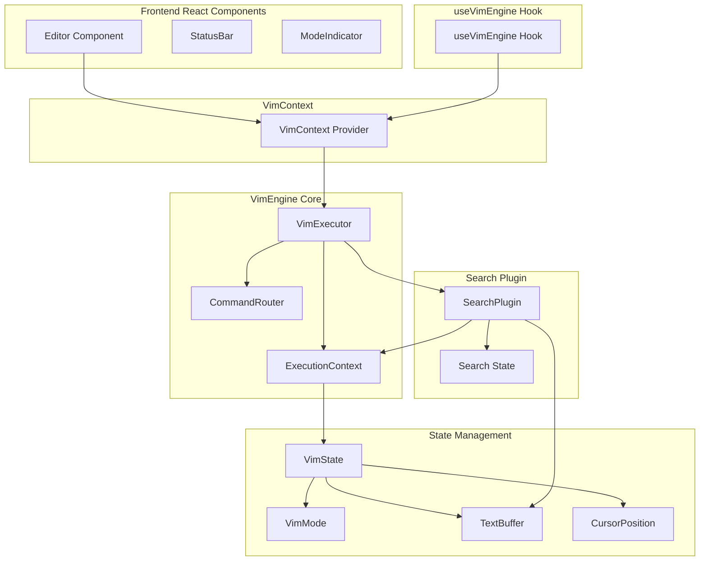
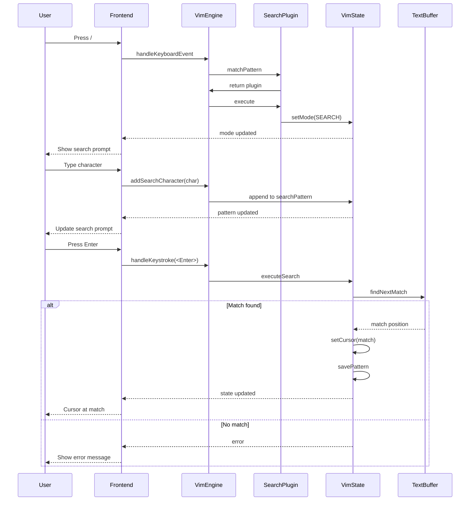

# Search Functionality Implementation Plan

## Overview

This document outlines a detailed implementation plan for adding search functionality to the vim-engine, mirroring vim's `/` command behavior. The implementation maintains a clean separation between frontend (React) responsibilities and vim-engine responsibilities.

## Architecture Overview



## Key Requirements

1. **Frontend Responsibilities**:
   - Mode management (transition to SEARCH mode when `/` is pressed)
   - Key capture during search mode
   - User interface updates (search prompt display)
   - Relaying key presses to vim-engine

2. **VimEngine Responsibilities**:
   - Search logic (pattern matching)
   - Pattern storage (persist after successful search)
   - Cursor movement on match
   - Error handling (pattern not found)

## Implementation Steps

### Phase 1: Core Infrastructure

#### 1.1 Add SEARCH Mode to VimMode

**File**: `packages/vim-engine/src/state/VimMode.ts`

**Changes**:
- Add `SEARCH` to the `VimMode` union type
- Add `SEARCH` constant to `VIM_MODE` object
- Add `SEARCH` case to `isValidVimMode` function

**Code snippet**:
```typescript
export type VimMode = 'NORMAL' | 'INSERT' | 'VISUAL' | 'COMMAND' | 'REPLACE' | 'SELECT' | 'SEARCH';

export const VIM_MODE = {
  // ... existing modes
  SEARCH: 'SEARCH' as VimMode,
} as const;
```

#### 1.2 Add Search State to VimState

**File**: `packages/vim-engine/src/state/VimState.ts`

**Changes**:
- Add `currentSearchPattern` property to store the current search pattern
- Add `lastSearchPattern` property to store the last successfully matched pattern
- Add methods to get/set search pattern
- Update `clone()` method to copy search patterns
- Update `reset()` method to clear search patterns

**New properties**:
```typescript
/**
 * Current search pattern being built during search mode
 */
private _currentSearchPattern: string = '';

/**
 * Last successfully matched search pattern
 */
private _lastSearchPattern: string = '';
```

**New methods**:
```typescript
getCurrentSearchPattern(): string;
setCurrentSearchPattern(pattern: string): void;
getLastSearchPattern(): string;
setLastSearchPattern(pattern: string): void;
clearSearchPattern(): void;
```

### Phase 2: VimEngine Methods

#### 2.1 Add Search Methods to VimExecutor

**File**: `packages/vim-engine/src/core/VimExecutor.ts`

**New methods**:
```typescript
/**
 * Start search mode - called when user presses /
 */
startSearchMode(): void;

/**
 * Add a character to the current search pattern
 * @param char - The character to add
 */
addSearchCharacter(char: string): void;

/**
 * Remove the last character from the search pattern
 */
removeSearchCharacter(): void;

/**
 * Execute the search with the current pattern
 * @returns SearchResult with match position or error
 */
executeSearch(): { success: boolean; line: number; column: number; error?: string };

/**
 * Exit search mode and return to normal mode
 */
exitSearchMode(): void;

/**
 * Get the current search pattern
 */
getCurrentSearchPattern(): string;

/**
 * Cancel search and return to normal mode without executing
 */
cancelSearch(): void;
```

#### 2.2 Update ErrorHandler

**File**: `packages/vim-engine/src/core/ErrorHandler.ts`

**Add error type**:
```typescript
export type SearchErrorCode = 'PATTERN_NOT_FOUND';

export class VimError extends Error {
  code: ErrorCode | SearchErrorCode;
  
  constructor(code: ErrorCode | SearchErrorCode, message: string) {
    super(message);
    this.code = code;
    this.name = 'VimError';
  }
}
```

### Phase 3: Search Plugin

#### 3.1 Create SearchPlugin

**File**: `packages/vim-engine/src/plugins/search/SearchPlugin.ts`

**Structure**:
```typescript
export class SearchPlugin extends AbstractVimPlugin {
  constructor() {
    super(
      'search',
      'Search functionality for vim',
      ['/', '?'],  // Forward and backward search patterns
      ['NORMAL']   // Only active in normal mode
    );
  }

  protected performAction(context: ExecutionContextType): void {
    // Start search mode when / or ? is pressed
    context.setMode('SEARCH');
    context.setCurrentSearchPattern('');
  }
}
```

#### 3.2 Create Search Utilities

**File**: `packages/vim-engine/src/plugins/search/searchUtils.ts`

**Functions**:
```typescript
/**
 * Find next occurrence of pattern in buffer
 * @param buffer - The text buffer to search
 * @param pattern - The search pattern
 * @param startLine - Line to start searching from
 * @param startColumn - Column to start searching from
 * @returns Position of match or null if not found
 */
export function findNextMatch(
  buffer: TextBuffer,
  pattern: string,
  startLine: number,
  startColumn: number
): { line: number; column: number } | null;

/**
 * Find previous occurrence of pattern in buffer
 * @param buffer - The text buffer to search
 * @param pattern - The search pattern
 * @param startLine - Line to start searching from
 * @param startColumn - Column to start searching from
 * @returns Position of match or null if not found
 */
export function findPreviousMatch(
  buffer: TextBuffer,
  pattern: string,
  startLine: number,
  startColumn: number
): { line: number; column: number } | null;
```

### Phase 4: Frontend Integration

#### 4.1 Update VimContext

**File**: `packages/vim-demo/src/contexts/VimContext.tsx`

**Changes**:
- Add search mode support in `handleKeyDown`
- Add search pattern display state
- Register SearchPlugin

**New state**:
```typescript
const [searchPattern, setSearchPattern] = useState('');
const [searchError, setSearchError] = useState<string | null>(null);
```

**Update handleKeyDown for search mode**:
```typescript
const handleKeyDown = (event: React.KeyboardEvent) => {
  if (!vimEngine) return;
  
  const currentMode = vimEngine.getCurrentMode();
  
  if (currentMode === VIM_MODE.SEARCH) {
    // Handle search mode keys
    if (event.key === 'Enter') {
      // Execute search
      vimEngine.handleKeystroke('<Enter>');
      updateState();
    } else if (event.key === 'Escape') {
      // Cancel search
      vimEngine.cancelSearch();
      updateState();
    } else if (event.key === 'Backspace') {
      // Remove last character
      vimEngine.handleKeystroke('<BS>');
      updateState();
    } else if (event.key.length === 1) {
      // Add character to search pattern
      vimEngine.addSearchCharacter(event.key);
      updateState();
    }
    
    event.preventDefault();
    event.stopPropagation();
    return;
  }
  
  // ... existing handling
};
```

#### 4.2 Update StatusBar for Search Mode

**File**: `packages/vim-demo/src/components/StatusBar.tsx`

**Changes**:
- Add SEARCH mode styling
- Display search prompt when in search mode
- Show search pattern as it's being typed

**Search mode display**:
```typescript
case VIM_MODE.SEARCH:
  return 'bg-vim-search text-white';

case VIM_MODE.SEARCH:
  return 'SEARCH';
```

**Search prompt**:
```typescript
// Show search prompt when in search mode
if (vimState.mode === VIM_MODE.SEARCH) {
  return (
    <div className="search-prompt">
      /{currentSearchPattern}
    </div>
  );
}
```

#### 4.3 Update ModeIndicator

**File**: `packages/vim-demo/src/components/ModeIndicator.tsx`

**Changes**:
- Add SEARCH mode configuration

**New mode config**:
```typescript
case VIM_MODE.SEARCH:
  return {
    label: 'SEARCH',
    color: 'bg-vim-search',
    textColor: 'text-vim-search',
    borderColor: 'border-vim-search',
  };
```

**New badge**:
```typescript
case VIM_MODE.SEARCH:
  return { label: '/', color: 'bg-vim-search' };
```

#### 4.4 Update Editor Component

**File**: `packages/vim-demo/src/components/Editor.tsx`

**Changes**:
- Add search mode cursor styling
- Show search input overlay when in search mode

**Search mode cursor**:
```typescript
case VIM_MODE.SEARCH:
  return { ...baseStyle, backgroundColor: '#f59e0b', opacity: 0.8 };
```

**Search input overlay**:
```typescript
{/* Search input overlay */}
{vimState.mode === VIM_MODE.SEARCH && (
  <div className="search-overlay">
    <span className="search-prompt">/</span>
    <input
      type="text"
      value={searchPattern}
      onChange={(e) => handleSearchInput(e.target.value)}
      className="search-input"
      autoFocus
    />
  </div>
)}
```

#### 4.5 Add Tailwind Colors

**File**: `packages/vim-demo/tailwind.config.js`

**Add**:
```javascript
colors: {
  'vim-search': '#f59e0b',
}
```

### Phase 5: Plugin Registration

#### 5.1 Register SearchPlugin

**Update** `packages/vim-demo/src/contexts/VimContext.tsx`:
```typescript
import { SearchPlugin } from '@vim-engine/core';

// In useEffect:
engine.registerPlugin(new SearchPlugin());
```

**Update** `packages/vim-demo/src/hooks/useVimEngine.ts`:
```typescript
import { SearchPlugin } from '@vim-engine/core';

// In useEffect:
engine.registerPlugin(new SearchPlugin());
```

### Phase 6: Exports

#### 6.1 Export Search Components

**File**: `packages/vim-engine/src/plugins/search/index.ts`
```typescript
export { SearchPlugin } from './SearchPlugin';
export { SearchState } from './SearchState';
export * from './searchUtils';
```

**File**: `packages/vim-engine/src/plugins/index.ts`
```typescript
export * from './search';
export * from './movement';
```

**File**: `packages/vim-engine/src/index.ts`
```typescript
export * from './plugins';
// ... existing exports
```

## Search Flow Diagram



## Error Handling

**Error message format**:
```
Pattern not found: {searchPattern}
```

**Display location**: Status bar or toast notification

## Testing Strategy

1. **Unit Tests**:
   - `SearchPlugin.test.ts`
   - `searchUtils.test.ts`
   - `VimState.search.test.ts`

2. **Integration Tests**:
   - Search flow integration
   - Mode transition tests
   - Error handling tests

3. **E2E Tests**:
   - Full search user journey
   - Error message display

## Files to Create/Modify

### New Files
- `packages/vim-engine/src/plugins/search/SearchPlugin.ts`
- `packages/vim-engine/src/plugins/search/SearchState.ts`
- `packages/vim-engine/src/plugins/search/searchUtils.ts`
- `packages/vim-engine/src/plugins/search/index.ts`

### Modified Files
- `packages/vim-engine/src/state/VimMode.ts`
- `packages/vim-engine/src/state/VimState.ts`
- `packages/vim-engine/src/core/VimExecutor.ts`
- `packages/vim-engine/src/core/ErrorHandler.ts`
- `packages/vim-engine/src/plugins/index.ts`
- `packages/vim-engine/src/index.ts`
- `packages/vim-demo/src/contexts/VimContext.tsx`
- `packages/vim-demo/src/hooks/useVimEngine.ts`
- `packages/vim-demo/src/components/StatusBar.tsx`
- `packages/vim-demo/src/components/ModeIndicator.tsx`
- `packages/vim-demo/src/components/Editor.tsx`
- `packages/vim-demo/tailwind.config.js`

## Implementation Order

1. Add SEARCH mode to VimMode
2. Add search state to VimState
3. Create SearchPlugin
4. Add search methods to VimExecutor
5. Create search utilities
6. Update ErrorHandler for search errors
7. Update frontend components for search mode
8. Add tailwind color for search mode
9. Register SearchPlugin in demo app
10. Add exports
11. Write tests
