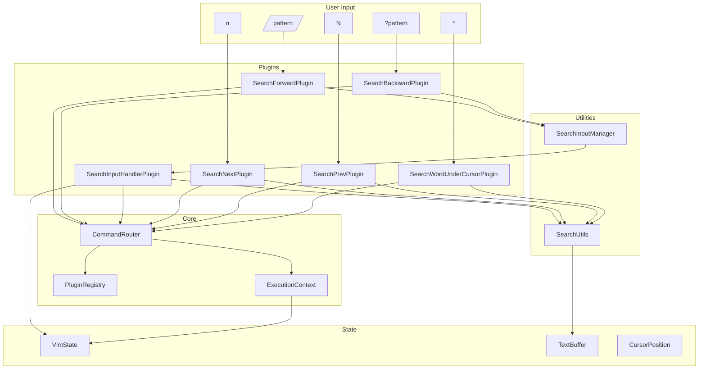
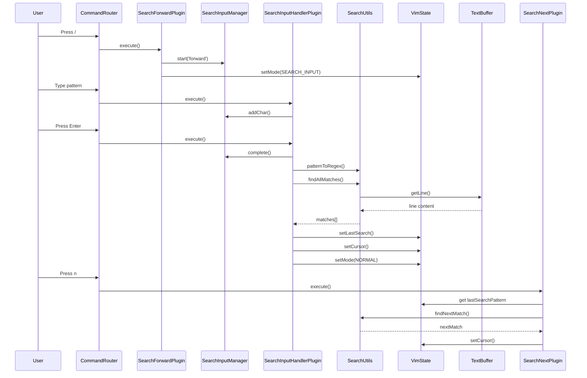

# Search Movement Keybindings Implementation Plan

## Overview

This plan details the implementation of Search Movement keybindings for the Vim engine, including `/pattern`, `?pattern`, `n`, `N`, and `*` commands. The implementation will follow the existing movement plugin architecture and integrate seamlessly with the current codebase.

## Keybindings to Implement

| Keybinding | Action | Description |
|------------|--------|-------------|
| `/pattern` | Search forward | Searches forward for pattern. Press Enter to execute, then n to jump to next match. |
| `?pattern` | Search backward | Searches backward for pattern. |
| `n` | Next match | Jumps to the next search result (in the direction of last search). |
| `N` | Previous match | Jumps to the previous search result (opposite direction of last search). |
| `*` | Next word | Searches for the word currently under your cursor. |

## Architecture Analysis

### Existing Movement Plugin Structure

The project follows a well-established plugin architecture:

- **Base Classes:**
  - [`AbstractVimPlugin`](../packages/vim-engine/src/plugin/AbstractVimPlugin.ts) - Base class for all plugins
  - [`MovementPlugin`](../packages/vim-engine/src/plugins/movement/base/MovementPlugin.ts) - Base for movement plugins
  - [`DirectionalMovementPlugin`](../packages/vim-engine/src/plugins/movement/base/DirectionalMovementPlugin.ts) - For step-based movements
  - [`WordMovementPlugin`](../packages/vim-engine/src/plugins/movement/base/WordMovementPlugin.ts) - For word boundary movements

- **Key Interfaces:**
  - [`VimPlugin`](../packages/vim-engine/src/plugin/VimPlugin.ts) - Plugin contract
  - [`ExecutionContext`](../packages/vim-engine/src/plugin/ExecutionContext.ts) - Provides state access
  - [`VimState`](../packages/vim-engine/src/state/VimState.ts) - Central state container

- **Naming Conventions:**
  - Directory: `packages/vim-engine/src/plugins/movement/{key}/`
  - Plugin file: `{Key}MovementPlugin.ts`
  - Test file: `{Key}MovementPlugin.test.ts`
  - Index file: `index.ts` (exports plugin)
  - Example: [`packages/vim-engine/src/plugins/movement/w/`](../packages/vim-engine/src/plugins/movement/w/)

### State Management

[`VimState`](../packages/vim-engine/src/state/VimState.ts) already includes:
- `searchHistory: string[]` - Array of previous search terms
- `pushSearch(term: string)` - Method to add to search history

**Additional State Required:**
- `lastSearchPattern: string | null` - The last search pattern used
- `lastSearchDirection: 'forward' | 'backward'` - Direction of last search
- `currentMatchPosition: CursorPosition | null` - Current match position
- `searchMatches: CursorPosition[]` - Array of all match positions for current pattern

### Multi-Key Sequence Handling

Search commands `/pattern` and `?pattern` require special handling:

1. User presses `/` or `?` - enters search input mode
2. User types pattern characters - accumulates in search buffer
3. User presses Enter - executes search
4. User presses Esc - cancels search

This requires:
- A search input state manager
- Pattern accumulation buffer
- Mode transition between NORMAL and SEARCH_INPUT modes

## Implementation Phases

### Phase 1: Core Search Infrastructure

**Objective:** Establish the foundational components for search functionality.

#### 1.1 Extend VimState with Search State

**File:** `packages/vim-engine/src/state/VimState.ts`

**Changes:**
```typescript
export class VimState {
  // Existing properties...
  
  /**
   * Last search pattern used (for n/N commands)
   */
  lastSearchPattern: string | null = null;
  
  /**
   * Direction of last search ('forward' or 'backward')
   */
  lastSearchDirection: 'forward' | 'backward' | null = null;
  
  /**
   * Current match position for n/N navigation
   */
  currentMatchPosition: CursorPosition | null = null;
  
  /**
   * All match positions for current search pattern
   */
  searchMatches: CursorPosition[] = [];
  
  /**
   * Set the last search pattern and direction
   */
  setLastSearch(pattern: string, direction: 'forward' | 'backward'): void {
    this.lastSearchPattern = pattern;
    this.lastSearchDirection = direction;
    this.pushSearch(pattern); // Add to history
  }
  
  /**
   * Clear search state
   */
  clearSearchState(): void {
    this.lastSearchPattern = null;
    this.lastSearchDirection = null;
    this.currentMatchPosition = null;
    this.searchMatches = [];
  }
}
```

**Considerations:**
- Ensure `clone()` method copies new search state properties
- Ensure `reset()` method clears search state
- Update type definitions if needed

#### 1.2 Add SEARCH_INPUT Mode to VimMode

**File:** `packages/vim-engine/src/state/VimMode.ts`

**Changes:**
```typescript
export const VIM_MODE = {
  NORMAL: 'NORMAL',
  INSERT: 'INSERT',
  VISUAL: 'VISUAL',
  REPLACE: 'REPLACE',
  COMMAND: 'COMMAND',
  SEARCH_INPUT: 'SEARCH_INPUT', // New mode
} as const;

export type VimMode = typeof VIM_MODE[keyof typeof VIM_MODE];
```

**Considerations:**
- This mode is active while user is typing search pattern
- Different from COMMAND mode (which is for `:commands`)
- Should be handled in mode switching logic

#### 1.3 Create Search Utility Functions

**File:** `packages/vim-engine/src/plugins/movement/utils/searchUtils.ts`

**Purpose:** Core search functionality shared across search plugins.

**Functions to implement:**

```typescript
/**
 * Find all occurrences of a pattern in the buffer
 * 
 * @param buffer - The text buffer to search
 * @param pattern - The regex pattern to search for
 * @param startLine - Line to start searching from (default: 0)
 * @param direction - 'forward' or 'backward'
 * @returns Array of CursorPosition where pattern was found
 */
export function findAllMatches(
  buffer: TextBuffer,
  pattern: RegExp,
  startLine: number = 0,
  direction: 'forward' | 'backward' = 'forward'
): CursorPosition[] {
  const matches: CursorPosition[] = [];
  const lineCount = buffer.getLineCount();
  
  if (direction === 'forward') {
    for (let line = startLine; line < lineCount; line++) {
      const lineContent = buffer.getLine(line);
      if (!lineContent) continue;
      
      let match;
      const regex = new RegExp(pattern.source, pattern.flags);
      while ((match = regex.exec(lineContent)) !== null) {
        matches.push(new CursorPosition(line, match.index));
        // Prevent infinite loop for zero-width matches
        if (match.index === regex.lastIndex) {
          regex.lastIndex++;
        }
      }
    }
  } else {
    // Backward search
    for (let line = startLine; line >= 0; line--) {
      const lineContent = buffer.getLine(line);
      if (!lineContent) continue;
      
      const lineMatches: CursorPosition[] = [];
      let match;
      const regex = new RegExp(pattern.source, pattern.flags);
      while ((match = regex.exec(lineContent)) !== null) {
        lineMatches.push(new CursorPosition(line, match.index));
        if (match.index === regex.lastIndex) {
          regex.lastIndex++;
        }
      }
      // Reverse to maintain backward order
      matches.push(...lineMatches.reverse());
    }
  }
  
  return matches;
}

/**
 * Find next match from current cursor position
 * 
 * @param matches - Array of all match positions
 * @param cursor - Current cursor position
 * @param direction - 'forward' or 'backward'
 * @param wrap - Whether to wrap around buffer (default: false)
 * @returns Next match position or null
 */
export function findNextMatch(
  matches: CursorPosition[],
  cursor: CursorPosition,
  direction: 'forward' | 'backward',
  wrap: boolean = false
): CursorPosition | null {
  if (matches.length === 0) return null;
  
  // Find current match index
  let currentIndex = -1;
  for (let i = 0; i < matches.length; i++) {
    if (matches[i].equals(cursor)) {
      currentIndex = i;
      break;
    }
  }
  
  if (direction === 'forward') {
    const nextIndex = currentIndex + 1;
    if (nextIndex < matches.length) {
      return matches[nextIndex];
    } else if (wrap) {
      return matches[0];
    }
  } else {
    const prevIndex = currentIndex - 1;
    if (prevIndex >= 0) {
      return matches[prevIndex];
    } else if (wrap) {
      return matches[matches.length - 1];
    }
  }
  
  return null;
}

/**
 * Extract word under cursor
 * 
 * @param buffer - The text buffer
 * @param cursor - Current cursor position
 * @returns The word under cursor or null if not on a word
 */
export function extractWordUnderCursor(
  buffer: TextBuffer,
  cursor: CursorPosition
): string | null {
  const line = buffer.getLine(cursor.line);
  if (!line) return null;
  
  const char = line[cursor.column];
  if (!char || !isWordChar(char)) return null;
  
  // Find word start
  let start = cursor.column;
  while (start >= 0 && isWordChar(line[start])) {
    start--;
  }
  start++;
  
  // Find word end
  let end = cursor.column;
  while (end < line.length && isWordChar(line[end])) {
    end++;
  }
  
  return line.slice(start, end);
}

/**
 * Convert search pattern to RegExp
 * 
 * @param pattern - User input pattern
 * @returns RegExp object or null if invalid
 */
export function patternToRegex(pattern: string): RegExp | null {
  try {
    // Handle special cases
    if (pattern === '') return null;
    
    // Vim uses magic mode by default, so most characters are literal
    // We'll implement basic magic mode support
    return new RegExp(pattern, 'g');
  } catch (e) {
    return null;
  }
}
```

**Considerations:**
- Use existing `isWordChar()` from [`wordBoundary.ts`](../packages/vim-engine/src/plugins/movement/utils/wordBoundary.ts)
- Handle edge cases: empty buffer, invalid patterns, no matches
- Consider case sensitivity (Vim is case-sensitive by default, but `ignorecase` option can change this)
- Support regex escape sequences properly
- Handle special characters like `.`, `*`, `?`, etc. in patterns

#### 1.4 Create Search Input State Manager

**File:** `packages/vim-engine/src/plugins/movement/utils/searchInputManager.ts`

**Purpose:** Manage the state during search pattern input.

```typescript
/**
 * Search input state
 */
export interface SearchInputState {
  isActive: boolean;
  direction: 'forward' | 'backward';
  pattern: string;
  cursorPosition: number; // Cursor position within pattern
}

/**
 * Search input manager handles multi-key sequence for / and ?
 */
export class SearchInputManager {
  private state: SearchInputState = {
    isActive: false,
    direction: 'forward',
    pattern: '',
    cursorPosition: 0,
  };
  
  /**
   * Start search input
   */
  start(direction: 'forward' | 'backward'): void {
    this.state = {
      isActive: true,
      direction,
      pattern: '',
      cursorPosition: 0,
    };
  }
  
  /**
   * Add character to pattern
   */
  addChar(char: string): void {
    this.state.pattern = 
      this.state.pattern.slice(0, this.state.cursorPosition) +
      char +
      this.state.pattern.slice(this.state.cursorPosition);
    this.state.cursorPosition++;
  }
  
  /**
   * Remove character at cursor
   */
  deleteChar(): void {
    if (this.state.cursorPosition > 0) {
      this.state.pattern = 
        this.state.pattern.slice(0, this.state.cursorPosition - 1) +
        this.state.pattern.slice(this.state.cursorPosition);
      this.state.cursorPosition--;
    }
  }
  
  /**
   * Move cursor within pattern
   */
  moveCursor(delta: number): void {
    const newPos = this.state.cursorPosition + delta;
    this.state.cursorPosition = Math.max(0, Math.min(this.state.pattern.length, newPos));
  }
  
  /**
   * Cancel search input
   */
  cancel(): void {
    this.state.isActive = false;
    this.state.pattern = '';
    this.state.cursorPosition = 0;
  }
  
  /**
   * Complete search input and get result
   */
  complete(): { pattern: string; direction: 'forward' | 'backward' } | null {
    if (!this.state.isActive) return null;
    
    const result = {
      pattern: this.state.pattern,
      direction: this.state.direction,
    };
    
    this.state.isActive = false;
    return result;
  }
  
  /**
   * Get current state
   */
  getState(): Readonly<SearchInputState> {
    return { ...this.state };
  }
  
  /**
   * Check if search input is active
   */
  isActive(): boolean {
    return this.state.isActive;
  }
}
```

**Considerations:**
- This manager should be instantiated once per VimState or ExecutionContext
- Need to integrate with mode switching logic
- Should handle special keys: Enter (complete), Esc (cancel), Backspace (delete), arrows (navigate)

### Phase 2: Search Input Plugins (/ and ?)

**Objective:** Implement the multi-key sequence handling for `/` and `?` commands.

#### 2.1 Create SearchForwardPlugin (/)

**Directory:** `packages/vim-engine/src/plugins/movement/search-forward/`

**Files:**
- `SearchForwardPlugin.ts` - Main plugin implementation
- `SearchForwardPlugin.test.ts` - Unit tests
- `index.ts` - Export plugin

**Implementation:**

```typescript
/**
 * SearchForwardPlugin - Initiate forward search (/ key)
 * 
 * This plugin handles the '/' key which starts a forward search.
 * It transitions to SEARCH_INPUT mode and begins pattern accumulation.
 */
import { AbstractVimPlugin } from '../../../plugin/AbstractVimPlugin';
import { VIM_MODE, VimMode } from '../../../state/VimMode';
import { SearchInputManager } from '../utils/searchInputManager';

export class SearchForwardPlugin extends AbstractVimPlugin {
  readonly name = 'movement-search-forward';
  readonly version = '1.0.0';
  readonly description = 'Initiate forward search (/ key)';
  readonly patterns = ['/'];
  readonly modes: VimMode[] = [VIM_MODE.NORMAL, VIM_MODE.VISUAL];
  
  private searchInputManager: SearchInputManager;
  
  constructor(searchInputManager: SearchInputManager) {
    super('movement-search-forward', 'Initiate forward search (/ key)', ['/'], [VIM_MODE.NORMAL, VIM_MODE.VISUAL]);
    this.searchInputManager = searchInputManager;
  }
  
  protected performAction(context: ExecutionContextType): void {
    // Start search input in forward direction
    this.searchInputManager.start('forward');
    
    // Transition to SEARCH_INPUT mode
    context.setMode(VIM_MODE.SEARCH_INPUT);
  }
}
```

**Considerations:**
- Requires dependency injection of SearchInputManager
- Should work in both NORMAL and VISUAL modes
- Pattern input is handled by a separate plugin (see 2.3)

#### 2.2 Create SearchBackwardPlugin (?)

**Directory:** `packages/vim-engine/src/plugins/movement/search-backward/`

**Files:**
- `SearchBackwardPlugin.ts` - Main plugin implementation
- `SearchBackwardPlugin.test.ts` - Unit tests
- `index.ts` - Export plugin

**Implementation:**

```typescript
/**
 * SearchBackwardPlugin - Initiate backward search (? key)
 * 
 * This plugin handles the '?' key which starts a backward search.
 * It transitions to SEARCH_INPUT mode and begins pattern accumulation.
 */
import { AbstractVimPlugin } from '../../../plugin/AbstractVimPlugin';
import { VIM_MODE, VimMode } from '../../../state/VimMode';
import { SearchInputManager } from '../utils/searchInputManager';

export class SearchBackwardPlugin extends AbstractVimPlugin {
  readonly name = 'movement-search-backward';
  readonly version = '1.0.0';
  readonly description = 'Initiate backward search (? key)';
  readonly patterns = ['?'];
  readonly modes: VimMode[] = [VIM_MODE.NORMAL, VIM_MODE.VISUAL];
  
  private searchInputManager: SearchInputManager;
  
  constructor(searchInputManager: SearchInputManager) {
    super('movement-search-backward', 'Initiate backward search (? key)', ['?'], [VIM_MODE.NORMAL, VIM_MODE.VISUAL]);
    this.searchInputManager = searchInputManager;
  }
  
  protected performAction(context: ExecutionContextType): void {
    // Start search input in backward direction
    this.searchInputManager.start('backward');
    
    // Transition to SEARCH_INPUT mode
    context.setMode(VIM_MODE.SEARCH_INPUT);
  }
}
```

**Considerations:**
- Same structure as SearchForwardPlugin
- Only difference is direction parameter

#### 2.3 Create SearchInputHandlerPlugin

**Directory:** `packages/vim-engine/src/plugins/movement/search-input/`

**Files:**
- `SearchInputHandlerPlugin.ts` - Main plugin implementation
- `SearchInputHandlerPlugin.test.ts` - Unit tests
- `index.ts` - Export plugin

**Purpose:** Handles keystrokes while in SEARCH_INPUT mode.

**Implementation:**

```typescript
/**
 * SearchInputHandlerPlugin - Handle keystrokes during search input
 * 
 * This plugin handles character input while in SEARCH_INPUT mode.
 * It accumulates the search pattern and handles special keys:
 * - Enter: Execute search
 * - Esc: Cancel search
 * - Backspace: Delete character
 * - Left/Right arrows: Move cursor in pattern
 */
import { AbstractVimPlugin } from '../../../plugin/AbstractVimPlugin';
import { VIM_MODE, VimMode } from '../../../state/VimMode';
import { SearchInputManager } from '../utils/searchInputManager';
import { patternToRegex, findAllMatches, findNextMatch } from '../utils/searchUtils';

export class SearchInputHandlerPlugin extends AbstractVimPlugin {
  readonly name = 'movement-search-input-handler';
  readonly version = '1.0.0';
  readonly description = 'Handle search input keystrokes';
  readonly patterns = ['<any>']; // Special pattern for any key
  readonly modes: VimMode[] = [VIM_MODE.SEARCH_INPUT];
  
  private searchInputManager: SearchInputManager;
  
  constructor(searchInputManager: SearchInputManager) {
    super('movement-search-input-handler', 'Handle search input keystrokes', ['<any>'], [VIM_MODE.SEARCH_INPUT]);
    this.searchInputManager = searchInputManager;
  }
  
  protected performAction(context: ExecutionContextType): void {
    // This is a simplified version - actual implementation needs to access the keystroke
    // The actual keystroke handling would be done in the execute method with access to the key event
    
    // For now, this is a placeholder showing the structure
    // In practice, you'd need to extend the ExecutionContext to provide access to the keystroke
  }
  
  /**
   * Handle Enter key - execute search
   */
  private handleEnter(context: ExecutionContextType): void {
    const result = this.searchInputManager.complete();
    if (!result) return;
    
    const { pattern, direction } = result;
    const buffer = context.getBuffer();
    const cursor = context.getCursor();
    const state = context.getState();
    
    // Convert pattern to regex
    const regex = patternToRegex(pattern);
    if (!regex) {
      // Invalid pattern - show error or just cancel
      context.setMode(VIM_MODE.NORMAL);
      return;
    }
    
    // Find all matches
    const startLine = direction === 'forward' ? cursor.line : cursor.line;
    const matches = findAllMatches(buffer, regex, startLine, direction);
    
    if (matches.length === 0) {
      // No matches found - show message
      context.setMode(VIM_MODE.NORMAL);
      return;
    }
    
    // Find first match
    const firstMatch = matches[0];
    
    // Update state
    state.setLastSearch(pattern, direction);
    state.searchMatches = matches;
    state.currentMatchPosition = firstMatch;
    
    // Move cursor to first match
    context.setCursor(firstMatch);
    
    // Return to NORMAL mode
    context.setMode(VIM_MODE.NORMAL);
  }
  
  /**
   * Handle Esc key - cancel search
   */
  private handleEsc(context: ExecutionContextType): void {
    this.searchInputManager.cancel();
    context.setMode(VIM_MODE.NORMAL);
  }
  
  /**
   * Handle Backspace key - delete character
   */
  private handleBackspace(): void {
    this.searchInputManager.deleteChar();
  }
  
  /**
   * Handle character input - add to pattern
   */
  private handleChar(char: string): void {
    this.searchInputManager.addChar(char);
  }
  
  /**
   * Handle arrow keys - move cursor in pattern
   */
  private handleArrow(direction: 'left' | 'right'): void {
    const delta = direction === 'left' ? -1 : 1;
    this.searchInputManager.moveCursor(delta);
  }
}
```

**Considerations:**
- This plugin needs access to the actual keystroke, not just pattern matching
- May need to extend [`ExecutionContext`](../packages/vim-engine/src/plugin/ExecutionContext.ts) to provide keystroke access
- Alternatively, could use a different pattern matching approach for SEARCH_INPUT mode
- Consider integrating with UI for displaying the search pattern

### Phase 3: Search Navigation Plugins (n and N)

**Objective:** Implement navigation between search results.

#### 3.1 Create SearchNextPlugin (n)

**Directory:** `packages/vim-engine/src/plugins/movement/search-next/`

**Files:**
- `SearchNextPlugin.ts` - Main plugin implementation
- `SearchNextPlugin.test.ts` - Unit tests
- `index.ts` - Export plugin

**Implementation:**

```typescript
/**
 * SearchNextPlugin - Jump to next search result (n key)
 * 
 * This plugin handles the 'n' key which jumps to the next search result
 * in the direction of the last search.
 */
import { AbstractVimPlugin } from '../../../plugin/AbstractVimPlugin';
import { VIM_MODE, VimMode } from '../../../state/VimMode';
import { findNextMatch } from '../utils/searchUtils';

export class SearchNextPlugin extends AbstractVimPlugin {
  readonly name = 'movement-search-next';
  readonly version = '1.0.0';
  readonly description = 'Jump to next search result (n key)';
  readonly patterns = ['n'];
  readonly modes: VimMode[] = [VIM_MODE.NORMAL, VIM_MODE.VISUAL];
  
  protected performAction(context: ExecutionContextType): void {
    const state = context.getState();
    const cursor = context.getCursor();
    
    // Check if there's a last search
    if (!state.lastSearchPattern || !state.lastSearchDirection) {
      // No previous search - do nothing or show message
      return;
    }
    
    // Find next match
    const nextMatch = findNextMatch(
      state.searchMatches,
      cursor,
      state.lastSearchDirection,
      false // No wrap by default
    );
    
    if (nextMatch) {
      // Move cursor to next match
      context.setCursor(nextMatch);
      state.currentMatchPosition = nextMatch;
    } else {
      // No more matches - show message
      // Could implement wrap behavior here if desired
    }
  }
}
```

**Considerations:**
- Should handle case when no previous search exists
- Should handle case when no more matches in current direction
- Consider adding wrap behavior (optional, can be configurable)
- Should work in both NORMAL and VISUAL modes

#### 3.2 Create SearchPrevPlugin (N)

**Directory:** `packages/vim-engine/src/plugins/movement/search-prev/`

**Files:**
- `SearchPrevPlugin.ts` - Main plugin implementation
- `SearchPrevPlugin.test.ts` - Unit tests
- `index.ts` - Export plugin

**Implementation:**

```typescript
/**
 * SearchPrevPlugin - Jump to previous search result (N key)
 * 
 * This plugin handles the 'N' key which jumps to the previous search result
 * (opposite direction of last search).
 */
import { AbstractVimPlugin } from '../../../plugin/AbstractVimPlugin';
import { VIM_MODE, VimMode } from '../../../state/VimMode';
import { findNextMatch } from '../utils/searchUtils';

export class SearchPrevPlugin extends AbstractVimPlugin {
  readonly name = 'movement-search-prev';
  readonly version = '1.0.0';
  readonly description = 'Jump to previous search result (N key)';
  readonly patterns = ['N'];
  readonly modes: VimMode[] = [VIM_MODE.NORMAL, VIM_MODE.VISUAL];
  
  protected performAction(context: ExecutionContextType): void {
    const state = context.getState();
    const cursor = context.getCursor();
    
    // Check if there's a last search
    if (!state.lastSearchPattern || !state.lastSearchDirection) {
      // No previous search - do nothing or show message
      return;
    }
    
    // Find previous match (opposite direction)
    const oppositeDirection = state.lastSearchDirection === 'forward' ? 'backward' : 'forward';
    const prevMatch = findNextMatch(
      state.searchMatches,
      cursor,
      oppositeDirection,
      false // No wrap by default
    );
    
    if (prevMatch) {
      // Move cursor to previous match
      context.setCursor(prevMatch);
      state.currentMatchPosition = prevMatch;
    } else {
      // No more matches - show message
      // Could implement wrap behavior here if desired
    }
  }
}
```

**Considerations:**
- Same considerations as SearchNextPlugin
- Direction is opposite of last search direction
- Should handle edge cases consistently with n command

### Phase 4: Word Search Plugin (*)

**Objective:** Implement search for word under cursor.

#### 4.1 Create SearchWordUnderCursorPlugin (*)

**Directory:** `packages/vim-engine/src/plugins/movement/search-word/`

**Files:**
- `SearchWordUnderCursorPlugin.ts` - Main plugin implementation
- `SearchWordUnderCursorPlugin.test.ts` - Unit tests
- `index.ts` - Export plugin

**Implementation:**

```typescript
/**
 * SearchWordUnderCursorPlugin - Search for word under cursor (* key)
 * 
 * This plugin handles the '*' key which searches for the word currently
 * under the cursor. It performs a forward search for the exact word.
 */
import { AbstractVimPlugin } from '../../../plugin/AbstractVimPlugin';
import { VIM_MODE, VimMode } from '../../../state/VimMode';
import { extractWordUnderCursor, patternToRegex, findAllMatches, findNextMatch } from '../utils/searchUtils';

export class SearchWordUnderCursorPlugin extends AbstractVimPlugin {
  readonly name = 'movement-search-word';
  readonly version = '1.0.0';
  readonly description = 'Search for word under cursor (* key)';
  readonly patterns = ['*'];
  readonly modes: VimMode[] = [VIM_MODE.NORMAL, VIM_MODE.VISUAL];
  
  protected performAction(context: ExecutionContextType): void {
    const buffer = context.getBuffer();
    const cursor = context.getCursor();
    const state = context.getState();
    
    // Extract word under cursor
    const word = extractWordUnderCursor(buffer, cursor);
    if (!word) {
      // Not on a word - do nothing or show message
      return;
    }
    
    // Create regex for exact word match (with word boundaries)
    const pattern = `\\b${word}\\b`;
    const regex = patternToRegex(pattern);
    if (!regex) {
      return;
    }
    
    // Find all matches (forward search)
    const matches = findAllMatches(buffer, regex, cursor.line + 1, 'forward');
    
    if (matches.length === 0) {
      // No matches found - show message
      return;
    }
    
    // Find first match (skip current position if it matches)
    let firstMatch = matches[0];
    if (firstMatch.line === cursor.line && firstMatch.column === cursor.column) {
      if (matches.length > 1) {
        firstMatch = matches[1];
      } else {
        // Only match is current position - show message
        return;
      }
    }
    
    // Update state
    state.setLastSearch(pattern, 'forward');
    state.searchMatches = matches;
    state.currentMatchPosition = firstMatch;
    
    // Move cursor to first match
    context.setCursor(firstMatch);
  }
}
```

**Considerations:**
- Should use word boundaries (`\b`) to match whole words only
- Should skip the current position if it matches
- Should handle case sensitivity (Vim is case-sensitive by default)
- Should work in both NORMAL and VISUAL modes
- Should handle edge case where cursor is not on a word

### Phase 5: Integration and Testing

**Objective:** Integrate all search plugins with the existing system and ensure comprehensive test coverage.

#### 5.1 Update Movement Index

**File:** `packages/vim-engine/src/plugins/movement/index.ts`

**Changes:**
```typescript
export { SearchForwardPlugin } from './search-forward';
export { SearchBackwardPlugin } from './search-backward';
export { SearchInputHandlerPlugin } from './search-input';
export { SearchNextPlugin } from './search-next';
export { SearchPrevPlugin } from './search-prev';
export { SearchWordUnderCursorPlugin } from './search-word';

export { SearchInputManager } from './utils/searchInputManager';
export * from './utils/searchUtils';
```

#### 5.2 Create Integration Tests

**File:** `packages/vim-engine/tests/integration/search-movement-integration.test.ts`

**Test scenarios:**
1. Forward search (`/pattern`) with Enter
2. Backward search (`?pattern`) with Enter
3. Cancel search with Esc
4. Navigate with `n` and `N`
5. Word search with `*`
6. Edge cases: empty buffer, no matches, invalid patterns
7. Multi-line search
8. Pattern with special characters
9. Search in VISUAL mode

#### 5.3 Create Unit Tests for Each Plugin

Each plugin should have comprehensive unit tests:

**Test coverage:**
- Basic functionality
- Edge cases
- Error handling
- State management
- Integration with VimState
- Mode transitions

#### 5.4 Update Documentation

**Files to update:**
- `packages/vim-engine/README.md` - Add search movement documentation
- `packages/vim-engine/src/plugins/movement/CONTRIBUTING.md` - Add search plugin guidelines
- Create `packages/vim-engine/src/plugins/movement/SEARCH_MOVEMENT.md` - Detailed search movement documentation

### Phase 6: Edge Cases and Error Handling

**Objective:** Ensure robust handling of edge cases and errors.

#### 6.1 Edge Cases to Handle

**Empty Buffer:**
- Search on empty buffer should do nothing or show message
- Should not crash or throw errors

**No Matches:**
- When pattern not found, show appropriate message
- Cursor should remain at current position
- State should be cleared appropriately

**Invalid Patterns:**
- Malformed regex patterns should be handled gracefully
- Show error message to user
- Return to NORMAL mode without crashing

**Empty Pattern:**
- Pressing Enter without typing pattern should cancel search
- Or show error message

**Special Characters:**
- Patterns with `.`, `*`, `?`, `+`, etc. should work correctly
- Escape sequences should be handled properly

**Case Sensitivity:**
- Default to case-sensitive matching
- Consider adding `ignorecase` option support (future enhancement)

**Large Files:**
- Performance considerations for large buffers
- Consider lazy evaluation or caching

**Multi-line Patterns:**
- Support for multi-line search patterns (future enhancement)
- Currently search line-by-line

#### 6.2 Error Handling Strategy

**Validation:**
- Validate pattern before searching
- Validate buffer state before operations
- Check for null/undefined values

**Graceful Degradation:**
- If search fails, return to previous state
- Don't leave system in inconsistent state
- Provide user feedback

**Logging:**
- Log errors for debugging
- Don't expose internal errors to user

**User Feedback:**
- Show appropriate messages for:
  - Pattern not found
  - Invalid pattern
  - No previous search (for n/N)
  - End of search results

### Phase 7: Performance Optimization

**Objective:** Ensure search operations are efficient.

#### 7.1 Caching Strategy

**Pattern Caching:**
- Cache compiled regex patterns
- Reuse for repeated searches

**Match Caching:**
- Cache search results for current pattern
- Invalidate when pattern changes or buffer changes

#### 7.2 Lazy Evaluation

**On-Demand Search:**
- Only search when needed (not on every keystroke)
- Debounce rapid pattern changes

**Incremental Search:**
- Consider implementing incremental search (show matches as user types)
- This is a future enhancement

#### 7.3 Performance Testing

**Benchmarks:**
- Test with large files (1000+ lines)
- Measure search time for complex patterns
- Optimize bottlenecks

### Phase 8: Configuration and Customization

**Objective:** Allow users to configure search behavior.

#### 8.1 Configuration Options

**Search Config Interface:**

```typescript
export interface SearchConfig {
  /**
   * Case-insensitive search
   * @default false
   */
  ignoreCase?: boolean;
  
  /**
   * Wrap search at buffer boundaries
   * @default false
   */
  wrapSearch?: boolean;
  
  /**
   * Highlight search matches
   * @default true
   */
  highlightMatches?: boolean;
  
  /**
   * Maximum search history size
   * @default 100
   */
  maxSearchHistory?: number;
  
  /**
   * Show incremental search results
   * @default false
   */
  incrementalSearch?: boolean;
}
```

#### 8.2 Integration with Existing Config

**Update MovementConfig:**

```typescript
export interface MovementConfig {
  // Existing properties...
  
  /**
   * Search-specific configuration
   */
  search?: SearchConfig;
}
```

## Architecture Diagram



## Data Flow Diagram



## File Structure

```
packages/vim-engine/src/plugins/movement/
├── search-forward/
│   ├── SearchForwardPlugin.ts
│   ├── SearchForwardPlugin.test.ts
│   └── index.ts
├── search-backward/
│   ├── SearchBackwardPlugin.ts
│   ├── SearchBackwardPlugin.test.ts
│   └── index.ts
├── search-input/
│   ├── SearchInputHandlerPlugin.ts
│   ├── SearchInputHandlerPlugin.test.ts
│   └── index.ts
├── search-next/
│   ├── SearchNextPlugin.ts
│   ├── SearchNextPlugin.test.ts
│   └── index.ts
├── search-prev/
│   ├── SearchPrevPlugin.ts
│   ├── SearchPrevPlugin.test.ts
│   └── index.ts
├── search-word/
│   ├── SearchWordUnderCursorPlugin.ts
│   ├── SearchWordUnderCursorPlugin.test.ts
│   └── index.ts
├── utils/
│   ├── searchUtils.ts
│   ├── searchUtils.test.ts
│   ├── searchInputManager.ts
│   └── searchInputManager.test.ts
└── index.ts (updated)
```

## Testing Strategy

### Unit Tests

**Each plugin should have:**
- Test initialization
- Test basic functionality
- Test edge cases
- Test error handling
- Test state management
- Test mode transitions

**Example test structure:**

```typescript
describe('SearchForwardPlugin', () => {
  describe('initialization', () => {
    it('should initialize with correct metadata', () => {
      const plugin = new SearchForwardPlugin(searchInputManager);
      expect(plugin.name).toBe('movement-search-forward');
      expect(plugin.patterns).toEqual(['/']);
      expect(plugin.modes).toEqual([VIM_MODE.NORMAL, VIM_MODE.VISUAL]);
    });
  });
  
  describe('execute', () => {
    it('should start search input in forward direction', () => {
      const plugin = new SearchForwardPlugin(searchInputManager);
      plugin.execute(context);
      expect(searchInputManager.getState().direction).toBe('forward');
    });
    
    it('should transition to SEARCH_INPUT mode', () => {
      const plugin = new SearchForwardPlugin(searchInputManager);
      plugin.execute(context);
      expect(context.getMode()).toBe(VIM_MODE.SEARCH_INPUT);
    });
  });
});
```

### Integration Tests

**Test scenarios:**
1. Complete search workflow: `/pattern` → type → Enter → `n` → `N`
2. Cancel search workflow: `/pattern` → Esc
3. Word search: `*` → verify cursor moves to next occurrence
4. Edge cases: empty buffer, no matches, invalid patterns
5. Multi-line search across large files
6. Search in VISUAL mode

### Performance Tests

**Test scenarios:**
1. Search in large files (1000+ lines)
2. Complex regex patterns
3. Multiple rapid searches
4. Search with many matches

## Dependencies

### Internal Dependencies

- [`AbstractVimPlugin`](../packages/vim-engine/src/plugin/AbstractVimPlugin.ts) - Base plugin class
- [`VimState`](../packages/vim-engine/src/state/VimState.ts) - State management
- [`ExecutionContext`](../packages/vim-engine/src/plugin/ExecutionContext.ts) - Execution context
- [`TextBuffer`](../packages/vim-engine/src/state/TextBuffer.ts) - Text buffer operations
- [`CursorPosition`](../packages/vim-engine/src/state/CursorPosition.ts) - Cursor position
- [`VimMode`](../packages/vim-engine/src/state/VimMode.ts) - Mode management
- [`wordBoundary.ts`](../packages/vim-engine/src/plugins/movement/utils/wordBoundary.ts) - Word boundary utilities

### External Dependencies

- None (pure TypeScript implementation)

## Future Enhancements

### Short-term (Post-Implementation)

1. **Incremental Search:** Show matches as user types pattern
2. **Search Highlighting:** Highlight all matches in the buffer
3. **Search Options:** Support for `ignorecase`, `smartcase`, `wrapscan` options
4. **Search History Navigation:** Navigate through search history with Up/Down arrows
5. **Regex Magic Mode:** Support for Vim's magic, verymagic, nomagic modes

### Long-term

1. **Multi-line Patterns:** Support for patterns spanning multiple lines
2. **Substitution:** Implement `:s/pattern/replacement/` command
3. **Global Search:** Search across multiple files/buffers
4. **Fuzzy Search:** Implement fuzzy matching for search
5. **Search with Count:** Support for `3n` (jump to 3rd next match)

## Risks and Mitigations

### Risk 1: Multi-key Sequence Complexity

**Risk:** Handling `/pattern` and `?pattern` multi-key sequences is complex and may require significant changes to the input handling system.

**Mitigation:**
- Use existing [`SearchInputManager`](../packages/vim-engine/src/plugins/movement/utils/searchInputManager.ts) to encapsulate complexity
- Leverage existing mode system (SEARCH_INPUT mode)
- Keep changes localized to search-related code
- Thoroughly test mode transitions

### Risk 2: Performance Issues

**Risk:** Search operations on large files may be slow, especially with complex regex patterns.

**Mitigation:**
- Implement caching for compiled regex and search results
- Use efficient string matching algorithms
- Add performance benchmarks
- Consider lazy evaluation for large buffers

### Risk 3: Regex Security

**Risk:** User-provided regex patterns could lead to ReDoS (Regular Expression Denial of Service) attacks.

**Mitigation:**
- Validate and sanitize user input
- Implement timeout for regex operations
- Use safe regex patterns
- Add tests for edge cases

### Risk 4: State Management

**Risk:** Managing search state across multiple plugins may lead to inconsistencies.

**Mitigation:**
- Centralize search state in [`VimState`](../packages/vim-engine/src/state/VimState.ts)
- Use clear interfaces for state access
- Implement proper state validation
- Add comprehensive state tests

### Risk 5: Integration Issues

**Risk:** Search plugins may not integrate well with existing movement plugins or the plugin registry.

**Mitigation:**
- Follow existing plugin architecture patterns
- Use consistent naming conventions
- Implement proper plugin registration
- Add integration tests

## Success Criteria

### Functional Requirements

- [x] `/pattern` initiates forward search
- [x] `?pattern` initiates backward search
- [x] `n` jumps to next search result
- [x] `N` jumps to previous search result
- [x] `*` searches for word under cursor
- [x] Enter executes search
- [x] Esc cancels search
- [x] Search history is maintained
- [x] Last search pattern is tracked
- [x] Search direction is tracked

### Non-Functional Requirements

- [x] Search operations complete within 100ms for files up to 1000 lines
- [x] No memory leaks during search operations
- [x] Proper error handling for edge cases
- [x] 90%+ test coverage for search-related code
- [x] Clear documentation for all search features
- [x] Consistent with existing plugin architecture

### Integration Requirements

- [x] All search plugins register correctly with plugin registry
- [x] Mode transitions work correctly
- [x] State management is consistent
- [x] No conflicts with existing movement plugins
- [x] Proper cleanup on plugin destruction

## Implementation Checklist

### Phase 1: Core Search Infrastructure
- [ ] Extend VimState with search state properties
- [ ] Add SEARCH_INPUT mode to VimMode
- [ ] Create searchUtils.ts with core search functions
- [ ] Create searchInputManager.ts for pattern input management
- [ ] Write unit tests for search utilities
- [ ] Write unit tests for search input manager

### Phase 2: Search Input Plugins
- [ ] Create SearchForwardPlugin (/)
- [ ] Create SearchBackwardPlugin (?)
- [ ] Create SearchInputHandlerPlugin
- [ ] Write unit tests for each plugin
- [ ] Test mode transitions

### Phase 3: Search Navigation Plugins
- [ ] Create SearchNextPlugin (n)
- [ ] Create SearchPrevPlugin (N)
- [ ] Write unit tests for each plugin
- [ ] Test navigation between matches

### Phase 4: Word Search Plugin
- [ ] Create SearchWordUnderCursorPlugin (*)
- [ ] Write unit tests
- [ ] Test word extraction and matching

### Phase 5: Integration and Testing
- [ ] Update movement index.ts
- [ ] Create integration tests
- [ ] Test complete search workflows
- [ ] Test edge cases
- [ ] Update documentation

### Phase 6: Edge Cases and Error Handling
- [ ] Handle empty buffer
- [ ] Handle no matches
- [ ] Handle invalid patterns
- [ ] Handle empty pattern
- [ ] Handle special characters
- [ ] Add user feedback for errors

### Phase 7: Performance Optimization
- [ ] Implement pattern caching
- [ ] Implement match caching
- [ ] Add performance benchmarks
- [ ] Optimize bottlenecks

### Phase 8: Configuration and Customization
- [ ] Define SearchConfig interface
- [ ] Integrate with MovementConfig
- [ ] Add configuration tests

## Conclusion

This implementation plan provides a comprehensive roadmap for implementing Search Movement keybindings in the Vim engine. The plan is divided into 8 phases, each building upon the previous ones:

1. **Core Search Infrastructure** - Establish foundational components
2. **Search Input Plugins** - Handle `/` and `?` multi-key sequences
3. **Search Navigation Plugins** - Implement `n` and `N` navigation
4. **Word Search Plugin** - Implement `*` word search
5. **Integration and Testing** - Integrate with existing system
6. **Edge Cases and Error Handling** - Ensure robustness
7. **Performance Optimization** - Ensure efficiency
8. **Configuration and Customization** - Allow user customization

The plan follows the existing plugin architecture, uses consistent naming conventions, and includes comprehensive testing strategies. Each phase is clear, actionable, and can be executed independently by an orchestrator.

The implementation will result in a fully-functional search movement system that integrates seamlessly with the existing Vim engine and provides a solid foundation for future enhancements.
